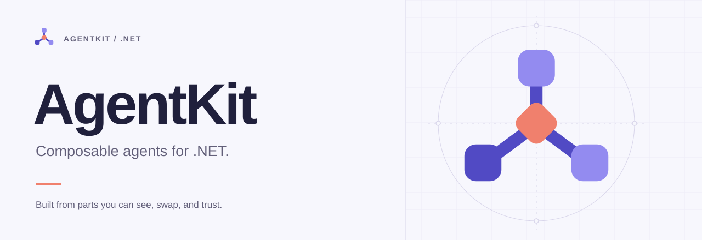

<!-- The banner switches artwork with the reader's color scheme, which needs a
     <picture> element; Markdown has no equivalent. Rule exemptions are scoped
     to this block only. -->
<!-- markdownlint-disable MD033 MD013 -->
<h1 align="center">
  <picture>
    <source media="(prefers-color-scheme: dark)" srcset="docs/assets/brand/agentkit-banner-dark.svg">
    
  </picture>
</h1>
<!-- markdownlint-restore -->

Build agents in C# from parts you can see, swap, and trust.

[](https://github.com/pavkam/agent-kit/actions/workflows/ci.yml)
[](https://codecov.io/gh/pavkam/agent-kit)
[](global.json)
[](docs/getting-started.md#current-status)
[](LICENSE)

```csharp
await using var engine = AgentEngine.CreateBuilder()
    .UseLocalDevelopmentDefaults()
    .UseOpenAI(apiKey, "gpt-4o-mini")
    .UseWorkspace("/path/to/your/project")
    .Build();

Console.WriteLine(await engine.AskAsync("What does this project do?"));
```

That is a complete agent: a model, a sandboxed directory it can read and edit, a
conversation that remembers, and a security policy that decides what it may do.
Every line is a plain dependency-injection registration underneath, so when you
outgrow the defaults you replace one piece instead of starting over.

## Try it

```sh
git clone https://github.com/pavkam/agent-kit.git && cd agent-kit
make restore && make build
export OPENAI_API_KEY=sk-...
dotnet run --project examples/QuickStart -- "In one sentence, what is AgentKit?"
```

## Then go one step further

| I want to…                                        | Read                                                    |
| ------------------------------------------------- | ------------------------------------------------------- |
| Understand each line of the agent above           | [Getting started](docs/getting-started.md)              |
| Keep conversations after a restart (SQLite)       | [Storing conversations](docs/guides/storage.md)         |
| Let the agent read, search, and edit files safely | [Working with files](docs/guides/file-system.md)        |
| Decide what the agent is allowed to do            | [Permissions and approvals](docs/guides/permissions.md) |
| Use another model provider or add tools           | [Composing an application](docs/guides/composition.md)  |
| See a full coding assistant built this way        | [CodingAgent example](examples/CodingAgent/README.md)   |

## Why AgentKit

- **Ordinary .NET.** `IServiceCollection`, typed options, `ILogger`, and
  standard host lifetimes. No parallel container, no magic.
- **Nothing implicit.** Credentials, storage, and permissions are things you
  choose by name. `UseLocalDevelopmentDefaults()` says exactly what it is.
- **Effects are guarded.** Every tool call, file write, network request, and
  process is authorized before it runs and enforced again where it happens.
- **Providers by capability.** Models declare what they support; the bundled
  catalog knows the limits and prices of the models it ships adapters for.
- **Inspectable.** Specifications, focused tests, conformance suites, and public
  API snapshots live next to the code.

AgentKit is in alpha: the runtime, providers, tools, and storage work, the
public API can still change, and the
[current status](docs/getting-started.md#current-status) says what remains. The
[documentation home](docs/index.md) covers architecture, concepts, the project
catalog, and the provider reference.

## Contributing

Bug reports, documentation fixes, and focused contributions are welcome. See
[Contributing](CONTRIBUTING.md) and the [Code of Conduct](CODE_OF_CONDUCT.md);
for bugs, use the [issue tracker](https://github.com/pavkam/agent-kit/issues)
with the commit you tried and a small reproduction.

MIT licensed. See [LICENSE](LICENSE).

Logo and artwork: [brand assets](docs/assets/brand/README.md).
