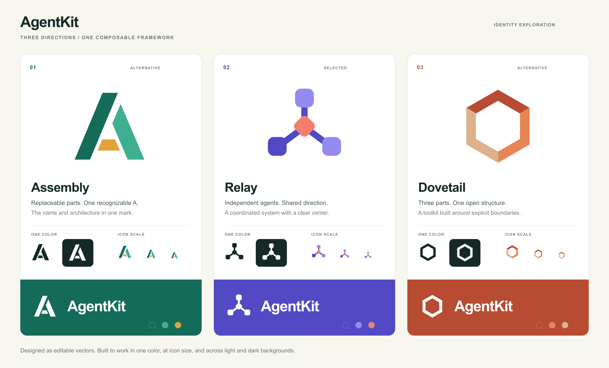

# AgentKit artwork

The **Relay** mark is AgentKit's selected identity. Three rounded nodes connect
through a central junction, representing independent agents working together
within one composable system.

## Concepts

| Direction | Meaning | Files |
| --- | --- | --- |
| Assembly | Replaceable parts forming the project's initial. | [SVG](concepts/assembly.svg) · [PNG](concepts/assembly.png) |
| Relay | Independent agents coordinated around a shared connection. | [SVG](concepts/relay.svg) · [PNG](concepts/relay.png) |
| Dovetail | Three fitted sections forming an open structure. | [SVG](concepts/dovetail.svg) · [PNG](concepts/dovetail.png) |

The comparison sheet includes color, single-color, reversed, and small-size
treatments. Relay is the selected direction; the alternatives remain available
as design explorations.

## Assets

| Use | SVG source | PNG export |
| --- | --- | --- |
| Transparent mark, light backgrounds | [SVG](agentkit-mark.svg) | [1024 × 1024](agentkit-mark.png) |
| Transparent mark, dark backgrounds | [SVG](agentkit-mark-dark.svg) | [1024 × 1024](agentkit-mark-dark.png) |
| Single-color mark | [SVG](agentkit-mark-mono.svg) | [1024 × 1024](agentkit-mark-mono.png) |
| White mark | [SVG](agentkit-mark-white.svg) | [1024 × 1024](agentkit-mark-white.png) |
| Square avatar | [SVG](agentkit-avatar.svg) | [1024 × 1024](agentkit-avatar.png) |
| README banner, light | [SVG](agentkit-banner-light.svg) | [1280 × 440](agentkit-banner-light.png) |
| README banner, dark | [SVG](agentkit-banner-dark.svg) | [1280 × 440](agentkit-banner-dark.png) |
| Social preview artwork | [SVG](agentkit-social.svg) | [1280 × 640](agentkit-social.png) |

The root README selects a banner for the reader's color scheme. The square
avatar and social preview are separate uploadable assets; embedding the README
banner does not change GitHub account or repository settings.

## Editing

The SVGs are the editable sources. They contain paths and text with no embedded
bitmaps, scripts, remote resources, or required font downloads. Typography uses
Arial with Helvetica and sans-serif fallbacks. PNGs are rendered exports.

Keep the node shapes, central junction, and connector proportions. Use the dark
variant on dark surfaces or a single-color variant where color is unavailable.
The supplied view boxes include clear space; avoid cropping into it. Use the
standalone mark at small sizes and the full artwork where the text remains
readable.

The light palette is indigo `#514AC4`, lavender `#938BF0`, and coral `#F0806D`
on pale lavender `#F7F7FD`. The dark treatment uses `#8B83EF`, `#C3BDFF`, and
`#FFAC98` on deep indigo `#191831`.

These assets were authored directly as SVG and exported to PNG, as requested.
No image-generation model was used. They are covered by the repository's
[MIT license](../../../LICENSE).
