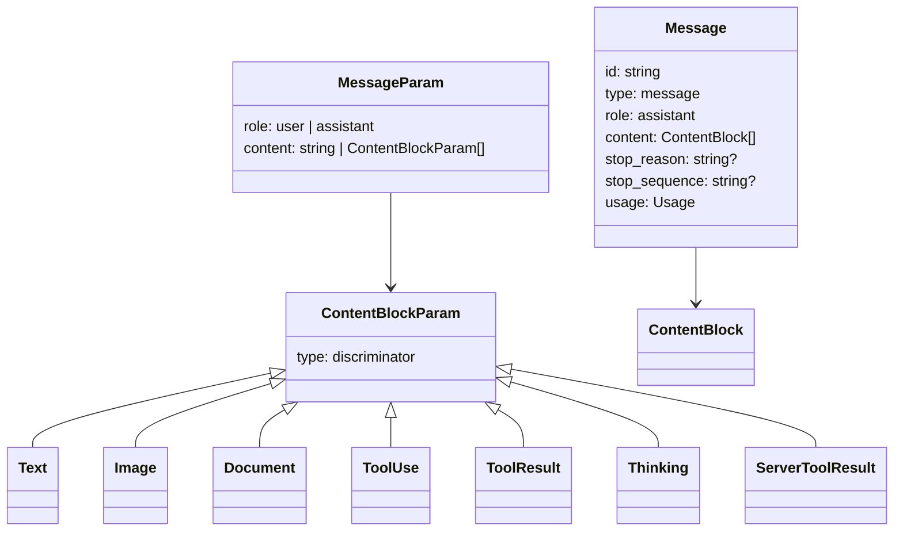
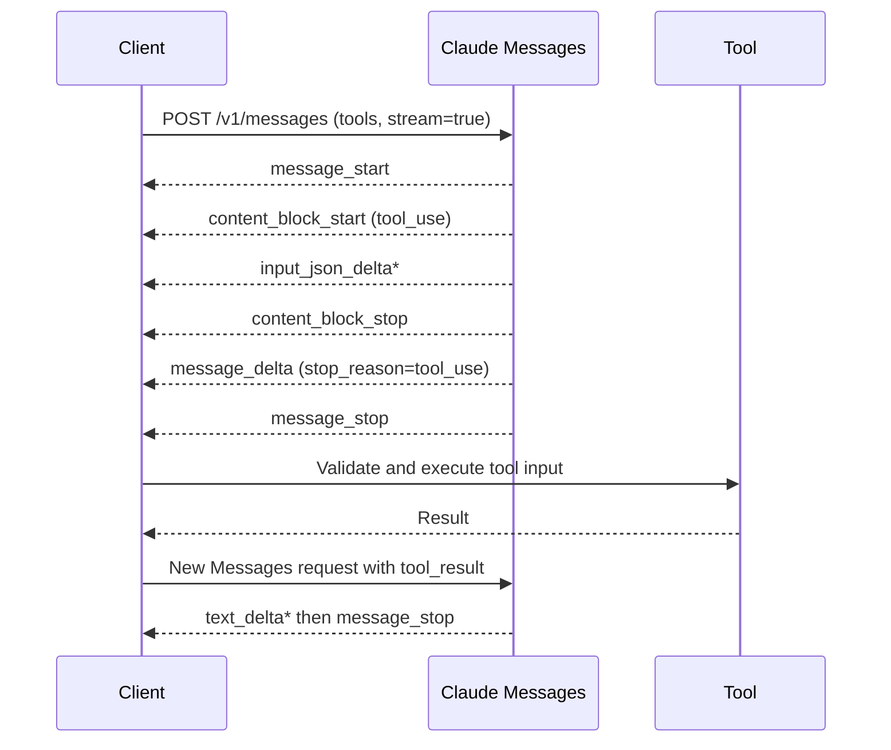

# Anthropic Claude API

**Contract snapshot:** 2026-09-06  
**Base URL:** <code>https://api.anthropic.com</code>  
**Preferred primitive:** Messages  
**Transport:** JSON over HTTPS and SSE

## Authentication and versioning

Required headers are <code>x-api-key</code>, <code>anthropic-version:
2023-06-01</code>, and <code>content-type: application/json</code>. Workload
Identity Federation can replace static keys where configured. Beta features
require an <code>anthropic-beta</code> header containing one or more feature
identifiers.

Capture the <code>request-id</code> response header. Requests using a credential
on behalf of a distinct party may use the beta
<code>anthropic-user-profile-id</code> header.

The dated Anthropic version header selects the stable wire contract. Beta
headers independently opt into preview fields and endpoints; keep them in
adapter configuration rather than sprinkling them through request code.

## Endpoint inventory

### General availability

| Method and path                                           | Purpose                                                       |
| --------------------------------------------------------- | ------------------------------------------------------------- |
| POST <code>/v1/messages</code>                            | Create a message; <code>stream:true</code> selects SSE        |
| POST <code>/v1/messages/count_tokens</code>               | Count message, system, document, image, and tool input tokens |
| POST <code>/v1/messages/batches</code>                    | Create an asynchronous Message batch                          |
| GET <code>/v1/messages/batches</code>                     | List batches                                                  |
| GET/DELETE <code>/v1/messages/batches/{id}</code>         | Get or delete a batch                                         |
| POST <code>/v1/messages/batches/{id}/cancel</code>        | Cancel a batch                                                |
| GET <code>/v1/messages/batches/{id}/results</code>        | Stream JSONL results                                          |
| GET <code>/v1/models</code>, <code>/v1/models/{id}</code> | Discover models and capabilities                              |
| POST/GET <code>/v1/files</code>                           | Upload or list files                                          |
| GET/DELETE <code>/v1/files/{id}</code>                    | Metadata or delete                                            |
| GET <code>/v1/files/{id}/content</code>                   | Download file                                                 |
| CRUD subset <code>/v1/skills</code>                       | Reusable agent skills                                         |

The legacy <code>POST /v1/complete</code> Text Completions endpoint remains in
SDK references but is deprecated for new integrations.

### Managed Agents beta

| Resource                      | Representative methods                                           |
| ----------------------------- | ---------------------------------------------------------------- |
| <code>/v1/agents</code>       | create, list, get, update, archive; list versions                |
| <code>/v1/environments</code> | create, list, get, update, delete/archive; inspect work items    |
| <code>/v1/sessions</code>     | create, list, get/update/delete, send commands, stop; SSE events |

Managed Agents run stateful configurations in managed sandboxes. They are not a
synonym for the stateless Messages API and must remain a separate optional
capability.

## Message request

| Field                                                            | Type                                     | Semantics                                                                   |
| ---------------------------------------------------------------- | ---------------------------------------- | --------------------------------------------------------------------------- |
| <code>model</code>                                               | string                                   | Model ID                                                                    |
| <code>max_tokens</code>                                          | integer                                  | Required output ceiling                                                     |
| <code>messages</code>                                            | <code>MessageParam[]</code>              | Alternating user/assistant history                                          |
| <code>system</code>                                              | string \| <code>TextBlockParam[]</code>? | Top-level system prompt; there is no system message role                    |
| <code>tools</code>                                               | <code>ToolParam[]</code>?                | Client functions and selected server tools                                  |
| <code>tool_choice</code>                                         | auto \| any \| none \| tool?             | Tool selection                                                              |
| <code>thinking</code>                                            | enabled/adaptive/disabled config?        | Extended/adaptive thinking; model-dependent                                 |
| <code>output_config</code>                                       | object?                                  | Structured output, format, or effort controls where supported               |
| <code>temperature</code>, <code>top_p</code>, <code>top_k</code> | number?                                  | Sampling; do not tune all simultaneously                                    |
| <code>stop_sequences</code>                                      | string[]?                                | Custom stops                                                                |
| <code>stream</code>                                              | boolean?                                 | SSE response                                                                |
| <code>metadata</code>                                            | {user_id?:string}?                       | Stable pseudonymous end-user attribution                                    |
| <code>service_tier</code>                                        | string?                                  | Capacity tier                                                               |
| cache/context controls                                           | object fields?                           | Prompt caching and context management; availability is model/beta dependent |

Consecutive messages of the same role may be combined by the service. A final
assistant message can prefill the response on supporting models, but this is not
portable across providers.

## Core type system

### Input content block families

| Discriminator             | Important fields                                         |
| ------------------------- | -------------------------------------------------------- |
| <code>text</code>         | <code>text</code>, cache control, optional citations     |
| <code>image</code>        | source as base64, URL, or file; media type               |
| <code>document</code>     | PDF/text/content/file source, title/context, citations   |
| <code>tool_result</code>  | <code>tool_use_id</code>, content, <code>is_error</code> |
| server-tool result blocks | tool-specific content/error payloads                     |

### Output content block families

| Discriminator                             | Important fields                                                                            |
| ----------------------------------------- | ------------------------------------------------------------------------------------------- |
| <code>text</code>                         | text plus citation annotations                                                              |
| <code>thinking</code> / redacted thinking | reasoning representation and signature                                                      |
| <code>tool_use</code>                     | <code>id</code>, <code>name</code>, parsed JSON <code>input</code>                          |
| server tool use/results                   | web search, code execution, bash, text editor, computer, memory, and related typed payloads |

The union grows as hosted tools ship. Unknown content blocks must be retained as
raw JSON.

### Response and usage

<code>Message</code> is:

<code>{id, type:"message", role:"assistant", model, content:ContentBlock[],
stop_reason?, stop_sequence?, usage, container?}</code>.

Known stop reasons include <code>end_turn</code>, <code>max_tokens</code>,
<code>stop_sequence</code>, <code>tool_use</code>, <code>pause_turn</code>,
<code>refusal</code>, and context-management stops. Treat the value as open.

Usage separates <code>input_tokens</code>, <code>output_tokens</code>,
cache-creation/read input tokens, server-tool use, and—on supporting
responses—output token details such as thinking tokens. Billing totals are
provider-defined; do not infer them by blindly adding nullable counters.

## SSE protocol

The native sequence is parsed through AgentKit's
[typed streaming contract](../concepts/streaming-and-event-protocol.md), without
flattening content blocks into OpenAI-style choice deltas. Typical ordering:

1. <code>message_start</code> with a partial Message;
2. zero or more blocks, each framed by <code>content_block_start</code>,
   <code>content_block_delta\*</code>, <code>content_block_stop</code>;
3. <code>message_delta</code> containing stop reason and cumulative usage;
4. <code>message_stop</code>.

<code>ping</code> may appear anywhere. <code>error</code> can arrive after
HTTP 200. Delta variants include <code>text_delta</code>,
<code>input_json_delta</code>, citation deltas, thinking deltas, and signature
deltas.

Tool input JSON is streamed as string fragments. Buffer per content-block index,
then parse only after its block stops.

The parser routes on the delta <code>type</code> first. Anthropic documents
empty fragments for known kinds — every <code>tool_use</code> block opens with
<code>{"type":"input_json_delta","partial_json":""}</code>, and a thinking block
with display omitted sends an empty <code>thinking_delta</code> — so an empty
fragment of a known kind is a no-op that emits no event. Only a genuinely
unrecognized delta <code>type</code> is surfaced as a
<code>ProviderContentDelta</code> carrying the raw delta. A
<code>content_block_delta</code> or <code>content_block_stop</code> whose
<code>index</code> was never opened by <code>content_block_start</code> is a
<code>ProtocolViolation</code> that retains the parts and usage received so far;
it is never silently dropped. A non-null <code>stop_sequence</code> from the
buffered message or the final <code>message_delta</code> is preserved in the
response's extension data under <code>stop_sequence</code>.

The second request must include the assistant's complete <code>tool_use</code>
block and a user <code>tool_result</code> block with the matching ID.

## Batches

A batch contains requests keyed by caller-supplied <code>custom_id</code>.
Individual results are <code>succeeded</code>, <code>errored</code>,
<code>canceled</code>, or <code>expired</code> variants. The batch object moves
through processing and terminal states and reports request counts. Results are
JSONL and may not be in input order; correlate only by <code>custom_id</code>.

Batch creation is non-idempotent unless the application supplies its own
deduplication. Poll with backoff, cancel through the explicit action, and
download results before deleting metadata.

## Errors and limits

Errors use <code>{type:"error", error:{type,message}, request_id?}</code> and
map into the [stable AgentKit error taxonomy](../concepts/error-taxonomy.md)
without discarding Anthropic's type or request ID. Important HTTP categories are
400 invalid request, 401 authentication, 403 permission, 404 not found, 413
request too large, 429 rate limit, 500 API error, and 529 overloaded. Streaming
errors use the same logical error object in an SSE event.

Request-size limits at verification time were 32 MB for Messages/token counting,
256 MB for Message Batches, and 500 MB for Files. Recheck before encoding them
as validators.

Retry 429, 500, 529, and transient transport errors with jitter and provider
headers. Do not automatically retry after a tool with side effects has executed.

## Cross-platform Claude warning

Claude on [Amazon Bedrock](aws-bedrock.md) and [Vertex AI](google-vertex-ai.md)
uses those platforms' authentication, endpoints, versioning, content envelopes,
error types, and feature cadence. Reuse the canonical Claude semantics, not the
direct Anthropic HTTP adapter.

## Adapter notes

1. Keep <code>system</code> outside <code>messages</code>.
2. Preserve content block order, indexes, and thinking signatures across turns.
3. Treat partial tool JSON as opaque bytes until block completion.
4. Make beta headers an explicit capability set.
5. Use the Models API capability object where available instead of model-name
   heuristics.
6. Separate Managed Agents resources from stateless Messages.

## Coding-harness interoperability

The
[provider-specific compatibility requirements](../profiles/coding-harness/provider-interoperability.md#provider-specific-compatibility-requirements)
define the route, history-repair, streaming, and compatibility details required
by a long-running coding loop. They do not override the public contract verified
below.

## First-party sources

- [API overview](https://platform.claude.com/docs/en/api/overview)
- [Messages API reference](https://platform.claude.com/docs/en/api/messages)
- [Message Batches reference](https://platform.claude.com/docs/en/api/messages/batches)
- [Models API reference](https://platform.claude.com/docs/en/api/models)
- [Streaming Messages](https://platform.claude.com/docs/en/build-with-claude/streaming)
- [Managed Agents overview](https://platform.claude.com/docs/en/managed-agents/overview)
