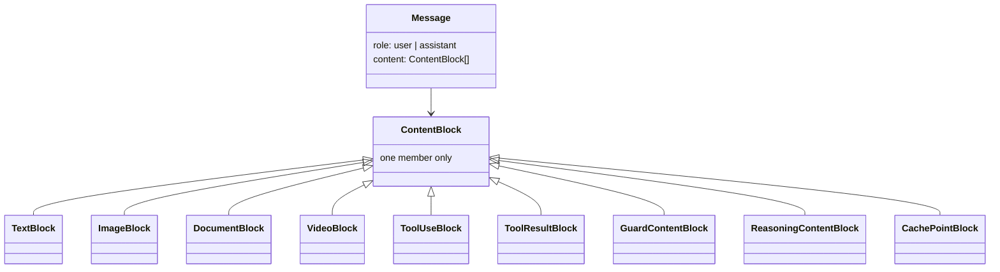
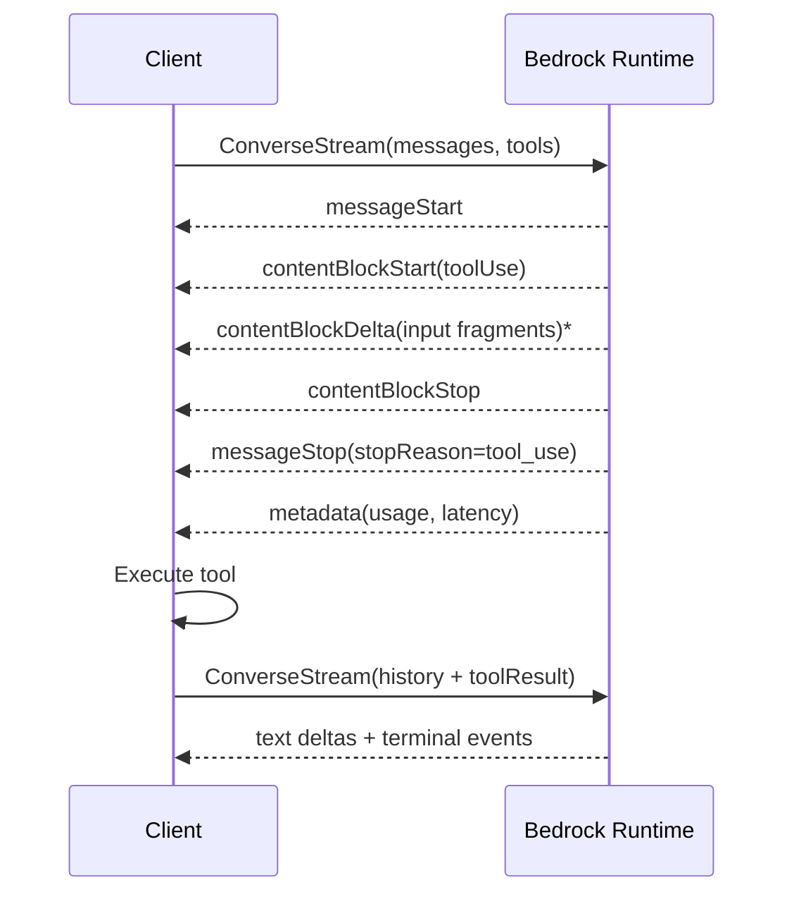
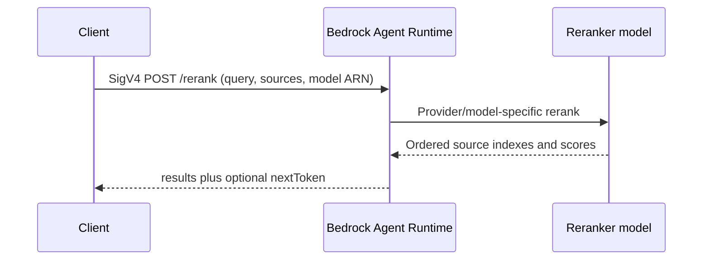

# Amazon Bedrock Runtime API

**Contract snapshot:** 2026-09-06  
**Regional endpoint:**
<code>https://bedrock-runtime.{region}.amazonaws.com</code>  
**Preferred primitive:** Converse / ConverseStream  
**Transport:** AWS SigV4 HTTPS, JSON, AWS event stream, and bidirectional event
stream

Bedrock is a multi-provider gateway. <code>Converse</code> provides a normalized
message contract; <code>InvokeModel</code> exposes each model's native JSON. The
same model family can therefore have two distinct wire contracts.

## Authentication and model addressing

Sign requests with AWS Signature Version 4 using service <code>bedrock</code>
and regional credentials. IAM actions are the authorization boundary; notably
Converse maps to <code>bedrock:InvokeModel</code> and ConverseStream to
<code>bedrock:InvokeModelWithResponseStream</code>.

The <code>modelId</code> path value can identify a base model, marketplace
endpoint, inference profile, prompt version ARN, provisioned throughput, custom
model deployment, imported model, or some SageMaker endpoints. Store both the
opaque value and a parsed resource kind.

## Complete Bedrock Runtime operation inventory

| Operation                                       | HTTP shape                                                     | Purpose                                   |
| ----------------------------------------------- | -------------------------------------------------------------- | ----------------------------------------- |
| <code>Converse</code>                           | POST <code>/model/{modelId}/converse</code>                    | Normalized message inference              |
| <code>ConverseStream</code>                     | POST <code>/model/{modelId}/converse-stream</code>             | Normalized event-stream inference         |
| <code>CountTokens</code>                        | POST <code>/model/{modelId}/count-tokens</code>                | Count Converse or InvokeModel input       |
| <code>InvokeModel</code>                        | POST <code>/model/{modelId}/invoke</code>                      | Model-native request/response             |
| <code>InvokeModelWithResponseStream</code>      | POST <code>/model/{modelId}/invoke-with-response-stream</code> | Native model streaming                    |
| <code>InvokeModelWithBidirectionalStream</code> | bidirectional event stream                                     | Low-latency supported-model sessions      |
| <code>ApplyGuardrail</code>                     | POST guardrail version endpoint                                | Evaluate text/image content independently |
| <code>InvokeGuardrailChecks</code>              | runtime guardrail operation                                    | Invoke configured guardrail checks        |
| <code>StartAsyncInvoke</code>                   | POST async invoke                                              | Start asynchronous model job              |
| <code>GetAsyncInvoke</code>                     | GET                                                            | Retrieve async job                        |
| <code>ListAsyncInvokes</code>                   | GET                                                            | List/filter async jobs                    |

Model discovery (<code>GetFoundationModel</code>, list models, throughput and
profile management) lives on the separate Bedrock control-plane endpoint. It is
needed for capability discovery but is not a Runtime operation.

## Converse request

| Field                                          | Type                                   | Semantics                                                        |
| ---------------------------------------------- | -------------------------------------- | ---------------------------------------------------------------- |
| <code>messages</code>                          | <code>Message[]</code>?                | Conversation history                                             |
| <code>system</code>                            | <code>SystemContentBlock[]</code>?     | System instructions                                              |
| <code>inferenceConfig</code>                   | object?                                | maxTokens, temperature, topP, stopSequences                      |
| <code>additionalModelRequestFields</code>      | JSON value?                            | Provider/model-specific escape hatch                             |
| <code>additionalModelResponseFieldPaths</code> | string[]?                              | JSON Pointers for native response fields                         |
| <code>toolConfig</code>                        | object?                                | tools and tool choice                                            |
| <code>guardrailConfig</code>                   | object?                                | identifier, version, trace; stream processing mode for streaming |
| <code>outputConfig</code>                      | object?                                | Structured text format/schema where supported                    |
| <code>performanceConfig</code>                 | object?                                | Latency preference                                               |
| <code>serviceTier</code>                       | object?                                | Requested processing tier                                        |
| <code>promptVariables</code>                   | map&lt;string,PromptVariableValue&gt;? | Variables for a Prompt Management ARN                            |
| <code>requestMetadata</code>                   | map&lt;string,string&gt;?              | Invocation-log filter metadata                                   |

When <code>modelId</code> is a managed prompt version, inference config, system,
tool config, and additional model fields must be defined in the prompt rather
than supplied in the call.

## Converse content types

AWS SDK models represent unions as objects where exactly one member is set.
Content includes text, image/document/video sources, tool use/result, guard
content, reasoning content, citations, cache points, and evolving model-specific
blocks. Binary fields are raw bytes in SDKs but base64 in REST JSON
serialization.

A tool specification is <code>{name, description?, inputSchema:{json: JSON
value}}</code>. Tool choice is a union of automatic, any/required, or a named
tool. Tool result content can be JSON, text, image, document, or video blocks
and carries a success/error status.

## Converse response

| Field                                                    | Type                                             |
| -------------------------------------------------------- | ------------------------------------------------ |
| <code>output</code>                                      | union, normally <code>{message: Message}</code>  |
| <code>stopReason</code>                                  | open string                                      |
| <code>usage</code>                                       | input/output/total plus cache read/write details |
| <code>metrics</code>                                     | <code>{latencyMs:number}</code>                  |
| <code>additionalModelResponseFields</code>               | JSON value?                                      |
| <code>trace</code>                                       | guardrail/prompt-router trace?                   |
| <code>performanceConfig</code>, <code>serviceTier</code> | actual configuration                             |

Known stop reasons include <code>end_turn</code>, <code>tool_use</code>,
<code>max_tokens</code>, <code>stop_sequence</code>,
<code>guardrail_intervened</code>, <code>content_filtered</code>, malformed
model/tool output, and context-window exceeded.

## ConverseStream event order

The response is an AWS event-stream union:

- <code>messageStart</code>;
- <code>contentBlockStart</code>;
- zero or more <code>contentBlockDelta</code>;
- <code>contentBlockStop</code>;
- <code>messageStop</code>;
- <code>metadata</code> with usage/metrics/trace;
- modeled exception events.

Do not parse this as SSE. Use an AWS event-stream decoder that validates frame
checksums and exposes exception members after headers.

## InvokeModel native contract

<code>InvokeModel</code> takes arbitrary bytes with <code>Content-Type</code>
and <code>Accept</code>; the JSON schema depends on <code>modelId</code>.
Headers can select guardrails, tracing, latency settings, and model lifecycle
options. <code>InvokeModelWithResponseStream</code> wraps provider chunks in AWS
event-stream frames.

An adapter needs a registry:

<code>(model provider, model family, operation) -> request codec + stream
decoder + usage mapper</code>.

Do not infer native schema solely from the model ID prefix; imported and
marketplace models can change naming patterns.

## Token counting, guardrails, and async jobs

<code>CountTokens</code> accepts a tagged union containing either a
Converse-shaped request or InvokeModel-native body and returns
<code>inputTokens</code>. It does not imply the model can run the corresponding
operation.

<code>ApplyGuardrail</code> accepts source
(<code>INPUT</code>/<code>OUTPUT</code>), content blocks, output
scope/qualifiers, and guardrail identity. The response includes action,
assessments, guarded output, and detailed usage. A guardrail intervention is a
policy result, not a retryable provider failure.

Async invocation takes model ID, model input, output S3 configuration, optional
client request token, and tags. Persist the invocation ARN/name and poll
<code>GetAsyncInvoke</code>. Prefer the service's client token for idempotency.

## Embeddings and Bedrock Agent Runtime rerank

Bedrock Runtime has no provider-neutral embedding operation. Embedding models
are invoked through <code>InvokeModel</code>, and each model family defines its
own JSON request, vector response, maximum input, dimensions, normalization, and
multimodal behavior. Register each embedding codec by exact model family and
store region, full model ID/ARN or inference profile, resolved family/version,
dimensions, and normalization with the vectors.

Reranking is a separate <strong>Agents for Amazon Bedrock Runtime</strong>
operation, not a Bedrock Runtime operation. Use the regional Agent Runtime
endpoint and the <code>bedrock:Rerank</code> permission.

<code>POST /rerank</code> accepts:

| Field                               | Type                        | Semantics                                                    |
| ----------------------------------- | --------------------------- | ------------------------------------------------------------ |
| <code>queries</code>                | <code>RerankQuery[1]</code> | Exactly one <code>{type:"TEXT",textQuery:{text}}</code>      |
| <code>sources</code>                | <code>RerankSource[]</code> | 1 to 1,000 inline sources                                    |
| <code>rerankingConfiguration</code> | tagged union                | Currently <code>BEDROCK_RERANKING_MODEL</code> configuration |
| <code>nextToken</code>              | string?                     | Continue a paged result set                                  |

Each source is <code>{type:"INLINE",inlineDocumentSource}</code>. The inline
document is a tagged union with <code>type:"TEXT"</code> plus
<code>textDocument:{text}</code>, or <code>type:"JSON"</code> plus
<code>jsonDocument</code> where supported.

The Bedrock configuration contains
<code>modelConfiguration:{modelArn,additionalModelRequestFields?}</code> and
optional <code>numberOfResults</code>. Additional model fields are an open JSON
map and must be namespaced to the chosen reranker codec.

The response is
<code>{results:[{index,relevanceScore,document?}],nextToken?}</code>.
<code>index</code> maps to the original <code>sources</code> array. Results can
echo text or JSON documents. Treat relevance values as model-local ordering
scores, preserve the model ARN, and do not fabricate usage when the operation
omits it.

Bedrock Knowledge Bases can also apply a reranking configuration inside
<code>Retrieve</code> or <code>RetrieveAndGenerate</code>. That is managed
retrieval/orchestration; keep it distinct from the direct caller-supplied-source
<code>Rerank</code> capability.

## Error model

Modeled exceptions include:

| Exception                                  |         Typical HTTP |
| ------------------------------------------ | -------------------: |
| <code>ValidationException</code>           |                  400 |
| <code>AccessDeniedException</code>         |                  403 |
| <code>ResourceNotFoundException</code>     |                  404 |
| <code>ModelTimeoutException</code>         |                  408 |
| <code>ModelErrorException</code>           |                  424 |
| <code>ModelNotReadyException</code>        |                  429 |
| <code>ThrottlingException</code>           |                  429 |
| <code>ServiceQuotaExceededException</code> | 400/402 by operation |
| <code>InternalServerException</code>       |                  500 |
| <code>ServiceUnavailableException</code>   |                  503 |

AWS SDKs may retry <code>ModelNotReadyException</code>. Configure one retry
owner to avoid multiplying SDK and framework attempts. Preserve AWS request ID,
extended request ID, model ID, region, and original model error status/resource.

## Adapter notes

1. Prefer Converse when the selected model supports every required capability.
2. Keep native InvokeModel codecs isolated by model family.
3. Represent AWS union objects as discriminated unions and reject multiple
   members.
4. Percent-encode <code>modelId</code> as a path segment without corrupting
   ARNs.
5. Treat streaming exception frames as terminal errors.
6. Query model capability metadata for streaming, modalities, tools, and
   regions.
7. Keep Bedrock Runtime embedding codecs and Bedrock Agent Runtime rerank as
   separate clients and IAM capabilities.

## First-party sources

- [Bedrock Runtime operations](https://docs.aws.amazon.com/bedrock/latest/APIReference/API_Operations_Amazon_Bedrock_Runtime.html)
- [Converse API](https://docs.aws.amazon.com/bedrock/latest/APIReference/API_runtime_Converse.html)
- [ConverseStream API](https://docs.aws.amazon.com/bedrock/latest/APIReference/API_runtime_ConverseStream.html)
- [InvokeModel API](https://docs.aws.amazon.com/bedrock/latest/APIReference/API_runtime_InvokeModel.html)
- [CountTokens API](https://docs.aws.amazon.com/bedrock/latest/APIReference/API_runtime_CountTokens.html)
- [Bedrock Agent Runtime Rerank API](https://docs.aws.amazon.com/bedrock/latest/APIReference/API_agent-runtime_Rerank.html)
- [Using reranker models](https://docs.aws.amazon.com/bedrock/latest/userguide/rerank-use.html)
