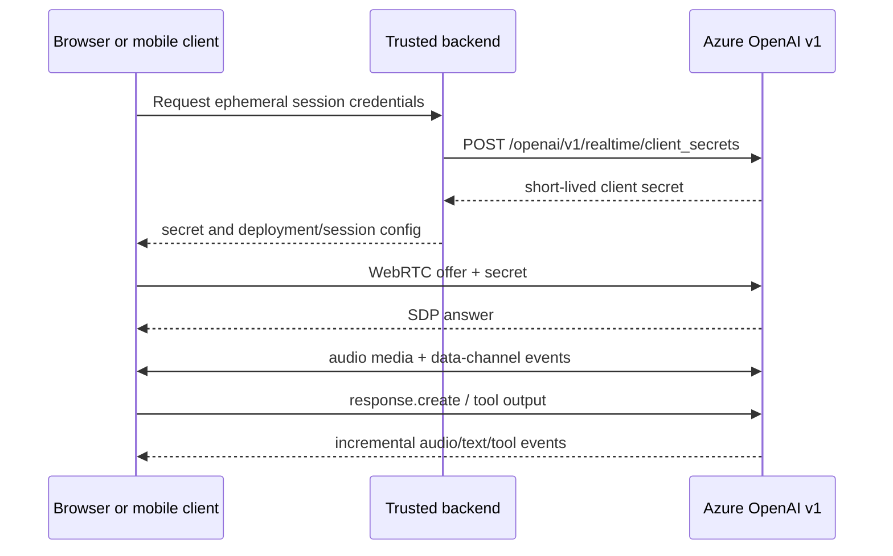
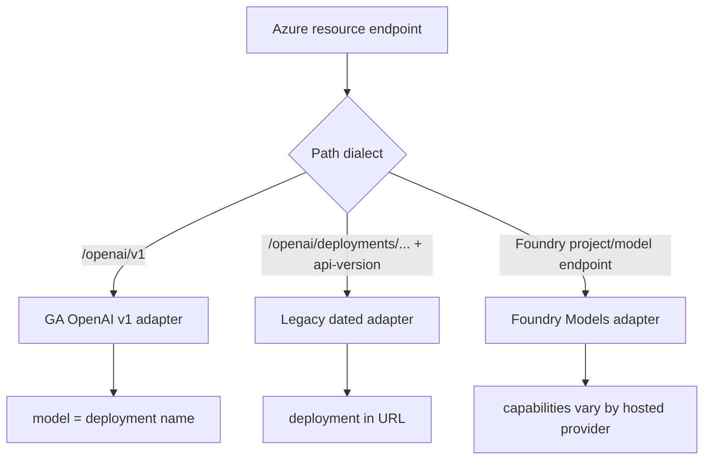

# Azure OpenAI and Microsoft Foundry model APIs

**Contract snapshot:** 2026-09-06  
**Preferred base URL:**
<code>https://{resource}.openai.azure.com/openai/v1</code>  
**Preferred primitive:** OpenAI v1 Responses  
**Transport:** JSON/HTTPS, SSE, WebSocket, and WebRTC

Azure exposes two model data planes that must not be confused: the
OpenAI-compatible <code>/openai/v1</code> API on an Azure OpenAI resource, and
the broader Foundry Models inference API. This adapter targets the former. Azure
AI Agent Service, resource provisioning, deployments, evaluations, and project
administration are separate control planes.

## Authentication, routing, and versions

Use one of:

- <code>api-key: AZURE_OPENAI_API_KEY</code>;
- <code>Authorization: Bearer &lt;Microsoft Entra token&gt;</code>, acquired for
  <code>https://cognitiveservices.azure.com/.default</code>.

The GA v1 API no longer requires a dated <code>api-version</code> query
parameter. The value sent in <code>model</code> is the Azure deployment name,
not necessarily the underlying OpenAI model ID. Resolve deployment capability
and region support outside the wire adapter.

Older deployment-scoped routes remain in service:

<code>https://{resource}.openai.azure.com/openai/deployments/{deployment}/{operation}?api-version={date}</code>

Keep that dialect behind a legacy adapter. It differs in URL construction,
versioning, feature rollout, and Azure-only extensions.

## v1 endpoint inventory

Availability is deployment-, model-, region-, and subscription-dependent. A path
existing in the contract does not make every deployed model eligible for it.

| Resource          | Principal paths under <code>/openai/v1</code>                                                                                                             |
| ----------------- | --------------------------------------------------------------------------------------------------------------------------------------------------------- |
| Responses         | POST <code>/responses</code>; GET/DELETE <code>/responses/{id}</code>; POST <code>/responses/{id}/cancel</code>; input items and compaction where enabled |
| Chat Completions  | POST <code>/chat/completions</code>; stored completion list/get/update/delete where enabled                                                               |
| Embeddings        | POST <code>/embeddings</code>                                                                                                                             |
| Images            | POST <code>/images/generations</code>, <code>/images/edits</code> where supported                                                                         |
| Audio             | speech, transcription, and translation operations under <code>/audio</code>                                                                               |
| Realtime          | client secrets and calls under <code>/realtime</code>; session traffic over WebRTC or WebSocket                                                           |
| Files and uploads | file CRUD/content and multipart upload lifecycle                                                                                                          |
| Vector stores     | stores, files, file batches, and search                                                                                                                   |
| Batch             | create/list/get/cancel and output/error files                                                                                                             |
| Fine-tuning       | jobs, events, checkpoints, pause/resume/cancel where offered                                                                                              |
| Models            | GET <code>/models</code> and <code>/models/{id}</code>                                                                                                    |

Use the [OpenAI contract](openai.md) for the full common type vocabulary. The
rest of this file records the Azure deltas that portability layers usually miss.

## Responses contract

The request is the OpenAI <code>ResponseCreateParams</code> shape:
<code>model</code>, <code>input</code>, <code>instructions</code>,
<code>tools</code>, <code>tool_choice</code>, <code>text.format</code>,
<code>reasoning</code>, <code>max_output_tokens</code>, <code>stream</code>,
state fields, metadata, and sampling controls. Capability-gate fields per Azure
deployment.

The result is a <code>Response</code> with an ordered open union in
<code>output[]</code>:

- assistant messages with typed text/refusal annotations;
- reasoning items;
- function calls and function-call outputs;
- hosted-tool calls such as search, file search, or code execution when that
  deployment supports them;
- newer item kinds that the adapter must preserve even before it understands
  them.

Do not assume <code>output[0]</code> is text. Join user-visible
<code>output_text</code> only as a convenience projection, and retain the source
items.

### Azure safety additions

Azure may attach content-filter results at prompt and completion/candidate
level. Categories commonly include hate, sexual, violence, and self-harm with
filtered/severity data; jailbreak, protected-material, and other classifiers
vary by feature and policy. A blocked prompt can be an HTTP error; a filtered
generation can instead end through a finish reason with filter metadata.

Represent these as an Azure namespaced safety object. Never collapse them to a
single boolean or translate them into a normal model refusal.

## Chat Completions contract

The common request includes:

| Field                                            | Type                              | Notes                                                       |
| ------------------------------------------------ | --------------------------------- | ----------------------------------------------------------- |
| <code>model</code>                               | string                            | Azure deployment name                                       |
| <code>messages</code>                            | <code>ChatMessage[]</code>        | Ordered roles and multimodal parts                          |
| <code>tools</code>, <code>tool_choice</code>     | function schemas, selector        | Parallel calls depend on the model                          |
| <code>response_format</code>                     | text, JSON object, or JSON schema | Schema support is model-dependent                           |
| <code>stream</code>, <code>stream_options</code> | boolean, object?                  | SSE and optional terminal usage                             |
| token/sampling fields                            | scalars?                          | Reasoning models may reject or reinterpret classic controls |

The response is <code>choices[]</code> plus usage. Each choice carries
<code>message</code> or streamed <code>delta</code>, <code>finish_reason</code>,
log probabilities where supported, and Azure content-filter metadata. Keep
prompt filter results separate from choice filter results.

Legacy “use your data” integrations can use Azure-specific extensions and
data-source objects. They are not portable Chat Completions fields; isolate them
in an Azure extension bag rather than adding them to the canonical message type.

## Realtime lifecycle

Use a trusted server to authenticate and mint a short-lived client secret for
browser/mobile clients. Do not expose the Azure resource key. WebRTC is
preferred for client audio; a server can use WebSocket for direct event control.
SIP availability is product/configuration dependent.

Realtime events are an open union. Preserve event IDs and item/content-part IDs,
and implement session, conversation item, input-audio-buffer, response,
text/audio delta, transcription, tool-call, rate-limit, and error families. A
transport close is not a successful terminal response.

## Legacy deployment-scoped dialect

Typical routes include:

| Operation        | Route suffix after <code>/deployments/{deployment}</code> |
| ---------------- | --------------------------------------------------------- |
| Chat             | <code>/chat/completions?api-version=...</code>            |
| Embeddings       | <code>/embeddings?api-version=...</code>                  |
| Image generation | model/version-specific image route                        |
| Audio            | model/version-specific audio route                        |

The deployment is in the URL, and some SDKs omit or ignore <code>model</code>.
Never mechanically prepend <code>/openai/v1</code> to a legacy path. Dated
preview contracts can add, rename, or remove fields independently of GA v1.

## Embeddings and rerank boundary

The GA <code>POST /openai/v1/embeddings</code> request and response follow the
OpenAI embedding contract. The request <code>model</code> is the Azure
deployment name; the legacy dialect instead selects deployment in the URL.
Persist both the deployment and its underlying resolved model/version, along
with resource region, dimensions, encoding, and any caller-side normalization.

Azure OpenAI does not expose a generic rerank endpoint. Azure AI Search semantic
ranker and Microsoft 365 Copilot Retrieval are separate services with different
authentication, corpus ownership, and score contracts. Foundry may host models
with provider-specific ranking APIs, but that does not add rerank to the Azure
OpenAI protocol.

## Foundry compatibility boundary

Foundry Models also exposes an OpenAI-compatible endpoint and older
<code>/models/chat/completions</code>-style inference. Compatibility depends on
the model provider and server implementation. Unsupported OpenAI fields may be
rejected, ignored, or absent from responses. Use explicit capability discovery
and record the selected data plane in telemetry.

## Errors, throttling, and observability

Errors normally use an OpenAI-shaped
<code>{error:{code,message,param?,type?}}</code> body, sometimes with nested
Azure details. Preserve the full body, HTTP status, request ID, region/resource,
deployment name, and all rate-limit headers.

- Retry 408, 429, and transient 5xx with jitter and server guidance.
- A 400/404 can mean unsupported API version, feature, model deployment, or
  wrong endpoint hostname; it is not automatically transient.
- A content-policy 400 is terminal unless the application deliberately changes
  the input.
- Entra 401/403 failures require token audience/role diagnosis, not blind
  retries.
- Batch, fine-tuning, upload, and media creation are side-effecting; persist IDs
  and use idempotency support where documented.

## Adapter rules

1. Store Azure resource endpoint and deployment separately from the underlying
   model family.
2. Select GA v1 versus legacy dated routing once, before serialization.
3. Capability-gate every hosted tool, modality, structured-output mode, and
   stateful operation.
4. Preserve Azure filter metadata and request IDs without contaminating the
   cross-provider core.
5. Re-query deployment/model metadata during rollout; Azure availability varies
   by region and subscription.
6. Never merge vectors from different deployments unless their resolved
   embedding-space identity is proven compatible.

## First-party sources

- [Azure OpenAI v1 API lifecycle](https://learn.microsoft.com/azure/ai-foundry/openai/api-version-lifecycle)
- [Azure OpenAI Responses API](https://learn.microsoft.com/azure/ai-foundry/openai/how-to/responses)
- [Azure OpenAI REST API reference](https://learn.microsoft.com/azure/ai-services/openai/reference)
- [Azure OpenAI Realtime API](https://learn.microsoft.com/azure/ai-foundry/openai/how-to/realtime-audio)
- [Azure OpenAI content filtering](https://learn.microsoft.com/azure/ai-services/openai/concepts/content-filter)
- [Microsoft Foundry OpenAI compatibility](https://learn.microsoft.com/azure/ai-foundry/model-inference/how-to/use-chat-completions)
