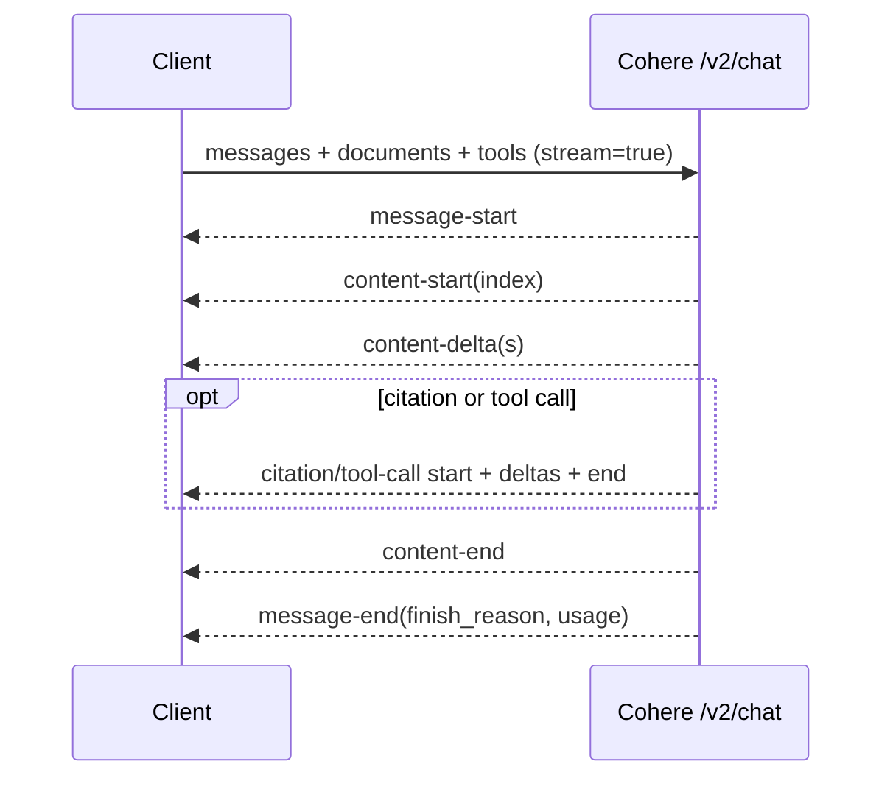
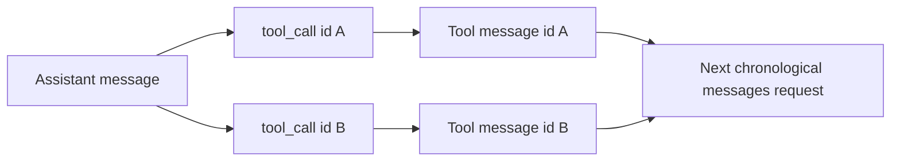

# Cohere API

**Contract snapshot:** 2026-09-06  
**Base URL:** <code>https://api.cohere.com</code>  
**Preferred primitive:** v2 Chat  
**Transport:** JSON/HTTPS and SSE

Cohere's core data plane is Chat, Embed, and Rerank. v2 deliberately changed
message history, tools, and response types; v1 endpoints remain a separate
legacy dialect for older Chat, generation, classification, tokenization,
embedding-job, and model clients.

## Authentication and versions

Send <code>Authorization: Bearer COHERE_API_KEY</code>.
<code>X-Client-Name</code> is an optional application identifier. Use explicit
<code>/v2</code> paths for new Chat, Embed, and Rerank integrations.

Do not infer v2 behavior from a v1 SDK method. In particular, v2 uses one
chronological <code>messages[]</code> array and tool-call IDs to associate
results.

## Endpoint inventory

| Version | Path                                                                       | Purpose                                                                        |
| ------- | -------------------------------------------------------------------------- | ------------------------------------------------------------------------------ |
| v2      | POST <code>/v2/chat</code>                                                 | Chat, grounding documents, citations, reasoning, tools, structured output, SSE |
| v2      | POST <code>/v2/embed</code>                                                | Text/image/mixed input embeddings in multiple encodings                        |
| v2      | POST <code>/v2/rerank</code>                                               | Rank documents against a query                                                 |
| v1      | <code>/v1/chat</code>, <code>/v1/generate</code>                           | Legacy generation contracts                                                    |
| v1      | <code>/v1/embed</code>, <code>/v1/rerank</code>, <code>/v1/classify</code> | Legacy semantic endpoints                                                      |
| v1      | create/list/get/cancel <code>/v1/embed-jobs</code>                         | Dataset-backed asynchronous embeddings                                         |
| v1      | <code>/v1/tokenize</code>, <code>/v1/detokenize</code>                     | Token conversion                                                               |
| v1      | <code>/v1/models</code>, <code>/v1/models/{id}</code>                      | Model discovery                                                                |

The platform also exposes asynchronous embedding-job functionality for supported
bulk workflows. It is not a general Chat batch API; model it as an embedding job
resource.

## v2 Chat request

| Field                         | Type                               | Notes                                                          |
| ----------------------------- | ---------------------------------- | -------------------------------------------------------------- |
| <code>model</code>            | string                             | Required                                                       |
| <code>messages</code>         | <code>Message[]</code>             | Required chronological System/User/Assistant/Tool messages     |
| <code>stream</code>           | boolean                            | Required by schema, defaults false                             |
| <code>tools</code>            | <code>Tool[]?</code>               | JSON Schema function definitions                               |
| <code>tool_choice</code>      | enum?                              | Model chooses, REQUIRED, or NONE where supported               |
| <code>strict_tools</code>     | boolean?                           | Force calls to conform to tool schemas                         |
| <code>documents</code>        | <code>(string\|Document)[]?</code> | Inline grounding corpus                                        |
| <code>citation_options</code> | object?                            | Citation generation/mode                                       |
| <code>response_format</code>  | JSON object/schema config?         | Restrictions apply with tools/documents                        |
| <code>thinking</code>         | object?                            | Reasoning configuration                                        |
| <code>safety_mode</code>      | enum?                              | Model-dependent safety instruction                             |
| token/sampling fields         | scalars?                           | max tokens, stop, temperature, k, p, seed, penalties, logprobs |

### Messages and content blocks

Messages are a role-discriminated union. User/System/Assistant content is an
ordered array of blocks such as text, image, document, thinking, or
citation-bearing output according to model capability. Assistant messages may
include <code>tool_calls</code>. Tool messages return content and the matching
<code>tool_call_id</code> or IDs.

Do not flatten content arrays to a single string. Citations refer to character
spans and document IDs; normalization must retain the original text and source
mapping.

<code>Document</code> can be a string or structured object with content and
caller metadata. Documents are supplied in the request rather than uploaded to a
provider file store. Treat their text and metadata as untrusted grounding
context.

## v2 Chat response

The response contains <code>id</code>, <code>message</code>,
<code>finish_reason</code>, and <code>usage</code>. The assistant message has
ordered content blocks, tool calls, and citations where requested. Finish
reasons are uppercase provider enums such as <code>COMPLETE</code>,
<code>STOP_SEQUENCE</code>, <code>MAX_TOKENS</code>, <code>TOOL_CALL</code>, or
safety/error variants. Preserve unknown values.

Usage has two views:

- <code>tokens</code>: input/output token accounting;
- <code>billed_units</code>: billable input/output/search/classification units.

They are not interchangeable. Keep the raw structures and derive totals
separately.

## Chat streaming event protocol

The adapter maps Cohere's semantic events into the
[AgentKit streaming grammar](../concepts/streaming-and-event-protocol.md) rather
than treating them as OpenAI choice deltas.

SSE uses semantic events rather than OpenAI choice deltas. The lifecycle
includes message start/end; content start/delta/end; citation start/delta/end;
tool-plan and tool-call start/delta/end; and debug/usage fields as the API
evolves.

Reduce events by their indexes and IDs. A message is complete only after
<code>message-end</code>; an HTTP 200 or content-end alone is insufficient.

## Tool loop

Tool definitions contain name, description, and JSON Schema parameters. A model
can emit multiple calls. Return each result in a Tool-role message associated
with the exact call ID, then send the accumulated conversation again.

Strict tool mode improves schema adherence but does not replace validation.
Validate names, arguments, permissions, and outputs before execution.

## Embed v2

Embedding implements a
[separate semantic-operation capability](semantic-operations.md) whose purpose,
encoding, dimensions, and model identity travel with every result.

<code>EmbedRequest</code> includes required <code>model</code>, required
<code>input_type</code> for modern models, exactly one of <code>texts</code>,
<code>images</code>, or mixed <code>inputs</code>, and selected
<code>embedding_types</code>. It can also include <code>output_dimension</code>,
<code>truncate</code>, <code>max_tokens</code>, and <code>priority</code>. Text
or mixed input arrays currently allow up to 96 inputs per call; image count/size
limits depend on the model family.

<code>input_type</code> is semantic intent: <code>search_document</code>,
<code>search_query</code>, <code>classification</code>, <code>clustering</code>,
or <code>image</code>. Query/document embeddings must use their matching intent;
it changes model behavior.

The response groups vectors by encoding:

| Encoding                                  | Element form                                 |
| ----------------------------------------- | -------------------------------------------- |
| <code>float</code>                        | floating-point vector                        |
| <code>int8</code>, <code>uint8</code>     | quantized integer vector                     |
| <code>binary</code>, <code>ubinary</code> | packed signed/unsigned binary representation |
| <code>base64</code>                       | encoded vector payload where supported       |

Preserve requested encoding and dimension with stored vectors. Never compare
vectors from different model/version/dimension/input-type contracts as if they
shared a space.

The response contains an ID, <code>embeddings</code> grouped by requested
encoding, echoed text/image metadata where applicable, and <code>meta</code>
with API version plus token/billed-unit counters. Each encoding array has one
vector per input in input order. Validate equal cardinality across requested
encodings and never assume quantized vectors share the float vector's element
type.

### Asynchronous embed jobs

<code>POST /v1/embed-jobs</code> launches a job over a validated
<code>embed-input</code> Dataset. Its request includes <code>model</code>,
<code>dataset_id</code>, <code>input_type</code>, optional name, embedding
types, and truncation policy. Creation returns <code>job_id</code>;
list/fetch/cancel operations manage its lifecycle. A completed job produces a
new <code>embed-output</code> Dataset containing source entries and vectors.

This is a v1 dataset/job contract, not a large v2 Embed request. Persist the job
and result dataset IDs, poll terminal state, and inspect job errors before
consuming output.

## Rerank v2

Reranking implements its own
[semantic-operation contract](semantic-operations.md), not a variation of
embedding generation.

<code>RerankRequest = {model, query, documents, top_n?, max_tokens_per_doc?,
priority?}</code>. <code>model</code>, string <code>query</code>, and non-empty
string <code>documents[]</code> are required. Cohere recommends no more than
1,000 documents per request and recommends encoding structured records as YAML
strings.

<code>top_n</code> is at least 1 and defaults to all results.
<code>max_tokens_per_doc</code> defaults to 4,096 and long documents are
automatically truncated. <code>priority</code> ranges from 0 to 999, where a
lower number receives higher scheduling priority.

The response is <code>{id?,results:[{index,relevance_score}],meta?}</code>.
Metadata includes API version and billable <code>search_units</code>. The v2
response does not need to echo document text; recover caller IDs/content from
the input index.

Results are relevance-sorted; <code>index</code> maps back to input order.
Scores are not a cross-query or cross-model probability contract. Record
truncation settings with evaluations because they materially affect ranking.

## Classify and legacy token APIs

Classify accepts model, inputs, and model/version-specific examples or controls
and returns per-input prediction, confidence, and label confidences. Keep
predicted label separate from confidence distribution.

Legacy tokenize/detokenize use a specific model tokenizer. Token IDs are not
portable between models or guaranteed stable across model aliases. Use them for
diagnostics and preflight, not cross-provider accounting.

## Errors and retries

Cohere statuses and bodies map through the
[AgentKit error taxonomy](../concepts/error-taxonomy.md) without losing the
provider request ID or retry detail.

The reference enumerates 400, 401, 403, 404, 422, 429, 498 invalid token, 499
client closed, 500, 501, 503, and 504. Preserve Cohere's message/body and
request ID.

- Retry 429/503/504 and selected 5xx with jitter and provider delay headers.
- 498 is authentication failure, not throttling.
- 499 means the client/proxy closed the request; retry only if application
  semantics allow it.
- 422 usually means a structurally valid JSON body with invalid field
  combinations.
- Never retry a tool-bearing request in a way that re-executes already committed
  side effects.

## First-party sources

- [Cohere v2 Chat reference](https://docs.cohere.com/v2/reference/chat)
- [Cohere v2 Chat API guide](https://docs.cohere.com/v2/docs/chat-api)
- [Cohere v2 Embed reference](https://docs.cohere.com/reference/embed)
- [Cohere v2 Rerank reference](https://docs.cohere.com/reference/rerank)
- [Cohere asynchronous Embed jobs](https://docs.cohere.com/reference/create-embed-job)
- [Cohere v2 API migration announcement](https://docs.cohere.com/v2/changelog/v2-api-release)
