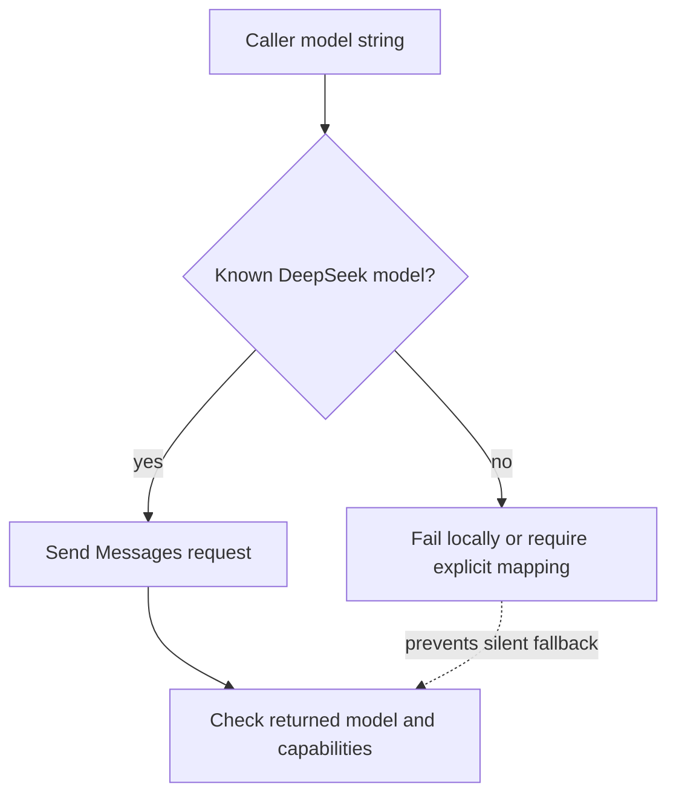

# DeepSeek API

DeepSeek exposes several wire dialects rather than one interchangeable surface.
The adapter selects an explicit
[API-family capability profile](../concepts/model-providers-and-capabilities.md)
before entering the
[provider request pipeline](../concepts/provider-request-pipeline.md).

**Contract snapshot:** 2026-09-06  
**OpenAI-style base URL:** <code>https://api.deepseek.com</code>  
**Anthropic-style base URL:** <code>https://api.deepseek.com/anthropic</code>  
**FIM beta base URL:** <code>https://api.deepseek.com/beta</code>  
**Preferred primitive:** Responses for hosted tool workflows; Anthropic Messages
for Claude-based agents; Chat Completions for broad clients\
**Transport:** JSON/HTTPS and SSE

DeepSeek supports three protocol dialects plus two distinct Files shapes. Its
compatibility policy deliberately accepts and silently ignores some unsupported
fields. That behavior is integration-friendly and semantically dangerous; the
adapter must expose effective capabilities explicitly.

## Authentication and dialect selection

OpenAI-shaped calls send <code>Authorization: Bearer DEEPSEEK_API_KEY</code>.
Anthropic SDKs use <code>x-api-key</code> through their normal authentication
flow against the Anthropic base. Keep keys server-side.

Choose the dialect before serializing a conversation. Do not mix OpenAI Response
items, Chat messages, and Anthropic content blocks in one stored transcript
without a deliberate loss-aware conversion.

## Endpoint inventory

| Base      | Method/path                         | Purpose                                                            |
| --------- | ----------------------------------- | ------------------------------------------------------------------ |
| standard  | POST <code>/chat/completions</code> | Chat, vision on eligible models, thinking, tools, JSON output, SSE |
| standard  | POST <code>/responses</code>        | Stateless OpenAI Responses-compatible generation and tools         |
| standard  | GET <code>/models</code>            | List available model IDs                                           |
| standard  | GET <code>/user/balance</code>      | Balance/availability information                                   |
| standard  | CRUD subset <code>/files</code>     | Upload/list/get/delete reusable image files                        |
| beta      | POST <code>/completions</code>      | Fill-in-the-middle completion                                      |
| Anthropic | POST <code>/v1/messages</code>      | Anthropic Messages-compatible inference                            |
| Anthropic | CRUD subset <code>/v1/files</code>  | Anthropic-shaped access to the same stored files                   |

No general embeddings, reranking, batch, image-generation, or realtime voice
endpoint appears in the verified public runtime contract.

## Chat Completions

### Request

<code>ChatRequest</code> contains required <code>model</code> and
<code>messages</code>, plus thinking, token/sampling controls, stops,
stream/options, tools/tool choice, response format, logprobs, and caller
identifier fields supported by the selected model.

Messages are a role union:

| Role      | Principal fields                                                              |
| --------- | ----------------------------------------------------------------------------- |
| system    | string content, optional name                                                 |
| user      | string or ordered text/image/file content parts                               |
| assistant | content, <code>reasoning_content</code>, tool calls, optional prefix controls |
| tool      | string content and required <code>tool_call_id</code>                         |

Thinking is controlled by <code>thinking:{type:"enabled"|"disabled",
reasoning_effort?}</code> on current models. Supported effort values and the
effect of sampling controls are model-specific. Returned
<code>reasoning_content</code> is separate from visible <code>content</code> and
can be required in reconstructed assistant history, particularly across tool
turns. Preserve it internally and apply disclosure policy separately.

Tools are currently function tools with JSON Schema parameters, optional strict
mode, and <code>none</code>/<code>auto</code>/<code>required</code>/forced tool
choice. Validate generated arguments despite strict mode.

<code>response_format:{type:"json_object"}</code> requests JSON output. The
prompt must also tell the model to emit JSON; otherwise it may produce
whitespace until the token limit. Validate the returned document and handle
truncation.

### Response and stream

The response is
<code>{id,choices[],created,model,system_fingerprint,object,usage}</code>.
Finish reasons include <code>stop</code>, <code>length</code>,
<code>content_filter</code>, <code>tool_calls</code>, and
<code>insufficient_system_resource</code>.

Usage contains:

- <code>prompt_tokens</code>, equal to hit plus miss tokens;
- <code>prompt_cache_hit_tokens</code> and
  <code>prompt_cache_miss_tokens</code>;
- <code>completion_tokens</code> with reasoning-token details;
- <code>total_tokens</code>.

Streaming is data-only SSE with Chat chunks and <code>data: [DONE]</code>. Delta
can include content, reasoning content, and tool-call fragments. A final usage
chunk can have empty choices.

## Responses API

POST <code>/responses</code> is stateless. It does not store responses or
conversations; clients resend the full relevant history. Supported status values
are <code>in_progress</code>, <code>completed</code>, <code>incomplete</code>,
and <code>failed</code>.

### Effective support matrix

| Feature                              | Effective behavior                                                             |
| ------------------------------------ | ------------------------------------------------------------------------------ |
| input/instructions                   | Supported; string or supported input items                                     |
| messages                             | system/user/assistant supported; developer is treated as user                  |
| tools                                | function and hosted web search supported                                       |
| custom tools                         | only the documented <code>apply_patch</code> custom tool                       |
| other built-ins                      | file search, code interpreter, computer use, MCP, and others ignored           |
| reasoning                            | effort supported; summary accepted but no summary generated                    |
| text format                          | supported; verbosity accepted but has no effect                                |
| parallel tool calls                  | field ignored; parallel calling is always enabled                              |
| state                                | <code>previous_response_id</code>, conversation, store, background unsupported |
| metadata/include/prompt/service tier | unsupported                                                                    |
| truncation                           | unsupported; oversized context returns 400                                     |
| cache controls                       | unsupported; prompt caching is automatic                                       |

Unsupported parameters are often silently ignored. The transport succeeding
therefore does not prove the requested semantic control took effect.

Input/output items include messages, reasoning, function calls/results,
web-search calls, and the supported custom tool calls/results.
Unknown/unsupported types may be ignored; validate capability before sending
them.

SSE is semantic and does not use <code>[DONE]</code>. Events include response
created/in-progress; output-item and content-part add/done;
reasoning/output-text deltas; function/custom-tool argument deltas; web-search
statuses; and exactly one terminal <code>response.completed</code>,
<code>response.incomplete</code>, or <code>response.failed</code>. Every event
has a monotonically increasing sequence number.

```mermaid
sequenceDiagram
    participant C as Client reducer
    participant D as DeepSeek Responses
    C->>D: POST /responses (stream=true, full history)
    D-->>C: response.created / in_progress
    D-->>C: output_item.added
    D-->>C: reasoning/text/tool deltas
    D-->>C: output_item.done
    D-->>C: completed OR incomplete OR failed + usage
    Note over C,D: No [DONE] sentinel; terminal event is authoritative
```

## Anthropic Messages compatibility

Point an Anthropic client at <code>https://api.deepseek.com/anthropic</code>.
The SDK appends <code>/v1/messages</code>. The wire model follows Anthropic
Messages: required model/messages/max tokens, system/content blocks, tools/tool
results, thinking blocks, stop reasons, usage, and semantic SSE.

DeepSeek maps Claude-like model names to DeepSeek models. More importantly, the
current guide says an unsupported model name can be automatically mapped to a
default DeepSeek model. Never use this fallback as discovery. Call
<code>/models</code>, validate the requested model, and log the model actually
returned.

Compatibility is partial. Keep a DeepSeek-specific capability table for content
blocks, beta headers, thinking, tools, and output schemas rather than importing
Anthropic's entire type universe.



## Files: two wire shapes, one store

The standard Files API stores reusable image files for eligible vision models.

### OpenAI-shaped files

- POST <code>/files</code> multipart with <code>file</code>,
  <code>purpose:user_data</code>, and optional created-at expiry duration;
- GET <code>/files</code> with <code>after</code>, <code>limit</code>,
  <code>order</code>, and purpose filters;
- GET/DELETE <code>/files/{file_id}</code>.

<code>FileObject =
{id,object:"file",bytes,created_at,filename,purpose,expires_at?}</code>. Use a
<code>{type:"file",file_id}</code> user content part. Inline
<code>file_data</code> and <code>file_id</code> are mutually exclusive.

### Anthropic-shaped files

The same store is available under <code>/anthropic/v1/files</code> and requires
<code>anthropic-beta: files-api-2025-04-14</code>. Differences include:

| Concern       | OpenAI shape                | Anthropic shape                              |
| ------------- | --------------------------- | -------------------------------------------- |
| list cursors  | <code>after</code>          | <code>after_id</code>/<code>before_id</code> |
| byte field    | <code>bytes</code>          | <code>size_bytes</code>                      |
| discriminator | <code>object</code>         | <code>type</code>                            |
| created time  | Unix seconds                | RFC 3339 string                              |
| delete type   | OpenAI-style deleted object | <code>file_deleted</code>                    |

File IDs are reusable across the two dialects, but response schemas are not.

## FIM beta

POST <code>https://api.deepseek.com/beta/completions</code> accepts required
model/prompt plus suffix, max tokens, stops, sampling, logprobs, echo, and
stream options. It returns OpenAI legacy <code>text_completion</code> choices
with text/logprobs/finish reason and cache-aware usage.

FIM is a prefix/suffix code completion contract, not Chat. Its stream uses
<code>[DONE]</code>. Deprecated penalty fields can be accepted without effect;
expose that as ignored behavior.

## Context cache, errors, and retries

Prompt caching is automatic and prefix-sensitive. There is no client cache key
or retention control on the Responses path. Usage hit/miss fields are the source
of truth. All dialect-specific failures still map through the
[stable AgentKit error taxonomy](../concepts/error-taxonomy.md).

- Preserve DeepSeek error code/message, HTTP status, request ID, system
  fingerprint, and raw body/event.
- Retry 429 and transient 5xx, including resource exhaustion, with jitter and
  provider guidance.
- <code>insufficient_system_resource</code> can appear as a finish reason after
  HTTP success; decide retryability from whether any tool side effects occurred.
- 400 context overflow, unsupported image placement, invalid tool pairing, and
  JSON/schema errors require request changes.
- Silent ignore is not success: emit diagnostics when a requested feature has no
  effect.

## Coding-harness interoperability

The
[provider-specific compatibility requirements](../profiles/coding-harness/provider-interoperability.md#provider-specific-compatibility-requirements)
define the route, history-repair, streaming, and compatibility details required
by a long-running coding loop. They do not override the public contract verified
below.

## First-party sources

- [DeepSeek Chat Completions reference](https://api-docs.deepseek.com/api/create-chat-completion/)
- [DeepSeek Responses API guide](https://api-docs.deepseek.com/guides/responses_api/)
- [DeepSeek Responses reference](https://api-docs.deepseek.com/api/create-response/)
- [DeepSeek Anthropic API guide](https://api-docs.deepseek.com/guides/anthropic_api/)
- [DeepSeek Files API](https://api-docs.deepseek.com/guides/files_api/)
- [DeepSeek FIM reference](https://api-docs.deepseek.com/api/create-completion)
- [DeepSeek model list](https://api-docs.deepseek.com/api/list-models)
