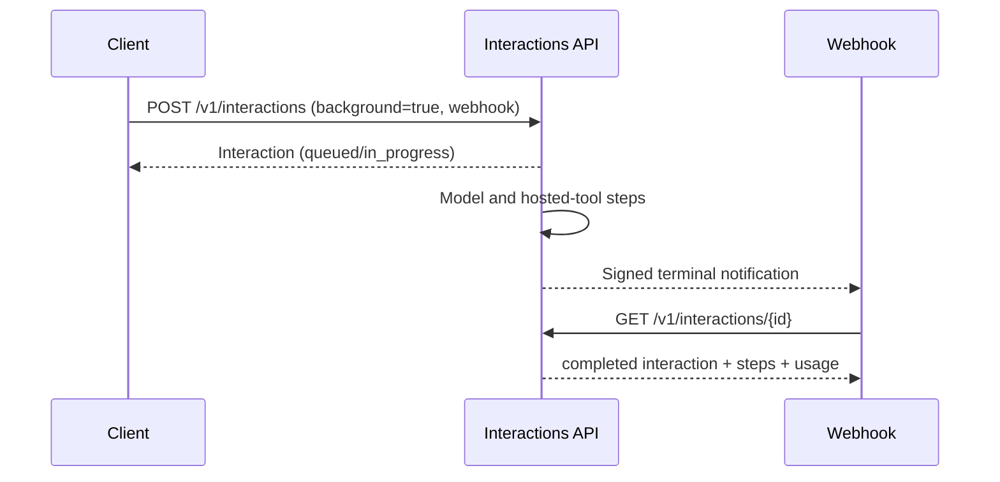
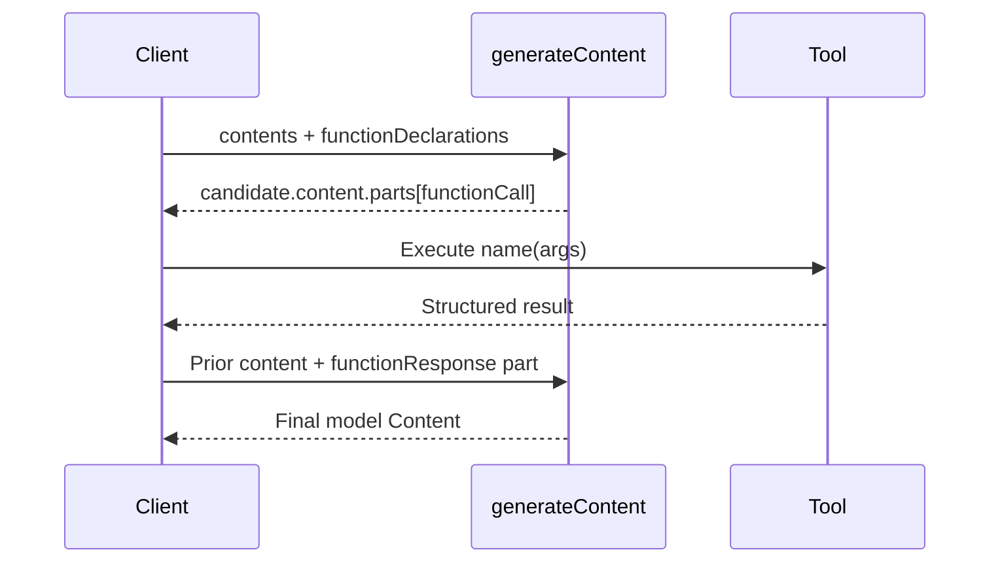
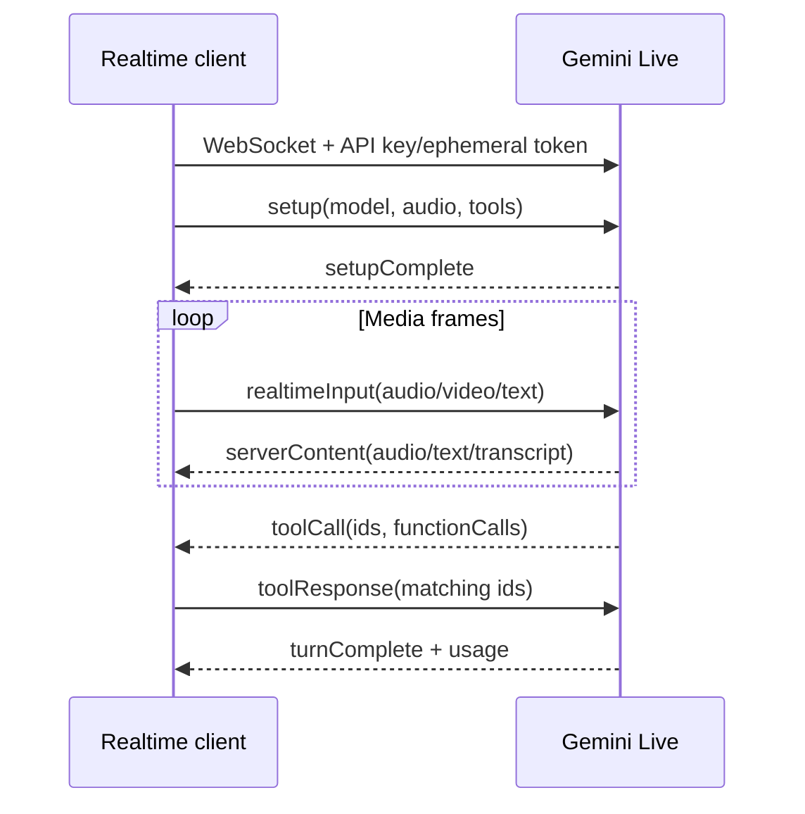

# Google Gemini Developer API

**Contract snapshot:** 2026-09-06  
**Base URL:** <code>https://generativelanguage.googleapis.com</code>  
**Preferred primitive:** Interactions for agentic state; GenerateContent for the
broadly supported model contract  
**Transport:** JSON/HTTPS, SSE, and WebSocket for Live

This file covers the API-key based Gemini Developer API. Vertex AI hosts many of
the same models with Google Cloud IAM, regional resource names, different
batch/cache resources, and additional prediction APIs; see
[Google Vertex AI](google-vertex-ai.md).

## Authentication and versions

Send <code>x-goog-api-key: GEMINI_API_KEY</code>. Some examples use the
equivalent <code>?key=...</code> query parameter; prefer the header so URLs and
logs do not carry credentials.

The stable surface is <code>v1</code>; newer or preview resources also appear
under <code>v1beta</code>. The Interactions API is available in both, while its
beta reference uses <code>/v1beta</code>. Live WebSocket is preview and uses a
<code>v1beta</code> service path. Keep API version per capability, not as one
global constant.

## Endpoint inventory

### Interactions and managed agent resources

| Method and path                                              | Purpose                                        |
| ------------------------------------------------------------ | ---------------------------------------------- |
| POST <code>/{version}/interactions</code>                    | Create/stream a model or agent interaction     |
| GET/DELETE <code>/{version}/interactions/{id}</code>         | Retrieve or delete stored interaction          |
| POST <code>/{version}/interactions/{id}/cancel</code>        | Cancel a background interaction                |
| CRUD subset <code>/{version}/agents</code>                   | Reusable agent definitions                     |
| CRUD subset <code>/{version}/environments</code>             | Managed execution environments and file reads  |
| CRUD subset <code>/{version}/triggers</code> plus executions | Scheduled/event-driven agent execution         |
| CRUD subset <code>/{version}/webhooks</code>                 | Completion delivery, ping, and secret rotation |

### Generative Language resources

| Resource/method        | REST path                                                                                               |
| ---------------------- | ------------------------------------------------------------------------------------------------------- |
| Generate               | POST <code>/v1beta/{model=models/*}:generateContent</code>                                              |
| Stream generate        | POST <code>/v1beta/{model=models/*}:streamGenerateContent</code> with <code>alt=sse</code>              |
| Count tokens           | POST <code>/v1beta/{model=models/*}:countTokens</code>                                                  |
| Embed / batch embed    | POST <code>:embedContent</code>, <code>:batchEmbedContents</code>, <code>:asyncBatchEmbedContent</code> |
| Async generation batch | POST <code>/v1beta/{batch.model=models/*}:batchGenerateContent</code>                                   |
| Generic prediction     | POST <code>:predict</code>, <code>:predictLongRunning</code>                                            |
| Models                 | GET <code>/v1beta/models</code>, <code>/v1beta/{name=models/*}</code>                                   |
| Cached content         | create/list/get/update/delete <code>/v1beta/cachedContents</code>                                       |
| Files                  | upload/register/list/get/delete under <code>/upload/v1beta/files</code> and <code>/v1beta/files</code>  |
| File search stores     | CRUD, documents, import/upload operations under <code>/v1beta/fileSearchStores</code>                   |
| Batch jobs             | get/list/update/cancel/delete under <code>/v1beta/batches</code>                                        |

Media models such as Imagen and Veo use model-specific <code>predict</code> or
long-running prediction schemas. Treat their instance/parameter/result bodies as
model-family contracts rather than forcing them into
<code>GenerateContentRequest</code>.

## Interactions API

Interactions is the server-stateful, agent-oriented primitive. A create request
contains:

| Field                                                            | Type                             | Notes                                                                                 |
| ---------------------------------------------------------------- | -------------------------------- | ------------------------------------------------------------------------------------- |
| <code>model</code>                                               | string \| model option           | Required for model interactions                                                       |
| <code>input</code>                                               | string \| <code>Content[]</code> | Required text/multimodal input                                                        |
| <code>system_instruction</code>                                  | string?                          | Model instruction                                                                     |
| <code>previous_interaction_id</code>                             | string?                          | Server-side continuation                                                              |
| <code>tools</code>                                               | <code>Tool[]</code>?             | Functions, search/maps, URL context, file search, code execution, MCP and other tools |
| <code>generation_config</code>                                   | object?                          | Token, sampling, thinking, speech/media configuration                                 |
| <code>response_format</code>                                     | object \| object[]?              | Per-modality response format and JSON schema                                          |
| <code>safety_settings</code>                                     | <code>SafetySetting[]</code>?    | Category thresholds                                                                   |
| <code>environment</code>                                         | string \| config?                | Existing or inline managed environment                                                |
| <code>background</code>, <code>stream</code>, <code>store</code> | boolean?                         | Execution/retention                                                                   |
| <code>labels</code>                                              | map&lt;string,string&gt;?        | Caller metadata                                                                       |
| <code>service_tier</code>, <code>webhook_config</code>           | object?                          | Scheduling and delivery                                                               |

An <code>Interaction</code> contains <code>id</code>, ISO-8601
<code>created</code>/<code>updated</code>, model/agent, status, ordered
<code>steps[]</code>, <code>usage</code>, and diagnostic <code>errors[]</code>.
Status is one of <code>queued</code>, <code>in_progress</code>,
<code>requires_action</code>, <code>completed</code>, <code>incomplete</code>,
<code>budget_exceeded</code>, <code>failed</code>, or <code>cancelled</code>.

Steps form an open tagged union:

- user input, model output, and thought;
- function call/result;
- Google Search, Maps, URL Context, file search, code execution, media
  processing;
- MCP call/result.

SSE events are discriminated by <code>event_type</code>: interaction
created/status/completed, step start/delta/stop, and error. Delta data is itself
typed for text, audio, image, video, thought signatures, function arguments, and
hosted-tool progress.

Verify webhook signatures, deduplicate deliveries by interaction/event identity,
and fetch authoritative state after notification.

## GenerateContent type system

### Request

<code>GenerateContentRequest</code> contains:

| Field                                        | Type                             |
| -------------------------------------------- | -------------------------------- |
| <code>contents</code>                        | <code>Content[]</code>, required |
| <code>systemInstruction</code>               | <code>Content?</code>            |
| <code>tools</code>                           | <code>Tool[]?</code>             |
| <code>toolConfig</code>                      | <code>ToolConfig?</code>         |
| <code>safetySettings</code>                  | <code>SafetySetting[]?</code>    |
| <code>generationConfig</code>                | <code>GenerationConfig?</code>   |
| <code>cachedContent</code>                   | resource name?                   |
| <code>serviceTier</code>, <code>store</code> | enum?, boolean?                  |

<code>Content</code> is <code>{role?: "user"|"model", parts: Part[]}</code>.
<code>Part</code> is an open union that includes text, inline/file data,
function call/response, executable code/code result, video metadata, thought
flags/signatures, and tool-specific content. Do not serialize tool results as
plain text when a <code>functionResponse</code> part is available.

<code>GenerationConfig</code> includes candidate count, stop sequences, max
output tokens, temperature/top-p/top-k, penalties, seed, logprobs, response MIME
type/schema/JSON schema, response modalities, speech/image/media resolution,
thinking config, routing, and model-specific options. Capability-gate every
field.

### Response

<code>GenerateContentResponse</code> contains <code>candidates[]</code>,
<code>promptFeedback?</code>, <code>usageMetadata?</code>,
<code>modelVersion?</code>, and <code>responseId?</code>. A candidate contains
content, finish reason/message, safety ratings, citation/grounding metadata,
token logprobs, and index.

Usage includes prompt, candidate, total, cached-content, thoughts, and tool-use
token counts with per-modality detail arrays. Preserve all counters.

SSE streaming repeats partial <code>GenerateContentResponse</code> objects. The
API does not provide OpenAI-style text-delta events; merge candidates and parts
by index while retaining safety and usage updates.

## Function call loop

Tool schemas use a Google/OpenAPI-compatible schema vocabulary. Tool choice
modes include automatic, any/forced, none, and validated variants depending on
API/model. Preserve thought signatures when supplied; some reasoning/tool flows
require them on later turns.

## Embeddings

Embedding is a separate model operation with three execution modes:

| Operation          | REST method                                                             | Semantics                             |
| ------------------ | ----------------------------------------------------------------------- | ------------------------------------- |
| Single             | POST <code>/v1beta/{model=models/*}:embedContent</code>                 | One embedding request                 |
| Synchronous batch  | POST <code>/v1beta/{model=models/*}:batchEmbedContents</code>           | Multiple requests in one HTTP call    |
| Asynchronous batch | POST <code>/v1beta/{batch.model=models/*}:asyncBatchEmbedContent</code> | Long-running batch resource/operation |

<code>EmbedContentRequest</code> carries required <code>content</code> plus
<code>embedContentConfig</code>. Current configuration fields include:

| Field                             | Type                   | Meaning                                              |
| --------------------------------- | ---------------------- | ---------------------------------------------------- |
| <code>taskType</code>             | <code>TaskType?</code> | Intended semantic operation                          |
| <code>title</code>                | string?                | Retrieval-document title; invalid for other purposes |
| <code>autoTruncate</code>         | boolean?               | Silently truncate overlength input when enabled      |
| <code>outputDimensionality</code> | integer?               | Reduced output dimension for supported models        |
| <code>documentOcr</code>          | boolean?               | Enable document OCR for supported multimodal models  |
| <code>audioTrackExtraction</code> | boolean?               | Extract video audio for supported models             |

Task types are <code>RETRIEVAL_QUERY</code>, <code>RETRIEVAL_DOCUMENT</code>,
<code>SEMANTIC_SIMILARITY</code>, <code>CLASSIFICATION</code>,
<code>CLUSTERING</code>, <code>QUESTION_ANSWERING</code>,
<code>FACT_VERIFICATION</code>, <code>CODE_RETRIEVAL_QUERY</code>, and an
unspecified/future value. Task type changes the vector transformation; store it
with every embedding. Use matching retrieval-query and retrieval-document
purposes.

The single response contains
<code>embedding:{values:number[],shape?:integer[]}</code> and
<code>usageMetadata</code>. Synchronous batch returns <code>embeddings[]</code>
in request order plus usage. Every nested request in
<code>batchEmbedContents</code> must name the same model as the path-level batch
model.

Asynchronous embedding batches accept an inline request set or file-backed
input, preserve per-request metadata, and return an operation. The terminal
batch output is either an ordered responses file or ordered inline responses;
each item contains exactly one response or <code>google.rpc.Status</code> error.
Poll the batch resource rather than treating operation creation as completion.

The Gemini Developer API has no generic query-plus-candidate rerank endpoint.
File Search is managed retrieval and must not advertise <code>IReranker</code>.

## Live API

Connect to:

<code>wss://generativelanguage.googleapis.com/ws/google.ai.generativelanguage.v1beta.GenerativeService.BidiGenerateContent</code>

Authentication is an API key query parameter or a short-lived constrained token.
The first and only first client message is <code>setup</code>; wait for
<code>setupComplete</code>.

Client messages are a one-of union: <code>setup</code>,
<code>clientContent</code>, <code>realtimeInput</code>, or
<code>toolResponse</code>. Server messages are a one-of union:
<code>setupComplete</code>, <code>serverContent</code>, <code>toolCall</code>,
<code>toolCallCancellation</code>, <code>goAway</code>, or
<code>sessionResumptionUpdate</code>, plus usage.

Handle interruption and tool-call cancellation as real state transitions. A
cancelled call may already have caused a side effect; the client owns
compensation.

## Files, caches, and batches

- File upload uses Google's resumable upload protocol and returns a
  <code>File</code> with name, URI, MIME type, size, timestamps, state, hashes,
  and errors. Poll processing state before inference.
- Cached content is a named resource with model, contents, system instruction,
  tools, token count, and TTL/expiry. Its immutable fields require recreation.
- Batch generation accepts inline requests for smaller jobs or a JSONL input
  file for large jobs. Creation is not idempotent. Output is ordered for
  inline/file response sets, but inspect per-item status and aggregate
  <code>BatchStats</code>.
- File-search operations are long-running; model operation resources explicitly
  rather than blocking an HTTP request.

## Errors and adapter notes

Google APIs use <code>google.rpc.Status</code>-style errors: numeric code,
message, and typed <code>details[]</code>. Retry resource exhaustion/429 and
transient 5xx with jitter. Safety blocks can be successful HTTP responses with
no usable candidate, so map prompt feedback and candidate finish reasons
separately from transport errors.

1. Choose Interactions versus GenerateContent explicitly; their state and output
   structures differ.
2. Use <code>role:"model"</code>, not <code>assistant</code>, on native Content.
3. Preserve ordered parts, safety metadata, thought signatures, and unknown
   union members.
4. Keep Live session events separate from unary Content parts.
5. Never assume <code>v1beta</code> types are wire-compatible with
   <code>v1</code>.
6. Keep embedding task type, output dimension, truncation, and resolved model in
   the vector-space identity.

## First-party sources

- [Gemini API reference](https://ai.google.dev/api)
- [Interactions API and OpenAPI description](https://ai.google.dev/api/interactions-api)
- [GenerateContent reference](https://ai.google.dev/api/generate-content)
- [All REST methods](https://ai.google.dev/api/all-methods)
- [Live WebSocket reference](https://ai.google.dev/api/live)
- [Files API](https://ai.google.dev/api/files)
- [Batch API](https://ai.google.dev/api/batch-api)
- [Embeddings API](https://ai.google.dev/api/embeddings)
