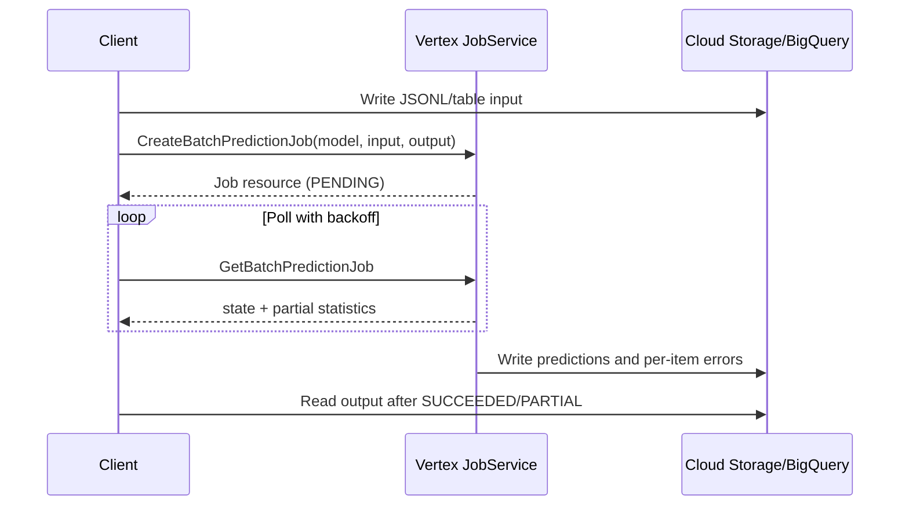
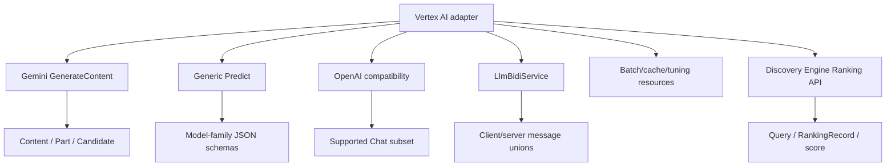

# Google Cloud Vertex AI generative APIs

**Contract snapshot:** 2026-09-06  
**Regional base URL:**
<code>https://{location}-aiplatform.googleapis.com</code>  
**Preferred primitive:** native <code>generateContent</code>  
**Transport:** REST JSON/SSE, gRPC server/bidirectional streams

Vertex AI is a platform, not one model protocol. It exposes Gemini-native
generation, generic prediction for Google media/embedding and third-party
models, an OpenAI compatibility layer, batch jobs, context caches, tuning, and
low-latency bidirectional sessions.

## Authentication and routing

Use OAuth 2.0/Google Application Default Credentials:

<code>Authorization: Bearer ACCESS_TOKEN</code>

The principal needs the relevant <code>aiplatform.*</code> IAM permissions.
Requests are regional unless a documented global endpoint is used. A publisher
model resource is:

<code>projects/{project}/locations/{location}/publishers/{publisher}/models/{model}</code>

A deployed/custom model may instead use:

<code>projects/{project}/locations/{location}/endpoints/{endpoint}</code>

Do not treat model IDs, publisher resources, endpoint IDs, tuned model
resources, and inference-profile-like routing resources as interchangeable
strings in the public API.

## Online inference endpoints

| Method                             | REST form                                                    | Use                                            |
| ---------------------------------- | ------------------------------------------------------------ | ---------------------------------------------- |
| <code>generateContent</code>       | POST <code>/v1/{publisherModel}:generateContent</code>       | Gemini multimodal unary generation             |
| <code>streamGenerateContent</code> | POST <code>/v1/{publisherModel}:streamGenerateContent</code> | Gemini server streaming                        |
| <code>countTokens</code>           | POST <code>/v1/{publisherModel}:countTokens</code>           | Token count                                    |
| <code>computeTokens</code>         | POST/RPC on model/endpoint                                   | Token IDs/details where supported              |
| <code>embedContent</code>          | model method, availability varies                            | Multimodal embeddings                          |
| <code>predict</code>               | POST <code>/v1/{modelOrEndpoint}:predict</code>              | Embeddings, Imagen, Veo, partner/custom models |
| <code>predictLongRunning</code>    | POST <code>/v1/{model}:predictLongRunning</code>             | Async media/model prediction                   |
| <code>rawPredict</code>            | POST <code>/v1/{endpoint}:rawPredict</code>                  | Arbitrary model-native payload                 |
| streaming predict methods          | gRPC/REST methods                                            | Server-streamed arbitrary prediction           |
| <code>BidiGenerateContent</code>   | <code>LlmBidiService</code> bidi RPC                         | Low-latency text/audio/video sessions          |

<code>v1beta1</code> exposes additional or earlier methods such as
<code>streamRawPredict</code> and <code>fetchPredictOperation</code>. Use the
exact discovery/RPC schema for the selected version.

## GenerateContent contract

Vertex's <code>GenerateContentRequest</code>, <code>Content</code>,
<code>Part</code>, tools, safety settings, generation config, candidate, and
usage types closely follow the Gemini native model described in
[Google Gemini](google-gemini.md). The important platform differences are
resource-qualified model names, OAuth/IAM, regional endpoints, Cloud Storage
URIs, Vertex-specific grounding/routing fields, Model Armor, and release
cadence.

Request fields:

<code>{model?, contents[], systemInstruction?, cachedContent?, tools[]?,
toolConfig?, safetySettings[]?, generationConfig?, labels?}</code>

<code>Content.parts[]</code> is an open union including text, inline bytes,
Cloud Storage/file data, function calls/results, executable code/results, video
metadata, and thought signatures.

Response fields:

<code>{candidates[], promptFeedback?, usageMetadata?, modelVersion?,
responseId?}</code>

Vertex finish/block reasons include safety, blocklist, prohibited content, Model
Armor, jailbreak, image safety, max tokens, malformed function calls, and other
model-specific values. A 200 with blocked prompt or empty candidates is not a
successful semantic completion.

## Generic Predict contract

<code>POST /v1/{endpoint}:predict</code> accepts:

| Field                   | Type                      | Notes                                                    |
| ----------------------- | ------------------------- | -------------------------------------------------------- |
| <code>instances</code>  | JSON value[]              | Required; each element follows the selected model family |
| <code>parameters</code> | JSON value?               | Model-specific                                           |
| <code>labels</code>     | map&lt;string,string&gt;? | Supported only by documented models                      |

The response contains model-dependent <code>predictions[]</code>,
deployment/model metadata, and optional explanations. Schema families include
text/multimodal embedding, image generation/editing/virtual try-on/reasoning,
and video generation.

For text embeddings, an instance commonly carries content, task type, title, and
auto-truncate behavior. A prediction contains
<code>embeddings.values:number[]</code> plus statistics such as token count and
truncation. Do not silently normalize away <code>truncated</code>.

## Embedding and Ranking API contracts

Embedding and ranking remain independent
[semantic-operation capabilities](semantic-operations.md), including when they
use different Google services and identities.

Vertex text and multimodal embeddings use model-family <code>:predict</code>
schemas. For current text-embedding families, each instance can carry
<code>content</code>, <code>task_type</code>, optional document
<code>title</code>, and <code>autoTruncate</code>; parameters can request
<code>outputDimensionality</code>. Results contain vectors and per-instance
statistics such as token count and whether truncation occurred.

Use matching purpose pairs such as retrieval query versus retrieval document.
Project, location, publisher/model resource, model version, task type,
dimensions, normalization, and truncation policy form the stored embedding-space
identity.

Google's standalone reranker is the Vertex AI Search/Agent Search Ranking API in
the <code>discoveryengine.googleapis.com</code> service, not a
<code>aiplatform.googleapis.com</code> generative-model method:

<code>POST
/v1/{rankingConfig=projects/_/locations/_/rankingConfigs/*}:rank</code>

<code>RankRequest =
{model?,topN?,query,records,userLabels?,ignoreRecordDetailsInResponse?}</code>

| Field                                      | Type                                | Notes                                                |
| ------------------------------------------ | ----------------------------------- | ---------------------------------------------------- |
| <code>query</code>                         | string                              | Query used to rank the supplied records              |
| <code>records</code>                       | <code>{id,title?,content?}[]</code> | Required; every record needs title, content, or both |
| <code>model</code>                         | string?                             | Semantic-ranker version or moving latest alias       |
| <code>topN</code>                          | integer?                            | Returned count; all records are still ranked         |
| <code>ignoreRecordDetailsInResponse</code> | boolean?                            | Return IDs/scores without title/content              |
| <code>userLabels</code>                    | map&lt;string,string&gt;?           | Google Cloud resource labels                         |

The response is <code>{records:[{id,title?,content?,score}]}</code>, sorted by
descending score. Scores are rounded and model-local. Preserve the caller's
<code>id</code>; do not correlate by response position because the operation
intentionally reorders records. Current documentation allows up to 200 records
and truncates record text beyond the selected model's token limit, so record the
exact ranker version and preprocessing policy in evaluations.

This API requires Discovery Engine OAuth scopes/IAM, including
<code>discoveryengine.rankingConfigs.rank</code>. Implement it as an optional
rerank adapter with its own endpoint, credentials/capability checks, quotas, and
error mapping.

## OpenAI-compatible endpoint

Compatibility is a distinct
[API-family capability profile](../concepts/model-providers-and-capabilities.md),
not evidence that every OpenAI field is supported.

Vertex exposes Chat Completions compatibility at a resource-qualified endpoint
such as:

<code>https://{location}-aiplatform.googleapis.com/v1/projects/{project}/locations/{location}/endpoints/openapi/chat/completions</code>

Google recommends the Gen AI SDK for new native integrations. Compatibility
supports a documented subset of OpenAI messages, tools, multimodal inputs, and
tool choice. Unsupported parameters can be ignored instead of rejected.
Gemini-specific options belong under
<code>extra_body</code>/<code>extra_content</code>, including safety, cached
content, thinking config, and thought markers.

That silent-ignore behavior is dangerous: an adapter must expose a
supported-field manifest and should reject caller features it knows Vertex will
discard.

## Context cache, batch, and tuning resources

| Resource                                            | Main operations                               |
| --------------------------------------------------- | --------------------------------------------- |
| <code>projects.locations.cachedContents</code>      | create, get, list, update expiry/TTL, delete  |
| <code>projects.locations.batchPredictionJobs</code> | create, get, list, cancel, delete             |
| <code>projects.locations.tuningJobs</code>          | create, get, list, cancel, rebase tuned model |
| long-running operations                             | get/cancel/delete/wait depending on service   |

A <code>CachedContent</code> records model, contents, system instruction, tools,
create/update/expire timestamps, usage metadata, and TTL. Generation references
its full resource name.

Batch prediction reads JSONL from Cloud Storage or BigQuery and writes
results/errors to configured output. Job state—not the HTTP response—determines
success.

## Bidirectional Live protocol

Live events map into the
[AgentKit streaming contract](../concepts/streaming-and-event-protocol.md) while
remaining separate from unary GenerateContent parts.

<code>LlmBidiService.BidiGenerateContent</code> is a bidirectional streaming
RPC. Client messages form a one-of setup, incremental client content, realtime
media input, playback/activity signals, and tool responses. Server messages form
a one-of setup completion, generated content, tool calls/cancellations, usage,
session resumption, and go-away signals.

Use official SDKs unless implementing gRPC framing, flow control, OAuth refresh,
reconnect, and session resumption is itself a product requirement.

## Errors, quota, and observability

REST and gRPC failures map through the
[stable AgentKit error taxonomy](../concepts/error-taxonomy.md) without
discarding Google status details or operation identity.

REST errors use <code>google.rpc.Status</code>; gRPC uses canonical status codes
and typed details. Retry <code>RESOURCE_EXHAUSTED</code>/429 only after the
documented delay, plus <code>UNAVAILABLE</code>, selected <code>ABORTED</code>,
and transport failures when idempotent. Never retry an LRO creation without
deduplication.

Capture Google request/trace headers, publisher model resource, resolved model
version, location, endpoint/deployed-model identifiers, token usage by modality,
safety/grounding metadata, and job operation names.

## Logical adapter split

These must be separate transports behind shared capabilities. A single “Vertex
request DTO” will become a bag of mutually invalid fields.

## Adapter notes

1. Include project, location, publisher, and resource kind in model routing.
2. Use native GenerateContent for full Gemini semantics.
3. Preserve arbitrary JSON for Predict, but bind known model-family schemas for
   validation.
4. Detect blocked/safety responses even on HTTP 200.
5. Never rely on OpenAI-compatible unknown fields being rejected.
6. Model long-running operations and jobs explicitly.
7. Keep generative Vertex AI and Discovery Engine ranking service identities
   separate.

## First-party sources

- [Vertex publisher model REST resource](https://cloud.google.com/vertex-ai/generative-ai/docs/reference/rest/v1beta1/projects.locations.publishers.models)
- [GenerateContent response schema](https://cloud.google.com/vertex-ai/generative-ai/docs/reference/rest/v1/GenerateContentResponse)
- [Generic Predict method](https://cloud.google.com/vertex-ai/generative-ai/docs/reference/rest/v1/projects.locations.endpoints/predict)
- [OpenAI library compatibility](https://cloud.google.com/vertex-ai/generative-ai/docs/multimodal/call-vertex-using-openai-library)
- [Vertex GenAI RPC services](https://cloud.google.com/vertex-ai/generative-ai/docs/reference/rpc)
- [Text embeddings](https://cloud.google.com/vertex-ai/generative-ai/docs/embeddings/get-text-embeddings)
- [Ranking API method](https://cloud.google.com/generative-ai-app-builder/docs/reference/rest/v1/projects.locations.rankingConfigs/rank)
- [Ranking and RAG guide](https://cloud.google.com/generative-ai-app-builder/docs/ranking)
