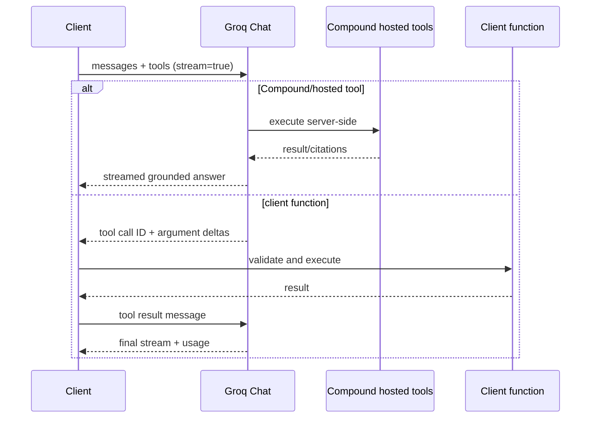
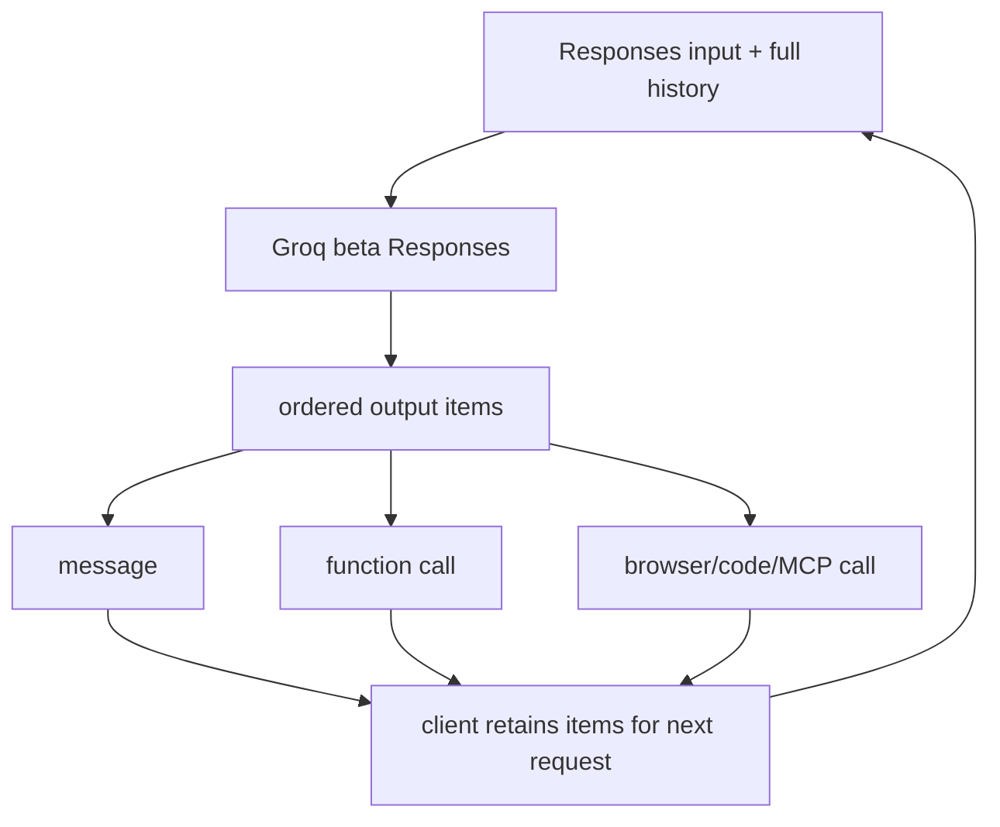
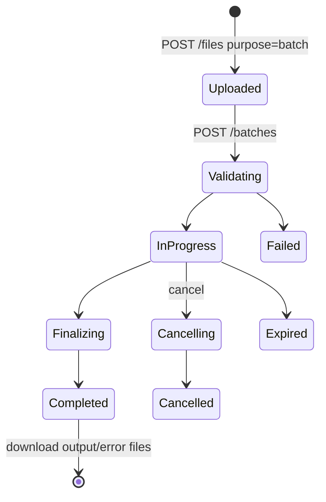

# Groq API

**Contract snapshot:** 2026-09-06  
**OpenAI-compatible base URL:** <code>https://api.groq.com/openai/v1</code>  
**Preferred primitive:** Chat Completions; Responses remains beta  
**Transport:** JSON/HTTPS, SSE, multipart, and binary audio

Groq provides low-latency OpenAI-shaped Chat, beta Responses, speech, models,
files, batches, and closed-beta fine-tuning. Groq Compound adds server-side
tools and orchestration through fields that are not part of OpenAI's contract.

## Authentication and endpoint inventory

Send <code>Authorization: Bearer GROQ_API_KEY</code>. Use the exact base above
for OpenAI clients.

| Family                  | Principal path                                                      |
| ----------------------- | ------------------------------------------------------------------- |
| Chat                    | POST <code>/openai/v1/chat/completions</code>                       |
| Responses beta          | POST <code>/openai/v1/responses</code>                              |
| Transcription           | POST <code>/openai/v1/audio/transcriptions</code>                   |
| Translation             | POST <code>/openai/v1/audio/translations</code>                     |
| Speech                  | POST <code>/openai/v1/audio/speech</code>                           |
| Models                  | GET <code>/openai/v1/models</code>, <code>/models/{id}</code>       |
| Batch                   | create/list/get/cancel under <code>/openai/v1/batches</code>        |
| Files                   | upload/list/get/delete/download under <code>/openai/v1/files</code> |
| Fine-tuning closed beta | list/create/get/delete under <code>/v1/fine_tunings</code>          |

Fine-tuning notably does not use the <code>/openai</code> prefix in the current
reference. Keep it as a separately composed resource path.

## Chat Completions request

The core request is <code>{model,messages,...}</code> with stream, tools/tool
choice, structured output, reasoning controls, token/sampling fields, stops,
logprobs, and service-tier options subject to the selected model.

Messages use System/User/Assistant/Tool roles. Content can be string or typed
text/image parts for eligible vision models. Assistant messages contain
content/reasoning/tool calls; Tool messages must match
<code>tool_call_id</code>.

### Groq extensions

| Field                                                                                      | Meaning                                                      |
| ------------------------------------------------------------------------------------------ | ------------------------------------------------------------ |
| <code>citation_options</code>                                                              | Enable/disable citations for retrieved/search-backed answers |
| <code>compound_custom</code>                                                               | Configure Compound model/tool orchestration                  |
| <code>disable_tool_validation</code>                                                       | Permit tool calls without normal requested-tool validation   |
| <code>documents</code>, search/tool settings                                               | Grounding and hosted tool configuration where supported      |
| <code>include_reasoning</code>/<code>reasoning_format</code>/<code>reasoning_effort</code> | Model-specific reasoning controls                            |

<code>disable_tool_validation</code> is a trust boundary. When enabled, the
model can return a tool name outside the submitted definitions on supported
systems. Dispatch through an explicit allowlist anyway; never reflectively
invoke by name.

Several OpenAI parameters are unsupported or constrained. For example, multiple
choices are generally not available (<code>n</code> must be one where accepted),
and fields can be rejected depending on the model. Maintain per-model capability
metadata instead of deleting fields after an error.

## Chat response and SSE

SSE deltas enter the
[typed streaming contract](../concepts/streaming-and-event-protocol.md), which
keeps text, reasoning, and tool arguments correlated until terminal validation.

The response follows <code>{id,object,created,model,choices[],usage}</code>. A
choice contains index, assistant message, and finish reason. Tool calls contain
stable IDs, type, function name, and JSON argument text.

Groq extensions appear in <code>x_groq</code> and usage detail. Preserve:

- request/provider IDs;
- queue, prompt, completion, and total timing when returned;
- cached/reasoning token breakdowns;
- citations, executed-tool metadata, and Compound details.

Streaming uses SSE Chat chunks and <code>[DONE]</code>. Choice deltas can carry
role, text, reasoning, and tool-call argument fragments. The usage-bearing final
chunk may have no choices.

## Responses beta

Responses output maps to the
[ordered message and content model](../concepts/message-and-content-model.md),
not a single projected string.

POST <code>/responses</code> supports text and eligible image inputs, function
calling, reasoning, structured outputs, SSE, and selected hosted tools such as
browser search, code interpreter, and remote MCP for eligible models.

The response uses ordered items: reasoning, assistant messages, function calls,
and built-in-tool calls/results. Preserve unknown items and construct
<code>output_text</code> only as a projection.

Despite some high-level compatibility wording, current beta does not support
stateful conversations. The documented unsupported set includes:

- <code>previous_response_id</code> and <code>store</code>;
- <code>truncation</code> and <code>include</code>;
- <code>safety_identifier</code> and <code>prompt_cache_key</code>;
- reusable <code>prompt</code> references.

Resend the required history in <code>input</code>. Capability-gate hosted tools
by model; the existence of a tool type in the API does not mean every model can
run it.

## Audio contracts

### Transcription

Multipart transcription accepts required model and either uploaded
<code>file</code> or supported <code>url</code>, plus language, prompt, response
format, temperature, and timestamp granularities. Batch requests require URL
input because multipart file bodies are not embedded in JSONL.

Response format can be JSON, text, or verbose JSON. Verbose results include
segment/word timestamps when requested. Preserve <code>x_groq</code> metadata.

### Translation

Translation has the same file-or-URL transport shape but produces English text.
Prompt should be English. JSON/text/verbose JSON formats and timestamps depend
on the selected model.

### Speech

Speech accepts text, model, voice, format, sample rate, and speed. It returns
audio bytes, despite JSON-oriented SDK wrappers. Preserve content type and
requested encoding; do not attempt JSON parsing.

## Batch and files

Upload JSONL with purpose <code>batch</code>, then create a batch with
<code>input_file_id</code>, endpoint, and a completion window. Files also
represent <code>batch_output</code> and error/results payloads.

The current Batch guide supports:

- <code>/v1/chat/completions</code>;
- <code>/v1/audio/transcriptions</code>;
- <code>/v1/audio/translations</code>.

Some generated API-reference schemas still enumerate only Chat as the batch
endpoint. Treat the Batch guide and actual eligible model as authoritative, and
fail capability checks before upload rather than relying on schema coincidence.

Every JSONL record is <code>{custom_id,method:"POST",url,body}</code>. Mixed
endpoint records are documented. For audio records, provide URL fields, not
local multipart file data.

Correlate records by <code>custom_id</code>. Batch status and request counts are
distinct from individual result status.

## Models and fine-tuning

Model discovery returns IDs, owner, active status, context window, and maximum
completion tokens where available. Use it for eligibility, but retain a separate
capability map for vision, reasoning, tools, structured output, batch, and
audio.

Fine-tuning is closed beta. Its resource identifies base model, input file,
tuning type, name, status/result model, and timestamps/events where exposed. Do
not expose the feature merely because SDK types exist; require entitlement
discovery.

## Errors, limits, and adapter rules

Groq failures map through the
[AgentKit error taxonomy](../concepts/error-taxonomy.md) while retaining
<code>x_groq</code>, request, rate-limit, and timing diagnostics.

Errors use an OpenAI-like error envelope and may include <code>x_groq</code>
diagnostics. Preserve status, code, message, parameter, request ID, and
rate-limit/timing headers.

- Retry 429 and transient 5xx with jitter and provider delay/reset headers.
- Groq can use 400/422 for unsupported model-field combinations; change the
  request rather than retry unchanged.
- Tool-use failures may be returned as validation errors with generated call
  details; never execute unvalidated arguments from an error body.
- Do not duplicate batch/file/fine-tuning creation without idempotency and
  persisted IDs.
- Keep reasoning and citations separate from answer text.

## Coding-harness interoperability

The
[provider-specific compatibility requirements](../profiles/coding-harness/provider-interoperability.md#provider-specific-compatibility-requirements)
define the route, history-repair, streaming, and compatibility details required
by a long-running coding loop. They do not override the public contract verified
below.

## First-party sources

- [Groq API reference](https://console.groq.com/docs/api-reference)
- [Groq Responses API](https://console.groq.com/docs/responses-api)
- [Groq tool use](https://console.groq.com/docs/tool-use)
- [Groq structured outputs](https://console.groq.com/docs/structured-outputs)
- [Groq Batch API](https://console.groq.com/docs/batch)
- [Groq data controls](https://console.groq.com/docs/your-data)
