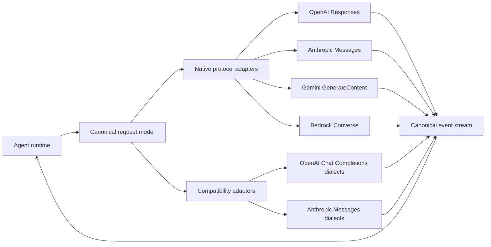
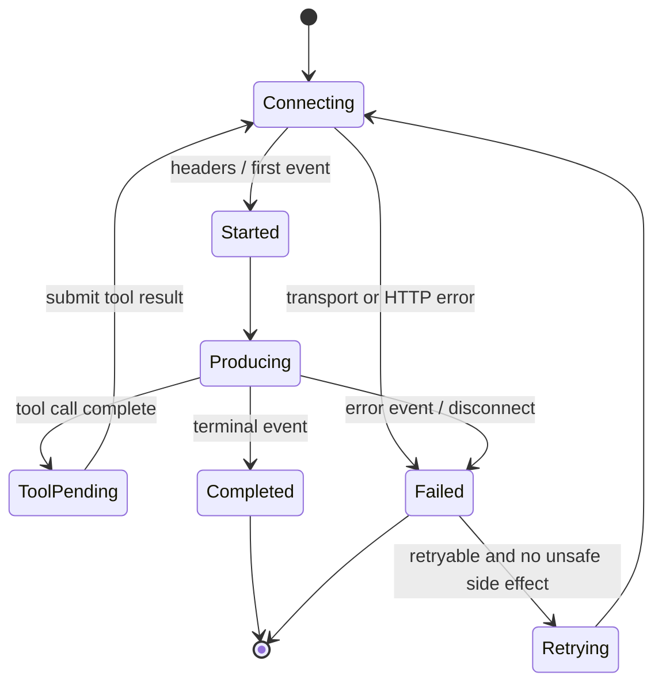

# LLM provider API contracts

This index is the protocol map for provider adapters in AgentKit. It documents
wire contracts, not marketing model lists. Model IDs, prices, quotas, and
feature availability drift too quickly to hard-code here; query each provider's
model-discovery API and capability metadata at runtime.

The [provider architecture](../architecture/06-model-and-embedding-providers.md)
defines how this research maps into AgentKit.Providers,
AgentKit.Providers.OpenAICompatible, and concrete provider packages. Researching
an API does not by itself commit the project to shipping its adapter.

**Last full verification:** 2026-09-06

## Scope and completeness

Each provider file covers the public APIs needed by an agent runtime:

- synchronous, streaming, background, batch, and realtime inference;
- messages, multimodal content, reasoning, tool calls, and structured output;
- embeddings, reranking, media generation, files, caches, and model discovery
  where offered;
- authentication, versioning, pagination, errors, retry behavior, and usage
  accounting;
- provider-specific agent/session resources when they materially replace
  client-side orchestration.

Organization administration, billing consoles, deployment provisioning, and
generic cloud control-plane APIs are out of scope unless they change the
inference contract. “All APIs” below therefore means all documented
model-runtime and directly supporting data-plane APIs, not every endpoint owned
by the vendor.

Type tables use these conventions:

- <code>T?</code>: nullable or optional;
- <code>T[]</code>: ordered array;
- <code>map&lt;string,T&gt;</code>: JSON object with dynamic string keys;
- <code>A | B</code>: tagged or structural union;
- <code>bytes</code>: binary body or base64, depending on the field;
- enum members are case-sensitive on the wire.

The cross-provider
[embedding, rerank, and retrieval contracts](semantic-operations.md) define the
canonical semantic-operation types, embedding-space identity, score semantics,
RAG timing, and conformance rules. Read that file before implementing any vector
or ranking adapter.

## Provider index

| Provider                                  | Preferred new-work primitive                  |              Native stream |                    Realtime |                         Tools |            Structured output |            Batch |                 Files/cache |             Embeddings |                     Rerank |
| ----------------------------------------- | --------------------------------------------- | -------------------------: | --------------------------: | ----------------------------: | ---------------------------: | ---------------: | --------------------------: | ---------------------: | -------------------------: |
| [OpenAI](openai.md)                       | Responses                                     |                        SSE |        WebRTC/WebSocket/SIP |     Yes, including hosted/MCP |                  JSON Schema |              Yes |                     Yes/yes |                    Yes |        No generic endpoint |
| [OpenRouter](openrouter.md)               | Chat Completions or Responses                 |                        SSE |           No native session | Yes, including hosted/plugins |                  JSON Schema |             Beta |                     Yes/yes |                    Yes |                        Yes |
| [Anthropic Claude](anthropic.md)          | Messages                                      |                        SSE |     No native audio session |                           Yes | Tool schemas / output config |              Yes |   Beta files/cache controls |                     No |                         No |
| [Google Gemini API](google-gemini.md)     | Interactions; GenerateContent for portability |                        SSE |                   WebSocket |         Yes, including hosted |                  JSON Schema |              Yes |                     Yes/yes |                    Yes |                         No |
| [Google Vertex AI](google-vertex-ai.md)   | GenerateContent                               |                   SSE/gRPC | Bidi gRPC/WebSocket via SDK |                           Yes |               OpenAPI subset |              Yes | Cloud Storage/context cache |                    Yes |       Separate Ranking API |
| [Amazon Bedrock](aws-bedrock.md)          | Converse                                      |           AWS event stream |  Bidirectional model stream |                           Yes |  JSON schema where supported |     Async invoke |     URI content/model cache |         Model-specific |          Agent Runtime API |
| [Azure OpenAI / Foundry](azure-openai.md) | OpenAI v1 Responses                           |                        SSE |            WebRTC/WebSocket |                           Yes |                  JSON Schema |              Yes |                     Yes/yes |                    Yes |   No Azure OpenAI endpoint |
| [Microsoft Copilot](microsoft-copilot.md) | M365 Copilot Chat or Retrieval                |              SSE snapshots |                          No |       No caller tools in Chat |                           No |               No |          Managed M365 index |         No raw vectors | No caller-candidate rerank |
| [Z.ai](z-ai.md)                           | Chat Completions                              |                        SSE |                          No |           Yes + hosted search |                  JSON Schema |      Async media |                       Files |     No public endpoint |                         No |
| [Moonshot Kimi](moonshot-kimi.md)         | Responses or Chat Completions                 |                        SSE |                          No |            Yes + hosted tools |                  JSON Schema |              Yes |                 Files/cache |                     No |                         No |
| [Mistral AI](mistral-ai.md)               | Chat or Conversations                         |                        SSE |                          No |              Yes + connectors |                  JSON Schema |              Yes |             Files/libraries |                    Yes |                         No |
| [Cohere](cohere.md)                       | v2 Chat                                       |                        SSE |                          No |                           Yes |                  JSON Schema | No general batch |            Documents inline |                    Yes |                        Yes |
| [xAI](xai.md)                             | Responses                                     |                        SSE |      WebSocket/WebRTC voice |           Yes + hosted search |                  JSON Schema |              Yes |           Files/collections | Model/account-specific |                         No |
| [DeepSeek](deepseek.md)                   | Responses or Anthropic Messages               |                        SSE |                          No |                           Yes | JSON mode/schema by protocol |               No |      Automatic prompt cache |                     No |                         No |
| [Groq](groq.md)                           | Chat Completions; Responses is beta           |                        SSE |                          No |                Yes + Compound |    JSON object/schema subset |              Yes |                 Batch files |                     No |                         No |
| [Ollama](ollama.md)                       | Native Chat; Responses for portability        | NDJSON / SSE compatibility |                          No |                           Yes |                  JSON Schema |               No |           Local model store |                    Yes |                         No |

Blanket “OpenAI-compatible” is not a capability. It is a family resemblance.
Every adapter must declare the exact endpoint dialect and supported-field set.

## Structural model

The canonical layer should preserve, not flatten:

1. ordered content blocks and unknown tagged-union members;
2. provider request IDs, model IDs, finish reasons, safety results, and raw
   usage;
3. reasoning separately from user-visible text;
4. tool-call identity and partial argument deltas;
5. provider extensions in a namespaced JSON bag;
6. raw events for forward compatibility and diagnostics.

## Universal streaming lifecycle

Do not treat an HTTP 200 as completion. SSE, NDJSON, AWS event streams, and
bidirectional sessions can carry terminal errors after headers.

## Adapter invariants

- Use provider-generated tool-call IDs verbatim. Never derive identity from
  array position.
- Accumulate streamed text and JSON arguments by event semantics; chunks are not
  guaranteed to align with UTF-8 characters or JSON tokens.
- Keep client cancellation distinct from provider cancellation and model stop.
- Retry 408, 409 lock/contention cases, 429, and transient 5xx only when the
  operation is idempotent. Honor <code>Retry-After</code> and provider reset
  headers.
- Generate an idempotency key where supported. For non-idempotent batch, upload,
  tuning, and media jobs, persist the returned job ID before polling.
- Model unknown enum members as strings plus known constants. Providers add
  finish reasons and event kinds without major version changes.
- Store usage as provider-native counters and derive normalized totals
  separately; cached, reasoning, audio, image, search, and billable units are
  not interchangeable.
- Make data-retention options explicit. Stateful Responses, conversations,
  files, batches, and cloud logging have different lifetimes.

## Freshness policy

Every file ends with first-party sources. Before implementing an adapter,
recheck the endpoint reference and changelog. A verified date is evidence of
when the contract was checked, not a promise that a vendor froze it afterward.
