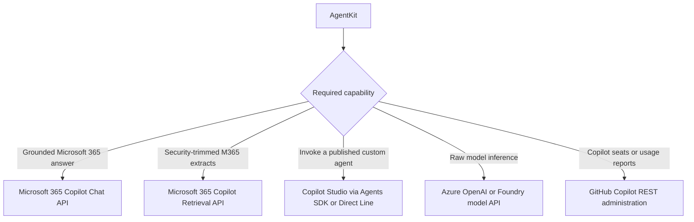
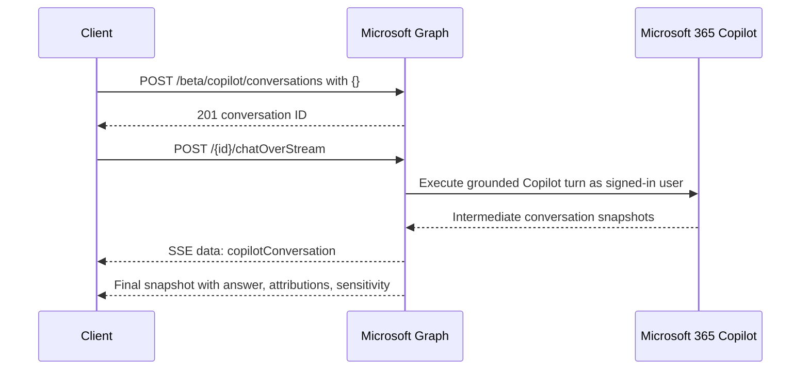
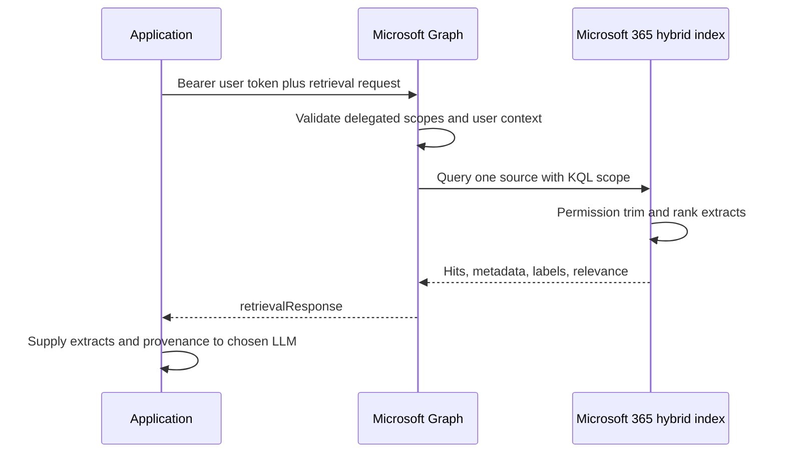

# Microsoft Copilot APIs

**Contract snapshot:** 2026-09-06  
**Primary base:** <code>https://graph.microsoft.com/{version}/copilot</code>  
**Primary surfaces:** Microsoft 365 Copilot Chat and Retrieval APIs  
**Transport:** JSON over HTTPS; SSE for streamed Chat

“Microsoft Copilot API” is not one model-provider endpoint. Microsoft 365
Copilot Chat, Microsoft 365 Copilot Retrieval, Copilot Studio agents, GitHub
Copilot administration, Azure OpenAI, and Microsoft Foundry have different
identities, protocols, licensing, permissions, and semantics.

This file treats Microsoft 365 Copilot Chat and Retrieval as the provider-facing
surfaces. It also records the Copilot Studio and GitHub Copilot boundaries so
adapters do not route model-generation requests into an administration or
bot-channel API.

## Product boundary

| Product surface                 | What it is                                              | What it is not                                                 |
| ------------------------------- | ------------------------------------------------------- | -------------------------------------------------------------- |
| Microsoft 365 Copilot Chat      | Managed, grounded, multi-turn answer synthesis          | A raw model endpoint with selectable decoding parameters/tools |
| Microsoft 365 Copilot Retrieval | Permission-trimmed retrieval from Microsoft 365 indexes | Embedding generation or caller-supplied-document reranking     |
| Copilot Studio                  | Published agent runtime/channel                         | A generic LLM protocol                                         |
| Azure OpenAI / Foundry          | Model inference APIs                                    | Microsoft 365 Copilot's work-data orchestration                |
| GitHub Copilot REST             | Seat, policy, metrics, and administrative APIs          | Public Chat Completions or embedding inference                 |

Azure model inference is specified separately in
[Azure OpenAI and Microsoft Foundry](azure-openai.md).

## Authentication, authorization, and versioning

Microsoft 365 Copilot APIs use Microsoft Graph authentication with Microsoft
Entra ID. Send an OAuth bearer token for the Graph audience. Permissions are
endpoint-specific and currently delegated: the signed-in user's identity is part
of the authorization decision and Microsoft 365 content is permission-trimmed to
that user.

The Retrieval API reference publishes both:

- <code>https://graph.microsoft.com/v1.0/copilot/retrieval</code>;
- <code>https://graph.microsoft.com/beta/copilot/retrieval</code>.

The Chat API is currently under <code>/beta</code>. Beta Graph contracts are
subject to change and are not supported for production use. Model version,
sampling parameters, and provider selection are not exposed: Microsoft operates
the Copilot stack behind the contract.

### Permission boundary

At the current snapshot:

- Retrieval uses delegated work/school identity. SharePoint and OneDrive require
  <code>Files.Read.All</code> plus <code>Sites.Read.All</code>; connector
  retrieval can require <code>ExternalItem.Read.All</code>. Application identity
  and personal Microsoft accounts are not supported.
- Chat uses delegated work/school identity and requires the documented Microsoft
  Graph read permissions for sites, mail, people, meeting transcripts, chats,
  channel messages, and external items. Application identity and personal
  accounts are not supported.

Ask for the least privileges applicable to the chosen API version and recheck
the live permissions table before deployment. Treat a user's Graph token as
user-bound security context, not a reusable provider API key.

## Microsoft 365 Copilot Chat API

### Endpoint inventory

| Operation              | Method and path                                                               | Result                                         |
| ---------------------- | ----------------------------------------------------------------------------- | ---------------------------------------------- |
| Create conversation    | POST <code>/beta/copilot/conversations</code>                                 | HTTP 201 plus <code>copilotConversation</code> |
| Continue synchronously | POST <code>/beta/copilot/conversations/{conversationId}/chat</code>           | HTTP 200 plus conversation snapshot            |
| Continue as stream     | POST <code>/beta/copilot/conversations/{conversationId}/chatOverStream</code> | HTTP 200 <code>text/event-stream</code>        |

Conversation creation takes an empty JSON object. The returned <code>id</code>
is required in subsequent paths.

### Chat request

Both continuation methods accept:

| Field                            | Type                                             | Required | Meaning                                                  |
| -------------------------------- | ------------------------------------------------ | -------: | -------------------------------------------------------- |
| <code>message</code>             | <code>{text:string}</code>                       |      Yes | User message                                             |
| <code>locationHint</code>        | <code>{timeZone:string,...}</code>               |      Yes | User location context; time zone is contract-significant |
| <code>additionalContext</code>   | <code>{text:string,description?:string}[]</code> |       No | Caller-supplied grounding excerpts                       |
| <code>contextualResources</code> | object                                           |       No | OneDrive/SharePoint file URIs and web-grounding control  |

<code>contextualResources.files[]</code> identifies OneDrive or SharePoint
resources by URI. <code>contextualResources.webContext.isWebEnabled</code>
controls web grounding for the current turn. Disabling web grounding is
turn-local; repeat the setting on every message where it must remain disabled.

The Chat API does not expose temperature, token budgets, model choice, function
tools, arbitrary system instructions, or output schema. Do not accept those
fields in an adapter and then discard them. Its documented output is textual,
though response messages can also include adaptive cards, attributions, and
sensitivity metadata.

### Conversation response types

<code>copilotConversation</code> is:

| Field                        | Type                                                                  | Semantics                                  |
| ---------------------------- | --------------------------------------------------------------------- | ------------------------------------------ |
| <code>id</code>              | string                                                                | Stable conversation identifier             |
| <code>createdDateTime</code> | DateTimeOffset                                                        | Creation time                              |
| <code>displayName</code>     | string                                                                | Service-provided display label             |
| <code>state</code>           | <code>active &#124; disengagedForRai &#124; unknownFutureValue</code> | Evolvable state                            |
| <code>turnCount</code>       | Int32                                                                 | Latest turn count                          |
| <code>messages</code>        | <code>copilotConversationResponseMessage[]</code>                     | Messages included in the returned snapshot |

Each response message includes <code>id</code>, <code>text</code>,
<code>createdDateTime</code>, raw <code>adaptiveCards[]</code>,
<code>attributions[]</code>, and <code>sensitivityLabel</code>. Preserve OData
discriminators and unknown fields. Attributions and sensitivity labels are part
of the answer's provenance and governance, not decorative metadata.

### Streaming contract

<code>chatOverStream</code> returns SSE where each <code>data</code> payload is
a <code>copilotConversation</code> snapshot/intermediate update. It is not
documented as OpenAI-style token deltas. Consumers should track
conversation/message IDs and replace or reconcile message snapshots rather than
blindly concatenating every <code>text</code> field.

Conversation <code>state=disengagedForRai</code> is a semantic terminal/policy
condition, not a retryable transport failure. The API's current limitations
include text-only answers, no action/content-generation skills, no code
interpreter or graphic-art tools, and no long-running tasks.

## Microsoft 365 Copilot Retrieval API

<code>POST /{version}/copilot/retrieval</code> retrieves relevant text extracts
from exactly one data source while enforcing the signed-in user's Microsoft 365
permissions, information barriers, and governance controls.

### Request

| Field                                | Type      | Constraints and semantics                                                                      |
| ------------------------------------ | --------- | ---------------------------------------------------------------------------------------------- |
| <code>queryString</code>             | string    | Required natural-language query, maximum 1,500 characters                                      |
| <code>dataSource</code>              | string    | Required: <code>sharePoint</code>, <code>oneDriveBusiness</code>, or <code>externalItem</code> |
| <code>dataSourceConfiguration</code> | object?   | Connector-specific configuration                                                               |
| <code>filterExpression</code>        | string?   | KQL scoping over supported/queryable fields                                                    |
| <code>resourceMetadata</code>        | string[]? | Retrievable metadata fields to echo                                                            |
| <code>maximumNumberOfResults</code>  | Int32?    | 1 to 25, default up to 25                                                                      |
| <code>includeThumbnails</code>       | boolean?  | Request page/thumbnails where available in the selected version                                |

Only one <code>dataSource</code> is allowed per request. If an application needs
multiple sources, issue separate calls and preserve source provenance before
combining results.

<code>filterExpression</code> uses KQL. Invalid syntax can execute without the
intended scope according to the reference, so validate filter construction and
never treat a malformed client-side authorization filter as a safe failure.
Security must still come from Graph's permission trimming.

### Response

<code>retrievalResponse = {retrievalHits: retrievalHit[]}</code>

Each <code>retrievalHit</code> contains:

| Field                         | Type                                                   | Meaning                                                                  |
| ----------------------------- | ------------------------------------------------------ | ------------------------------------------------------------------------ |
| <code>webUrl</code>           | string                                                 | Source item URL                                                          |
| <code>resourceType</code>     | evolvable enum                                         | Site, list, list item, external item, drive, drive item, or future value |
| <code>extracts</code>         | <code>{text:string,relevanceScore?:float,...}[]</code> | Grounding chunks                                                         |
| <code>resourceMetadata</code> | dynamic dictionary                                     | Requested retrievable fields                                             |
| <code>sensitivityLabel</code> | object                                                 | Source sensitivity information                                           |
| thumbnail/page fields         | version-specific objects?                              | Present only when requested and available                                |

An empty <code>retrievalHits</code> means no relevant results.
<code>relevanceScore</code> can be absent, especially for connector content.
When present, Microsoft documents it as cosine similarity between the query and
extract normalized to 0–1. Do not invent a zero for missing scores, and do not
compare these values with reranker scores from another provider.

This is a managed <code>IRetriever</code> contract. It does not return raw
embeddings and does not accept caller-supplied candidate documents, so it is
neither an embedding generator nor a reranker.

## Copilot Studio agent boundary

A published Copilot Studio agent can be invoked from web/native applications
through the Microsoft 365 Agents SDK Copilot Studio client. Direct Line is the
fallback when the SDK does not support the scenario.

Direct Line integration has its own lifecycle:

1. Call the agent-specific token endpoint copied from Copilot Studio.
2. Receive <code>{token,expires_in,conversationId}</code>.
3. Start/use a Direct Line conversation and post Bot Framework
   <code>Activity</code> objects.
4. Receive activities over WebSocket or poll them with a watermark.
5. Refresh the Direct Line token before expiry when required.

Activities can contain text, adaptive cards, events, attachments, handoff
signals, and channel data. This belongs behind an agent/channel adapter, not an
LLM completion adapter. Conversation IDs, watermarks, activity IDs, and token
lifetime all need separate state.

## GitHub Copilot boundary

GitHub's public Copilot REST endpoints manage and report Copilot: seats,
user/organization/enterprise usage, metrics reports, content-exclusion policy,
and cloud-agent repository policy. They do not expose GitHub Copilot as a public
Chat Completions, embedding, or rerank provider.

Use GitHub Models or another documented inference provider when raw model calls
are required. Never reuse GitHub Copilot billing/metrics DTOs as model-usage
DTOs; their aggregation, privacy thresholds, time windows, and attribution
semantics differ.

## Errors, retries, and governance

Microsoft Graph failures use the Graph/OData error envelope and Graph request
identifiers. The [AgentKit error mapping](../concepts/error-taxonomy.md)
captures <code>request-id</code>, <code>client-request-id</code>, date, API
version, tenant/user context identifier, and conversation ID without logging
tokens or retrieved content.

- Honor <code>Retry-After</code> for 429 and transient service failures.
- A synchronous Chat timeout does not prove that no conversation turn committed;
  inspect conversation state before replay if the API makes it available.
- Retrieval is read-only and normally safe to retry, but repeated calls can
  produce different results as the index and permissions change.
- Never cache a permission-trimmed retrieval result beyond the user's
  authorization context and source governance policy.
- Preserve attributions, source URLs, sensitivity labels, and user/tenant
  isolation through generation and caching.
- Treat beta enum members and OData resource types as open strings.

## Adapter rules

1. Expose Chat and [Retrieval](../concepts/memory-retrieval-and-storage.md) as
   separate capabilities; neither implements raw embedding or rerank.
2. Bind every call to the delegated user and tenant security context.
3. Reconcile streamed conversation snapshots by IDs; do not concatenate
   snapshots as token deltas.
4. Keep Graph <code>v1.0</code> and <code>beta</code> DTOs/version flags
   explicit.
5. Preserve citations/attributions and sensitivity metadata through the
   canonical response.
6. Reject unsupported raw-model options rather than silently ignoring tools,
   sampling, schema, or model-selection requests.
7. Keep Copilot Studio Direct Line and GitHub Copilot administration in separate
   adapter families.

## Coding-harness interoperability

The
[provider-specific compatibility requirements](../profiles/coding-harness/provider-interoperability.md#provider-specific-compatibility-requirements)
separate public Microsoft 365, Copilot Studio, GitHub administration, and
account-scoped inference profiles. Entitlement filtering remains account-local
and does not redefine the public contracts below.

## First-party sources

- [Microsoft 365 Copilot APIs overview](https://learn.microsoft.com/en-us/microsoft-365/copilot/extensibility/copilot-apis-overview)
- [Copilot API security and authentication](https://learn.microsoft.com/en-us/microsoft-365/copilot/extensibility/copilot-apis-security-authentication)
- [Microsoft 365 Copilot Chat overview](https://learn.microsoft.com/en-us/microsoft-365/copilot/extensibility/api/ai-services/chat/overview)
- [Create a Copilot conversation](https://learn.microsoft.com/en-us/microsoft-365/copilot/extensibility/api/ai-services/chat/copilotroot-post-conversations)
- [Synchronous Chat operation](https://learn.microsoft.com/en-us/microsoft-365/copilot/extensibility/api/ai-services/chat/copilotconversation-chat)
- [Streaming Chat operation](https://learn.microsoft.com/en-us/microsoft-365/copilot/extensibility/api/ai-services/chat/copilotconversation-chatoverstream)
- [Copilot conversation resource](https://learn.microsoft.com/en-us/microsoft-365/copilot/extensibility/api/ai-services/chat/resources/copilotconversation)
- [Copilot Retrieval operation](https://learn.microsoft.com/en-us/microsoft-365/copilot/extensibility/api/ai-services/retrieval/copilotroot-retrieval)
- [Retrieval extract resource](https://learn.microsoft.com/en-us/microsoft-365/copilot/extensibility/api/ai-services/retrieval/resources/retrievalextract)
- [Copilot Studio custom-app integration](https://learn.microsoft.com/en-us/microsoft-copilot-studio/publication-connect-bot-to-custom-application)
- [GitHub Copilot REST endpoints](https://docs.github.com/en/rest/copilot)
