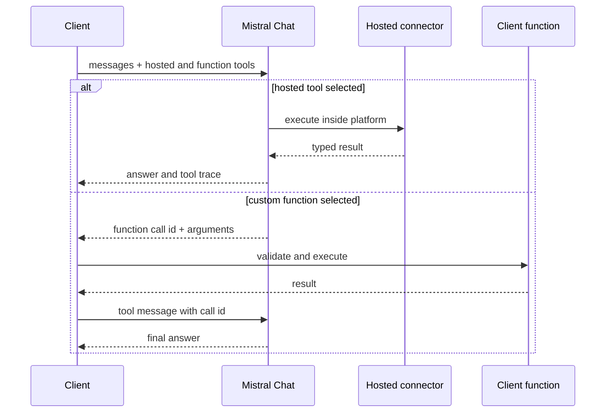
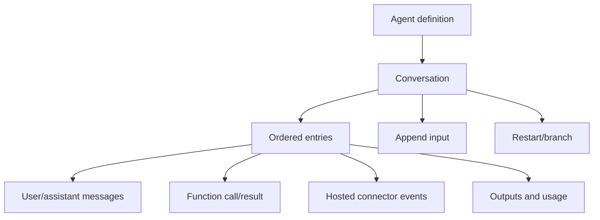

# Mistral AI API

**Contract snapshot:** 2026-09-06  
**Base URL:** <code>https://api.mistral.ai/v1</code>  
**Preferred primitive:** Chat Completions for stateless calls; Conversations for
managed agent state  
**Transport:** JSON/HTTPS and SSE

Mistral's data plane spans chat/FIM generation, persistent conversations,
embeddings, moderation, classification, OCR, transcription, files, batch,
fine-tuning, models, agents, and document libraries. Hosted connectors are
tools, not client-executed function calls.

## Authentication

Send <code>Authorization: Bearer MISTRAL_API_KEY</code> and <code>Content-Type:
application/json</code>, except multipart uploads. Keep keys server-side.
Workspace/project entitlements can affect visible models, agents, libraries, and
files.

## Endpoint inventory

| Family             | Principal paths                                                                  |
| ------------------ | -------------------------------------------------------------------------------- |
| Chat               | POST <code>/chat/completions</code>                                              |
| Fill-in-the-middle | POST <code>/fim/completions</code>                                               |
| Conversations      | create/append/restart/get/history under <code>/conversations</code>              |
| Agents             | agent CRUD/configuration and conversation execution surfaces                     |
| Embeddings         | POST <code>/embeddings</code>                                                    |
| Moderation         | POST <code>/moderations</code>, <code>/chat/moderations</code>                   |
| Classification     | POST <code>/classifications</code>, <code>/chat/classifications</code>           |
| OCR                | POST <code>/ocr</code>                                                           |
| Audio              | POST <code>/audio/transcriptions</code>                                          |
| Files              | upload/list/get/delete/content/download/URL operations under <code>/files</code> |
| Libraries          | document-library and document management/search resources                        |
| Batch              | create/list/get/cancel batch jobs and download results                           |
| Fine-tuning        | jobs, events, checkpoints, start/cancel under <code>/fine_tuning</code>          |
| Models             | list/get/delete/update/archive model resources as applicable                     |

Use discovery rather than a static model list. Hosted feature availability
varies by model and account.

## Chat request type system

<code>ChatCompletionRequest</code> includes:

| Field                                             | Type                                                                       | Notes                                                  |
| ------------------------------------------------- | -------------------------------------------------------------------------- | ------------------------------------------------------ |
| <code>model</code>                                | string                                                                     | Required model ID                                      |
| <code>messages</code>                             | <code>(SystemMessage\|UserMessage\|AssistantMessage\|ToolMessage)[]</code> | Required, ordered                                      |
| <code>tools</code>                                | <code>Tool[]?</code>                                                       | Functions plus supported hosted tools/connectors       |
| <code>tool_choice</code>                          | auto/none/any/named?                                                       | Exact values depend on model/tool family               |
| <code>response_format</code>                      | text, JSON object, or JSON schema?                                         | Structured output capability-gated                     |
| <code>stream</code>                               | boolean?                                                                   | SSE when true                                          |
| <code>safe_prompt</code>, <code>guardrails</code> | boolean?, configs?                                                         | Safety controls                                        |
| <code>prediction</code>, <code>prompt_mode</code> | object?/enum?                                                              | Specialized acceleration/instruction behavior          |
| token/sampling fields                             | scalars?                                                                   | max tokens, temperature, top-p, random seed, penalties |

Message <code>content</code> is a string or ordered content-chunk union. Chunks
can include text, image URL, document URL, reference, and other model-specific
types. Assistant messages can carry <code>tool_calls[]</code>; tool messages
identify the call and return content. Preserve chunk order and unknown chunk
tags.

<code>Tool</code> is an open union:

- custom function with JSON Schema parameters;
- web search or premium web search;
- code interpreter;
- image generation;
- document library;
- custom connector, including configured MCP integrations.

Hosted tools execute inside Mistral's service and can produce typed conversation
entries. Custom functions require the client to execute and return a tool
message.

## Response and stream

Non-streaming chat returns
<code>{id,object,created,model,choices[],usage}</code>. Each choice has index,
assistant message, and finish reason. Usage may include prompt, completion,
total, cache, and connector/tool counters; retain all provider fields.

SSE responses deliver <code>ChatCompletionChunk</code>-like choice deltas.
Accumulate content and tool arguments by choice/call identity, then wait for a
terminal finish reason and final usage. Mistral also supports structured stream
events for some conversation/agent operations; do not run all SSE through one
Chat-only decoder.

## Conversations and agents

The Conversations API is a stateful execution layer. A conversation can start
from a model or configured agent, accept new entries, branch/restart from prior
state, and return ordered entries. Entries form a tagged union including
messages, function calls/results, and hosted-tool events.

Store the provider conversation ID and entry IDs. Do not reconstruct state by
submitting a parallel Chat history unless deliberately migrating protocols.
Agent definitions can reference instructions, model, tools, completion
arguments, and handoffs/connectors; treat configuration and execution as
separate resources.

## Specialized inference contracts

### FIM

FIM accepts a prompt prefix, optional suffix, model, token/sampling controls,
and stop sequences. It returns completion choices and usage. It is
code-completion semantics, not a one-message chat shortcut.

### Embeddings

The embedding endpoint implements a
[separate semantic-operation capability](semantic-operations.md); it is not an
optional method on the conversational adapter.

<code>POST /v1/embeddings</code> accepts required <code>model</code> and string
or string-array <code>input</code>. Optional fields include
<code>encoding_format</code> (<code>float</code> or <code>base64</code>),
dynamic <code>metadata</code>, <code>output_dimension</code> where the model
supports dimensionality control, and <code>output_dtype</code>
(<code>float</code>, <code>int8</code>, <code>uint8</code>, <code>binary</code>,
or <code>ubinary</code>).

The response is
<code>{id,model,object,data:[{object,index,embedding}],usage}</code>. The vector
element/wire representation follows the selected output controls. Preserve
<code>index</code>, actual dimensions, dtype, encoding, model, and metadata to
restore input order and identify the embedding space.

Mistral does not expose a generic rerank endpoint in the scoped runtime. Do not
substitute classification or a chat prompt and claim native rerank support.

### Moderation and classification

Text and chat variants accept either raw inputs or message arrays. Moderation
returns category scores/flags; classification returns labels/scores according to
the selected classifier. Never map a moderation score directly to an HTTP
failure or a Chat refusal.

### OCR

OCR accepts document/image inputs by URL, uploaded file, or data form plus
page/image/table/header options. The response contains pages with markdown/text
and structured image/table/coordinate metadata. Page indexes and geometry are
part of the contract.

### Audio transcription

Multipart transcription accepts audio plus model, language/timestamp/diarization
and output options when supported. Results may be plain text, structured
segments, or streaming events. Preserve speaker and time ranges.

## Files, libraries, and batch

Files have purpose such as <code>fine-tune</code>, <code>batch</code>, or
<code>ocr</code>, visibility, optional expiry, byte count, filename, creation
time, and status. A file being uploaded does not imply that a library/OCR
ingestion operation has completed.

Batch creation selects one endpoint and either uploaded JSONL files or inline
requests. Verified batch endpoint values include:

- <code>/v1/chat/completions</code>, <code>/v1/fim/completions</code>,
  <code>/v1/embeddings</code>;
- <code>/v1/moderations</code>, <code>/v1/chat/moderations</code>;
- <code>/v1/classifications</code>, <code>/v1/chat/classifications</code>;
- <code>/v1/ocr</code>, <code>/v1/conversations</code>,
  <code>/v1/audio/transcriptions</code>.

Each JSONL line carries <code>custom_id</code> and <code>body</code>. Job state,
counts, output file, error file, timestamps, timeout, and metadata are
authoritative. Correlate results by <code>custom_id</code>.

## Errors and adapter rules

Map failures through the
[AgentKit error taxonomy](../concepts/error-taxonomy.md) while preserving HTTP
status, provider request ID, error message/type/detail, and raw body. Validation
errors may include a structured field path.

- Retry 429 and transient 5xx with jitter and provider delay headers.
- Do not retry invalid message unions, unsupported tool/response combinations,
  or safety failures unchanged.
- Conversation append, batch creation, uploads, and tuning are side-effecting;
  persist returned IDs before polling.
- Treat hosted connector output as untrusted external data.
- Capability-gate every content chunk, hosted tool, and structured-output
  feature by model.

## Coding-harness interoperability

The
[provider-specific compatibility requirements](../profiles/coding-harness/provider-interoperability.md#provider-specific-compatibility-requirements)
define the route, history-repair, streaming, and compatibility details required
by a long-running coding loop. They do not override the public contract verified
below.

## First-party sources

- [Mistral Chat API](https://docs.mistral.ai/api/endpoint/chat)
- [Mistral Conversations API](https://docs.mistral.ai/api/endpoint/beta/conversations)
- [Mistral Agents and Conversations](https://docs.mistral.ai/studio/agents/agents-api)
- [Mistral embeddings](https://docs.mistral.ai/capabilities/embeddings/overview)
- [Mistral embeddings endpoint](https://docs.mistral.ai/api/endpoint/embeddings)
- [Mistral OCR API](https://docs.mistral.ai/api/endpoint/ocr)
- [Mistral Batch API](https://docs.mistral.ai/api/endpoint/batch)
- [Mistral Files API](https://docs.mistral.ai/api/endpoint/files)
