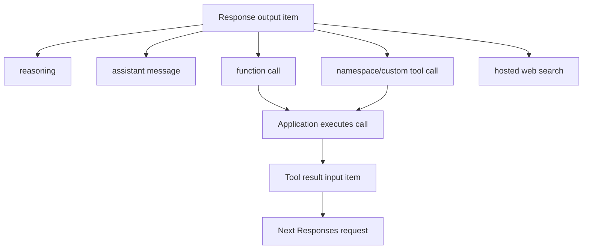
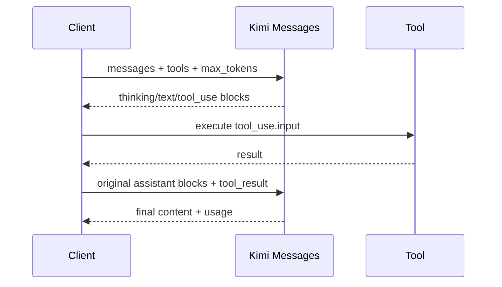
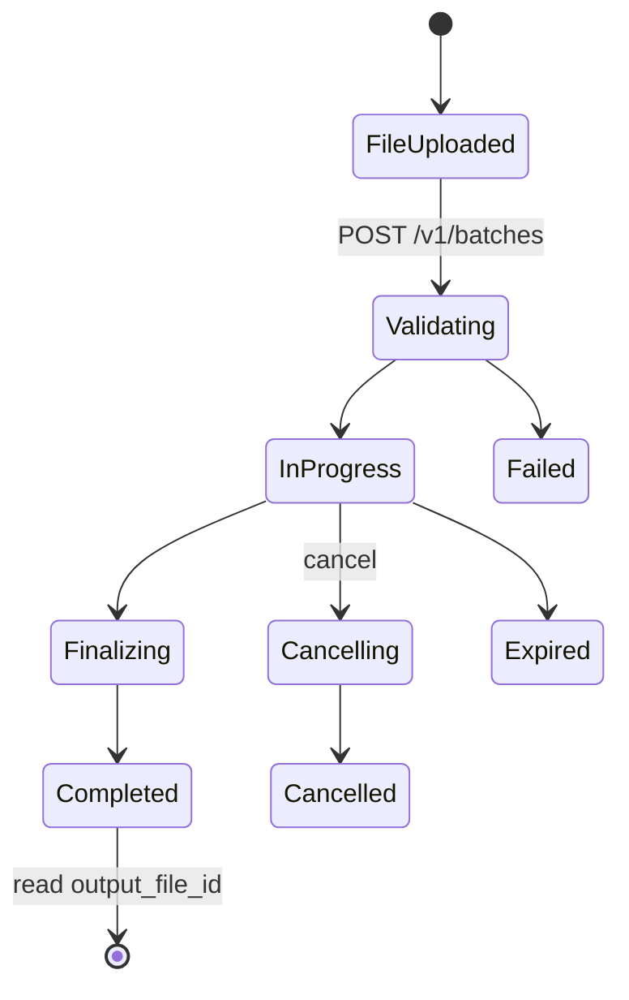

# Moonshot Kimi API

Kimi's Chat, Responses, and Anthropic-shaped surfaces are separate
[API-family capability profiles](../concepts/model-providers-and-capabilities.md);
wire resemblance does not make their lifecycle or errors interchangeable.

**Contract snapshot:** 2026-09-06  
**OpenAI-style base URL:** <code>https://api.moonshot.ai/v1</code>  
**Anthropic-style base URL:** <code>https://api.moonshot.ai/anthropic</code>  
**Preferred primitive:** Responses for agent output items; Chat Completions for
the broadest Kimi integration  
**Transport:** JSON/HTTPS and SSE

Kimi exposes three inference dialects: OpenAI-shaped Chat Completions,
OpenAI-shaped Responses, and Anthropic-shaped Messages. Sharing a base shape
does not imply full upstream feature coverage. Pin the chosen dialect per
conversation.

## Authentication and request proof

Send <code>Authorization: Bearer MOONSHOT_API_KEY</code>. Keys belong on trusted
servers.

The three model endpoints optionally support request proof. Send a
client-generated nonce, preferably UUID v4, as <code>X-Msh-Request-Nonce</code>.
Kimi returns:

- <code>Msh-Request-Timestamp</code>: Unix milliseconds when the request was
  accepted;
- <code>Msh-Request-Signature</code>: opaque <code>reqsigv1_...</code> value.

Verify with POST <code>/v1/signatures/verify</code> and
<code>{nonce,timestamp,model,signature}</code>. A valid signature proves
acceptance by Kimi for that model and time; it does not prove generation
success, response completeness, or nonce freshness. The verifier is replayable,
so the application owns replay windows and nonce uniqueness.

## Endpoint inventory

| Method and path                                       | Purpose                                                                |
| ----------------------------------------------------- | ---------------------------------------------------------------------- |
| POST <code>/v1/chat/completions</code>                | Stateless multimodal chat, reasoning, tools, JSON output, streaming    |
| POST <code>/v1/responses</code>                       | Ordered response items, function/hosted tools, state fields, streaming |
| POST <code>/anthropic/v1/messages</code>              | Anthropic Messages-compatible inference                                |
| GET <code>/v1/models</code>                           | Discover available model IDs                                           |
| POST <code>/v1/tokenizers/estimate-token-count</code> | Estimate input tokens                                                  |
| GET <code>/v1/users/me/balance</code>                 | Account balance                                                        |
| POST <code>/v1/signatures/verify</code>               | Verify request proof                                                   |
| file CRUD/content under <code>/v1/files</code>        | Upload, list, inspect, extract, delete                                 |
| batch create/list/get under <code>/v1/batches</code>  | Asynchronous Chat Completions batches                                  |
| POST <code>/v1/batches/{id}/cancel</code>             | Cancel a validating/running batch                                      |

No embeddings or native realtime voice endpoint appears in the verified public
contract.

## Chat Completions

### Request types

<code>ChatRequest</code> contains <code>model</code>, ordered
<code>messages</code>, and optional <code>stream</code>, token/sampling fields,
<code>tools</code>, <code>tool_choice</code>, <code>response_format</code>,
thinking/reasoning controls, stops, and metadata-like identifiers.

| Type                        | Shape                                                                                      |
| --------------------------- | ------------------------------------------------------------------------------------------ |
| <code>Message</code>        | <code>{role, content?, reasoning_content?, tool_calls?, tool_call_id?}</code>              |
| <code>Content</code>        | string or ordered text/image/video/file parts supported by the model                       |
| <code>Tool</code>           | OpenAI function form; Kimi official tools use documented reserved tool/channel conventions |
| <code>ResponseFormat</code> | text, JSON object, or JSON Schema depending on model                                       |
| <code>Thinking</code>       | model-specific mode/effort; returned reasoning must remain distinct from answer text       |

Kimi chat is stateless: the client resends history. For thinking models, carry
forward the assistant's documented reasoning field when required by that
model/dialect, especially across tool calls. Do not expose hidden reasoning to
the user just because it must be round-tripped.

The response follows <code>{id,object,created,model,choices[],usage}</code>.
Choices contain <code>message</code> and <code>finish_reason</code>. Usage
includes prompt/completion/total tokens and can include cached, cache-write, or
reasoning-token detail.

Streaming is SSE with OpenAI-like chunks and a <code>[DONE]</code> sentinel. The
last usage-bearing chunk may have no choices. Preserve call IDs and assemble
function arguments as raw JSON text until the call is complete.

## Responses API

The create request includes:

| Field                                                            | Type                                        | Notes                                                                       |
| ---------------------------------------------------------------- | ------------------------------------------- | --------------------------------------------------------------------------- |
| <code>model</code>                                               | string                                      | Required; use model discovery rather than a baked list                      |
| <code>input</code>                                               | <code>string &#124; input item array</code> | Text and supported multimodal/message/tool-result items                     |
| <code>instructions</code>                                        | string?                                     | System/developer direction                                                  |
| <code>tools</code>                                               | <code>Tool[]?</code>                        | Function, namespace, custom/apply-patch, or hosted web search as documented |
| <code>tool_choice</code>                                         | <code>string &#124; selector?</code>        | Tool policy                                                                 |
| <code>text</code>                                                | object?                                     | Format/schema configuration                                                 |
| <code>reasoning</code>                                           | object?                                     | Effort/summary controls                                                     |
| <code>previous_response_id</code>, <code>conversation</code>     | state references?                           | Support is Kimi/model specific                                              |
| <code>store</code>, <code>background</code>, <code>stream</code> | boolean?                                    | Persistence/execution mode                                                  |
| token/sampling/metadata fields                                   | scalars/objects?                            | Capability-gated                                                            |

The response is OpenAI-shaped:
<code>{id,object,status,created_at,completed_at?,model,output[],usage,...}</code>.
<code>output[]</code> is an ordered open union including:

- <code>reasoning</code> with summaries and optional encrypted content;
- assistant <code>message</code> with output text/refusal parts;
- <code>function_call</code> and function results supplied as later input;
- namespace/custom tool calls and hosted web-search calls when configured.

Usage separates <code>input_tokens_details.cached_tokens</code>,
<code>cache_write_tokens</code>, and
<code>output_tokens_details.reasoning_tokens</code>. Preserve them without
folding cache writes into cache hits.

SSE event names and item/delta shapes follow the Kimi Responses reference, not
whatever a particular OpenAI SDK version happens to know. Decode unknown event
types into raw events.

## Anthropic Messages dialect

POST <code>https://api.moonshot.ai/anthropic/v1/messages</code>. When using an
Anthropic SDK, configure base URL <code>https://api.moonshot.ai/anthropic</code>
and Kimi's Bearer authorization behavior.

The request has required <code>model</code>, <code>messages</code>, and
<code>max_tokens</code>, plus <code>system</code>, <code>stream</code>,
<code>stop_sequences</code>, tools/tool choice, metadata, and
<code>output_config</code> for reasoning effort and structured output.

The result is
<code>{id,type:"message",role:"assistant",model,content[],stop_reason,stop_sequence,usage}</code>.
Content is an ordered union of thinking, text, and tool-use blocks. Thinking
blocks include a signature that must be preserved when the protocol requires
round-tripping. Stop reasons include <code>end_turn</code>,
<code>max_tokens</code>, <code>tool_use</code>, and <code>refusal</code>.

Do not mix Anthropic content blocks into an existing Chat Completions history.
Convert deliberately or start a new conversation.

## Files

POST <code>/v1/files</code> is multipart with <code>file</code> and purpose:

- <code>file-extract</code> for document text extraction;
- <code>image</code> or <code>video</code> for multimodal input;
- <code>batch</code> for JSONL batch requests.

<code>FileObject</code> contains <code>id</code>, object, byte size, creation
time, filename, purpose, status, and status details. List returns
<code>{object:"list",data:FileObject[]}</code>. Content retrieval is meaningful
for extracted-text files. Upload completion and parsing readiness are separate
states.

## Batch lifecycle

Batch input is non-empty JSONL, up to the documented size limit, uploaded with
purpose <code>batch</code>. Every line contains unique <code>custom_id</code>,
<code>method:"POST"</code>, <code>url:"/v1/chat/completions"</code>, and a
normal chat request body. Current Batch API is for Chat Completions; do not send
Responses or Messages URLs.

Output and error records are files; correlate lines by <code>custom_id</code>,
not array order. Completion windows and supported model/parameter combinations
are live service constraints.

## Errors and adapter rules

Errors use <code>{error:{message,type,code?}}</code>; the Messages compatibility
path can also return Anthropic-style
<code>{type:"error",error,request_id}</code>. The
[AgentKit error mapping](../concepts/error-taxonomy.md) preserves the
originating dialect and request ID.

- Retry 429 and transient 5xx with jitter; do not retry validation,
  authentication, balance, or model-entitlement failures unchanged.
- A broken SSE connection has unknown completion under the
  [streaming terminality rules](../concepts/streaming-and-event-protocol.md).
  Use documented Partial Mode/reconnection guidance only when the application
  can avoid duplicate tool side effects.
- Cache behavior is automatic and prefix-sensitive. Usage, not a client guess,
  is authoritative for cache hits/writes.
- Model lists and allowed parameters drift. Query <code>/v1/models</code> and
  keep a capability matrix.

## Coding-harness interoperability

The
[provider-specific compatibility requirements](../profiles/coding-harness/provider-interoperability.md#provider-specific-compatibility-requirements)
define the route, history-repair, streaming, and compatibility details required
by a long-running coding loop. They do not override the public contract verified
below.

## First-party sources

- [Kimi API overview](https://platform.kimi.ai/docs/api/overview)
- [Kimi Chat Completions](https://platform.kimi.ai/docs/api/chat)
- [Kimi Responses API](https://platform.kimi.ai/docs/api/responses)
- [Kimi Messages API](https://platform.kimi.ai/docs/api/messages)
- [Kimi request signature verification](https://platform.kimi.ai/docs/api/signatures-verify)
- [Kimi Files API](https://platform.kimi.ai/docs/api/files)
- [Kimi Batch API guide](https://platform.kimi.ai/docs/guide/use-batch-api)
- [Kimi machine-readable API index](https://platform.kimi.ai/docs/llms.txt)
