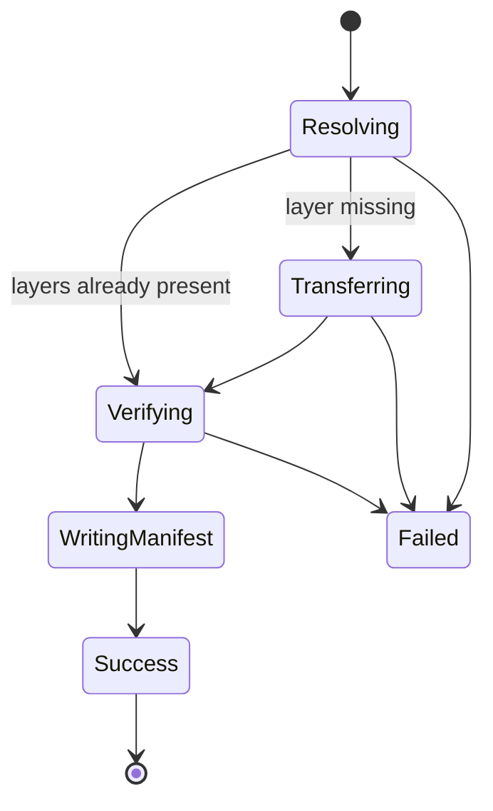
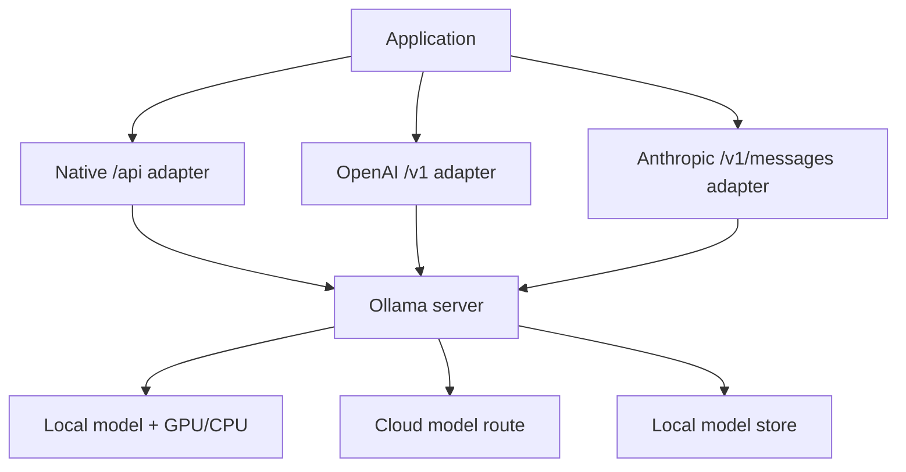

# Ollama API

**Contract snapshot:** 2026-09-06  
**Local native base URL:** <code>http://localhost:11434/api</code>  
**Cloud native base URL:** <code>https://ollama.com/api</code>  
**Preferred primitive:** Native Chat; use Responses or Messages only for client
compatibility  
**Transport:** JSON/HTTPS and newline-delimited JSON; SSE on compatibility
endpoints

Ollama is both a local model server and a cloud-model gateway. It exposes a
native runtime/model-management API plus partial OpenAI and Anthropic
compatibility. Local process security and remote cloud authentication are
different trust models.

## Authentication and trust boundary

The local API does not require authentication. Possession of network access to
the listening socket is effectively authority to run, pull, create, copy, and
delete models. Keep it on loopback or place it behind authenticated
infrastructure; never expose the default server casually.

Cloud requests use an Ollama API key as documented, normally
<code>Authorization: Bearer OLLAMA_API_KEY</code>. Compatibility SDKs may
require a non-empty key value even when the local server ignores it.

## Native endpoint inventory

| Method/path                     | Purpose                                                             |
| ------------------------------- | ------------------------------------------------------------------- |
| POST <code>/api/generate</code> | Prompt/suffix generation, optional images and raw/template controls |
| POST <code>/api/chat</code>     | Multi-message chat, vision, thinking, tools, structured output      |
| POST <code>/api/embed</code>    | Text embeddings                                                     |
| GET <code>/api/tags</code>      | List installed/available models                                     |
| GET <code>/api/ps</code>        | List models currently loaded in memory                              |
| POST <code>/api/show</code>     | Model metadata, template, parameters, capabilities                  |
| POST <code>/api/create</code>   | Create a model from files/model reference/configuration             |
| POST <code>/api/copy</code>     | Copy/alias a model name                                             |
| POST <code>/api/pull</code>     | Pull model layers                                                   |
| POST <code>/api/push</code>     | Push a model to a registry                                          |
| DELETE <code>/api/delete</code> | Delete a model                                                      |
| GET <code>/api/version</code>   | Server version                                                      |

Model management endpoints mutate local or registry state and are not normal
inference calls. Put them behind a separate permission boundary.

## Native Generate

<code>GenerateRequest</code> includes:

| Field                                      | Type                                | Notes                                                |
| ------------------------------------------ | ----------------------------------- | ---------------------------------------------------- |
| <code>model</code>                         | string                              | Required local/cloud model name                      |
| <code>prompt</code>                        | string?                             | Input prefix                                         |
| <code>suffix</code>                        | string?                             | Fill-in-the-middle suffix                            |
| <code>system</code>, <code>template</code> | string?                             | Override model defaults                              |
| <code>images</code>                        | base64 string[]?                    | Vision input for eligible models                     |
| <code>format</code>                        | <code>"json"</code> or JSON Schema? | Structured output                                    |
| <code>options</code>                       | object?                             | Runtime controls such as context/sampling/seed/stops |
| <code>raw</code>                           | boolean?                            | Bypass prompt templating                             |
| <code>stream</code>                        | boolean?                            | Defaults true                                        |
| <code>keep_alive</code>                    | duration/number?                    | Model residency after request                        |

The response contains model, ISO timestamp, generated <code>response</code>,
completion flag/reason, optional reusable context token array, and performance
counters. Durations are nanoseconds. Prompt/eval counts are tokens; do not
confuse them with duration fields.

The legacy <code>context</code> array is opaque tokenizer/model state. Do not
move it between models or providers.

## Native Chat type system

<code>ChatRequest =
{model,messages,tools?,format?,options?,stream?,think?,keep_alive?,logprobs?,top_logprobs?}</code>.

<code>Message</code> contains role, visible <code>content</code>, optional
separate <code>thinking</code>, image list, and tool calls. Tool calls contain
function name/description/arguments. Native tool-call objects may not carry an
OpenAI/Anthropic-style provider call ID; use adapter-scoped correlation
internally and do not pretend a synthesized ID came from Ollama.

<code>think</code> is boolean or an effort string such as high/medium/low for
supported models. <code>format</code> accepts <code>json</code> or a JSON
Schema. Prompt the model for the desired structure and still validate it.

The non-streaming response is:

<code>{model,created_at,message,done,done_reason,total_duration,load_duration,prompt_eval_count,prompt_eval_duration,eval_count,eval_duration,logprobs?}</code>

## Native streaming protocol

The NDJSON lifecycle maps into the
[AgentKit streaming contract](../concepts/streaming-and-event-protocol.md);
complete JSON lines are transport frames, not semantic terminals by themselves.

Generate, Chat, Create, Pull, and Push can stream newline-delimited JSON. Each
line is a complete JSON document; there are no SSE
<code>event:</code>/<code>data:</code> fields.

```mermaid
sequenceDiagram
    participant C as Client
    participant O as Ollama native API
    C->>O: POST /api/chat (stream omitted or true)
    O-->>C: NDJSON {message delta, done:false}
    O-->>C: NDJSON {message delta, done:false}
    O-->>C: NDJSON {done:true, done_reason, usage/durations}
    Note over C: newline frames JSON; done=true is terminal
```

The final frame carries aggregate timing/token metrics and can have empty
content. An error may terminate the stream before <code>done:true</code>; treat
that as failure/unknown completion.

## Embeddings

Embedding is a [separate semantic operation](semantic-operations.md), with the
resolved model digest and vector dimensions retained as space identity.

POST <code>/api/embed</code> accepts required model and string or string-array
input, plus <code>truncate</code>, optional dimensions, keep-alive, and runtime
options. <code>truncate</code> defaults true; false makes overlong input an
error.

The result is
<code>{model,embeddings:number[][],total_duration,load_duration,prompt_eval_count}</code>.
Preserve model tag/digest and dimension with stored vectors. Model aliases can
be overwritten, so a name alone is not sufficient provenance.

Ollama does not expose a native rerank endpoint. A locally hosted reranker needs
its own model protocol/adapter; prompting <code>/api/chat</code> to sort
documents is generative scoring, not contract-compatible rerank.

## Model resources and lifecycle

<code>/api/tags</code> returns model names, modification times, sizes, digests,
and details such as family/format/quantization. <code>/api/ps</code> adds loaded
size, expiry, and runtime details.

<code>/api/show</code> returns the Modelfile, parameters, template, system
prompt, license, model info/tensors, details, and capabilities. Capability
inspection is preferable to guessing tool/vision/thinking support from a model
name.

Create/Pull/Push stream status and layer digest/progress records. Their logical
lifecycle is:



Do not retry Create/Copy/Delete/Push automatically without resolving whether the
mutation already occurred.

## OpenAI compatibility

This surface requires its own
[capability profile](../concepts/model-providers-and-capabilities.md); the local
endpoint shape does not make unsupported OpenAI semantics appear.

Use local base <code>http://localhost:11434/v1</code>. A placeholder API key is
required by some OpenAI SDKs but ignored locally.

| Endpoint                                                 | Important coverage                                                                 |
| -------------------------------------------------------- | ---------------------------------------------------------------------------------- |
| <code>/v1/chat/completions</code>                        | streaming, JSON/schema, seed, vision, tools, thinking/reasoning controls, logprobs |
| <code>/v1/completions</code>                             | string prompt only, streaming, JSON, seed, suffix, logprobs                        |
| <code>/v1/responses</code>                               | streaming, function tools, reasoning summaries; added in Ollama 0.13.3             |
| <code>/v1/embeddings</code>                              | string/string-array/token inputs, encoding, dimensions                             |
| <code>/v1/models</code>, <code>/v1/models/{model}</code> | model discovery mapped from Ollama store                                           |
| <code>/v1/images/generations</code>                      | experimental; base64 result only                                                   |

### Responses state contradiction resolved

The compatibility page lists stateful request fields/features, but explicitly
says only non-stateful Responses is supported: <code>previous_response_id</code>
and <code>conversation</code> may be accepted/listed yet are not functionally
supported. Treat the endpoint as stateless and resend history. Never infer state
from successful parsing of those fields.

OpenAI Responses output/stream types are a subset. Hosted OpenAI tools, files,
vector stores, batches, moderation, and realtime are not implied.

## Anthropic compatibility

Use <code>http://localhost:11434</code> as the Anthropic base; POST path is
<code>/v1/messages</code>. Local <code>x-api-key</code> is accepted but not
validated, and <code>anthropic-version</code> is accepted but unused.

Supported core behavior includes Messages, semantic SSE, system prompts,
multi-turn content, base64 vision, tools/tool results, and basic thinking
blocks. Response blocks include text, tool use, and thinking; stop reasons
include end turn, max tokens, and tool use.

Documented gaps and partial behavior:

| Feature                                  | Behavior                                                                 |
| ---------------------------------------- | ------------------------------------------------------------------------ |
| count tokens                             | endpoint unsupported; returned counts are model-tokenizer approximations |
| forced/disabled <code>tool_choice</code> | unsupported despite appearing in a supported-field list                  |
| metadata                                 | unsupported despite appearing in a supported-field list                  |
| prompt cache, batches, citations, PDFs   | unsupported                                                              |
| image URL                                | unsupported; base64 image is supported                                   |
| thinking budget                          | accepted but not enforced                                                |
| mid-stream error events                  | unsupported; errors use HTTP status                                      |

When a documentation summary and the explicit “not supported” table conflict,
implement the narrower behavior and feature-test against the deployed Ollama
version.

## Deployment structure



Local and cloud models can share name/tag syntax but differ in execution,
authentication, retention, and availability. Record the resolved route in
telemetry.

## Errors and adapter rules

Native and compatibility failures map through the
[AgentKit error taxonomy](../concepts/error-taxonomy.md) while retaining the
originating dialect and daemon context.

Errors use an HTTP status plus JSON <code>{error:string}</code> or a
compatibility envelope. A missing model commonly returns 404. Stream failures
can occur after headers.

- Retry only transient transport/5xx failures; local overload may require
  queue/backpressure rather than repeated requests.
- Pull a missing model only when the caller authorized model-store mutation.
- Bound context, output, concurrency, and <code>keep_alive</code>; local memory
  is finite.
- Detect Ollama version before relying on new compatibility fields.
- Preserve native nanosecond metrics for latency/load/evaluation diagnostics.
- Treat model templates and registry artifacts as untrusted inputs.

## First-party sources

- [Ollama API introduction](https://docs.ollama.com/api/introduction)
- [Ollama native Chat API](https://docs.ollama.com/api/chat)
- [Ollama Generate API](https://docs.ollama.com/api/generate)
- [Ollama Embed API](https://docs.ollama.com/api/embed)
- [Ollama OpenAI compatibility](https://docs.ollama.com/api/openai-compatibility)
- [Ollama Anthropic compatibility](https://docs.ollama.com/api/anthropic-compatibility)
- [Ollama OpenAPI schema](https://docs.ollama.com/openapi.yaml)
