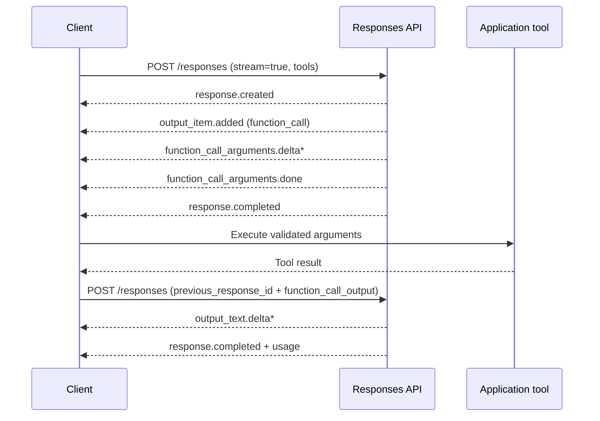
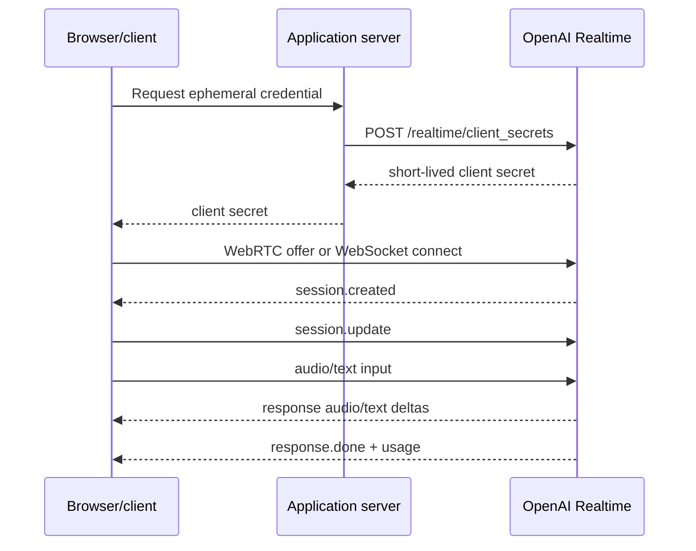

# OpenAI API

**Contract snapshot:** 2026-09-06  
**Base URL:** <code>https://api.openai.com/v1</code>  
**Preferred primitive:** Responses API  
**Transport:** JSON over HTTPS, SSE for streaming, WebRTC/WebSocket/SIP for
Realtime

## Authentication and versioning

Send <code>Authorization: Bearer OPENAI_API_KEY</code> and <code>Content-Type:
application/json</code>. Legacy organization keys may also need
<code>OpenAI-Organization</code> and <code>OpenAI-Project</code>. Capture
<code>x-request-id</code>; optionally send a unique
<code>X-Client-Request-Id</code> before the request leaves the process.

The REST major version is <code>v1</code>. OpenAI treats new optional fields,
resources, object properties, event kinds, and enum members as
backward-compatible additions. Therefore deserialize extensibly. Pin model
snapshots when repeatability matters; API stability does not imply identical
model behavior.

## Runtime endpoint inventory

| Resource                                                                                      | Methods                                                                                                 | Purpose                                                             |
| --------------------------------------------------------------------------------------------- | ------------------------------------------------------------------------------------------------------- | ------------------------------------------------------------------- |
| <code>/responses</code>                                                                       | POST; GET/DELETE <code>/{id}</code>; POST <code>/{id}/cancel</code>; GET <code>/{id}/input_items</code> | Primary multimodal generation, hosted tools, background work, state |
| <code>/responses/input_tokens</code>                                                          | POST                                                                                                    | Preflight token count                                               |
| <code>/responses/compact</code>                                                               | POST                                                                                                    | Compact a long Responses context                                    |
| <code>/chat/completions</code>                                                                | POST, GET                                                                                               | Legacy/portable chat; stored completion CRUD is also available      |
| <code>/completions</code>                                                                     | POST                                                                                                    | Legacy prompt completion                                            |
| <code>/realtime/client_secrets</code>                                                         | POST                                                                                                    | Mint ephemeral client credentials                                   |
| <code>/realtime/calls</code>                                                                  | POST; accept/reject/hangup/refer submethods                                                             | SIP and server-managed realtime calls                               |
| <code>/audio/speech</code>                                                                    | POST                                                                                                    | Text to speech                                                      |
| <code>/audio/transcriptions</code>, <code>/audio/translations</code>                          | POST                                                                                                    | Speech to text                                                      |
| <code>/audio/voices</code>, <code>/audio/voice_consents</code>                                | CRUD subset                                                                                             | Voice catalog and consent artifacts                                 |
| <code>/images/generations</code>, <code>/images/edits</code>, <code>/images/variations</code> | POST                                                                                                    | Image generation/editing                                            |
| <code>/videos</code> and subresources                                                         | POST/GET/DELETE                                                                                         | Async video generation, edits, extensions, remix, content           |
| <code>/embeddings</code>                                                                      | POST                                                                                                    | Vector embeddings                                                   |
| <code>/moderations</code>                                                                     | POST                                                                                                    | Text/image safety classification                                    |
| <code>/models</code>                                                                          | GET; GET/DELETE <code>/{model}</code>                                                                   | Discover and manage models                                          |

## Supporting endpoint inventory

| Resource                                                 | Methods                                                 | Purpose                               |
| -------------------------------------------------------- | ------------------------------------------------------- | ------------------------------------- |
| <code>/conversations</code> and <code>/{id}/items</code> | CRUD                                                    | Durable Responses conversation state  |
| <code>/files</code>                                      | POST/GET/DELETE; GET content                            | Reusable file objects                 |
| <code>/uploads</code>                                    | POST; add parts; complete/cancel                        | Multipart uploads                     |
| <code>/containers</code> and files                       | CRUD                                                    | Hosted code-execution containers      |
| <code>/vector_stores</code>                              | CRUD; file batches; search                              | Hosted retrieval                      |
| <code>/batches</code>                                    | POST/GET; cancel                                        | Asynchronous JSONL requests           |
| <code>/fine_tuning/jobs</code>                           | create/list/get/cancel/pause/resume; events/checkpoints | Model customization                   |
| <code>/evals</code> and runs/output items                | CRUD/run                                                | Evaluation definitions and executions |
| <code>/fine_tuning/alpha/graders</code>                  | validate/run                                            | Grader execution                      |
| <code>/skills</code> and versions/content                | CRUD subset                                             | Reusable skill artifacts              |
| Assistants, Threads, Runs                                | CRUD subset                                             | Deprecated predecessor to Responses   |

Organization administration and usage-reporting endpoints exist but are outside
the model-runtime adapter.

## Responses wire model

### Create request

| Field                                                                   | Type                                       | Semantics                                                                                                                   |
| ----------------------------------------------------------------------- | ------------------------------------------ | --------------------------------------------------------------------------------------------------------------------------- |
| <code>model</code>                                                      | string?                                    | Required unless supplied by a referenced prompt/agent configuration                                                         |
| <code>input</code>                                                      | string \| <code>ResponseInputItem[]</code> | User/developer messages, prior output items, tool results, images, files                                                    |
| <code>instructions</code>                                               | string \| item[]?                          | Developer instruction for this response; not inherited through <code>previous_response_id</code>                            |
| <code>conversation</code>                                               | string \| {id:string}?                     | Durable conversation; mutually exclusive with <code>previous_response_id</code>                                             |
| <code>previous_response_id</code>                                       | string?                                    | Chain to prior stored response                                                                                              |
| <code>tools</code>                                                      | <code>Tool[]</code>                        | Function, custom, web/file search, code interpreter, computer use, image generation, MCP/connectors, and other hosted tools |
| <code>tool_choice</code>                                                | string \| object?                          | none/auto/required, forced tool, allowed subset, hosted-tool selector                                                       |
| <code>text</code>                                                       | {format, verbosity}?                       | Plain text or strict JSON Schema output                                                                                     |
| <code>reasoning</code>                                                  | {effort?, summary?}?                       | Reasoning controls; model-dependent                                                                                         |
| <code>background</code>, <code>stream</code>, <code>store</code>        | boolean?                                   | Execution and retention modes                                                                                               |
| <code>max_output_tokens</code>, <code>max_tool_calls</code>             | integer?                                   | Generation and hosted-tool ceilings                                                                                         |
| <code>temperature</code>, <code>top_p</code>, <code>top_logprobs</code> | number?                                    | Sampling/log probability controls; model-dependent                                                                          |
| <code>include</code>                                                    | string[]?                                  | Opt into expensive or normally omitted tool results, images, logprobs, encrypted reasoning                                  |
| <code>prompt</code>                                                     | {id, version?, variables?}?                | Stored prompt template                                                                                                      |
| <code>prompt_cache_key</code>, <code>prompt_cache_options</code>        | string/object?                             | Cache routing and diagnostics                                                                                               |
| <code>metadata</code>                                                   | map&lt;string,string&gt;?                  | Up to 16 provider-stored pairs                                                                                              |
| <code>service_tier</code>                                               | string?                                    | Processing tier; response reports the tier actually used                                                                    |

### Input and output unions

<code>ResponseInputItem</code> and <code>ResponseOutputItem</code> are open
tagged unions. Important members include:

- <code>message</code> containing ordered text, image, audio, or file parts;
- <code>reasoning</code> with summaries and optionally encrypted continuation
  content;
- <code>function_call</code> / <code>function_call_output</code>;
- hosted-tool call items such as web search, file search, computer, code
  interpreter, image generation, shell, patch, and MCP;
- approval request/response and tool-result items;
- item references and compaction items.

Never assume <code>output[0]</code> is assistant text. Select
<code>type=message</code>, preserve every item, or use the SDK's convenience
<code>output_text</code> only when flattened text is genuinely sufficient.

### Response

| Field                                                    | Type                                                                                                     |
| -------------------------------------------------------- | -------------------------------------------------------------------------------------------------------- |
| <code>id</code>, <code>object</code>, <code>model</code> | string                                                                                                   |
| <code>created_at</code>, <code>completed_at</code>       | number, number?                                                                                          |
| <code>status</code>                                      | <code>queued &#124; in_progress &#124; completed &#124; incomplete &#124; failed &#124; cancelled</code> |
| <code>output</code>                                      | <code>ResponseOutputItem[]</code>                                                                        |
| <code>error</code>                                       | {code:string, message:string, ...}?                                                                      |
| <code>incomplete_details</code>                          | {reason:string}?                                                                                         |
| <code>usage</code>                                       | {input_tokens, input_tokens_details, output_tokens, output_tokens_details, total_tokens}?                |
| echoed configuration                                     | tools, tool_choice, text, reasoning, sampling, state and retention fields                                |

## Responses streaming

SSE event <code>type</code> is the discriminator. The adapter maps these event
families into the
[provider-neutral stream grammar](../concepts/streaming-and-event-protocol.md):

- lifecycle: <code>response.created</code>, <code>response.queued</code>,
  <code>response.in_progress</code>, <code>response.completed</code>,
  <code>response.incomplete</code>, <code>response.failed</code>;
- output structure: <code>response.output_item.added/done</code>,
  <code>response.content_part.added/done</code>;
- deltas: output text/refusal/audio/transcript, reasoning summary/text, function
  arguments, and hosted-tool specific deltas;
- errors: top-level <code>error</code>.

Use <code>sequence_number</code> where present. Unknown event types must pass
through without failing the stream.

Hosted tools may run inside one response. Application functions require a new
request carrying the matching <code>call_id</code>.

## Chat Completions dialect

Core request fields are <code>model</code>, <code>messages[]</code>,
<code>tools[]</code>, <code>tool_choice</code>, <code>response_format</code>,
<code>stream</code>, token limits, sampling controls, modalities/audio,
logprobs, metadata, prediction, reasoning controls, and service tier. Message
roles include developer/system, user, assistant, and tool; multimodal content is
a union of typed parts.

The response is <code>{id, object, created, model, choices[], usage?,
service_tier?, system_fingerprint?}</code>. Each choice has <code>index</code>,
<code>message</code> or streamed <code>delta</code>, <code>finish_reason</code>,
and optional logprobs. Treat finish reasons as open strings.

Use Responses for new work. Chat Completions remains important as the
lowest-common-denominator protocol implemented by many other providers.

## Realtime

Realtime sessions carry JSON events over WebRTC data channels or WebSocket;
audio media normally travels as WebRTC media. A server should mint short-lived
client secrets rather than expose a standard API key. SIP call-control endpoints
support accept, reject, hangup, and refer.

Client and server events are open discriminated unions. Preserve item IDs,
response IDs, content indexes, audio transcript events, rate-limit updates, and
error events.

## Embeddings

Under the [semantic-operation contract](semantic-operations.md), <code>POST
/embeddings</code> is a stateless vector-generation operation behind a separate
embedding interface, not the conversational Responses adapter.

### Embedding request

<code>EmbeddingRequest = {model, input, dimensions?, encoding_format?,
user?}</code>

| Field                        | Type                                        | Constraints                                                                              |
| ---------------------------- | ------------------------------------------- | ---------------------------------------------------------------------------------------- |
| <code>model</code>           | string                                      | Required embedding model ID                                                              |
| <code>input</code>           | string, string[], integer[], or integer[][] | Required text or token arrays; empty inputs are invalid                                  |
| <code>dimensions</code>      | integer?                                    | Positive output dimension; supported by <code>text-embedding-3</code> and later families |
| <code>encoding_format</code> | <code>float &#124; base64</code>?           | Defaults to floating-point JSON                                                          |
| <code>user</code>            | string?                                     | Stable end-user abuse-monitoring identifier                                              |

At the current contract snapshot, each input is limited to 8,192 tokens for the
embedding models, an input array can contain up to 2,048 items, and the sum
across all inputs in one request is limited to 300,000 tokens. Treat these as
live service limits: validate from model/reference metadata before relying on
them permanently.

Token-array input is tied to the selected model's tokenizer. It cannot be moved
between providers or model families. <code>dimensions</code> changes the
embedding space even when the model ID is unchanged.

### Embedding response

<code>EmbeddingResponse = {object:"list", data, model, usage}</code>, where each
data item is <code>{object:"embedding", embedding:number[]|string, index}</code>
and usage is <code>{prompt_tokens,total_tokens}</code>.

Use <code>index</code> to correlate batch inputs. Persist model, actual vector
length, encoding/element type, and any model snapshot with each vector
collection. OpenAI does not expose a query/document <code>input_type</code>; if
an application applies its own prefixes or normalization, those transformations
become part of the embedding-space identity.

### Asynchronous batch embeddings

The Batch API accepts <code>endpoint:"/v1/embeddings"</code>. Each JSONL line
has a unique <code>custom_id</code>, HTTP method/path, and an embedding request
body. The current batch limit is 50,000 embedding inputs across the batch.
Correlate the outer batch item by <code>custom_id</code> and vectors inside its
response by <code>data[].index</code>; these are two different identity levels.

### Rerank boundary

OpenAI does not expose a generic <code>/rerank</code> endpoint that accepts an
arbitrary query and caller-supplied candidate documents. Vector-store search and
the file-search hosted tool can apply managed ranking behavior, but those are
retrieval/tool contracts bound to OpenAI-managed vector stores. They must not
advertise the provider-neutral <code>IReranker</code> capability.

## Errors, retries, and idempotency

HTTP errors generally use <code>{error:{message,type,param?,code?}}</code>. The
[AgentKit error mapping](../concepts/error-taxonomy.md) also handles terminal
error objects inside Responses and Realtime streams and captures request IDs on
both success and failure.

- Retry 408, 409, 429, and transient 5xx with bounded exponential backoff and
  jitter.
- Honor <code>Retry-After</code> and rate-limit reset headers.
- Do not replay non-idempotent uploads, batch creation, tuning, or media jobs
  unless an idempotency strategy proves the first call did not commit.
- A disconnected stream may already have produced tool calls or stored state;
  retrieve the response by ID before replaying when possible.

## Adapter notes

1. Map Responses into the
   [ordered content model](../concepts/message-and-content-model.md), not a
   single string.
2. Keep <code>call_id</code> distinct from item <code>id</code>.
3. Store reasoning, refusal, annotations, and safety data separately from
   visible text.
4. Let callers choose stateful versus stateless/ZDR-compatible flows.
5. Mark Assistants/Threads/Runs as deprecated and avoid them in the canonical
   API.
6. Capability-gate fields per model; a valid API field is not necessarily
   accepted by every model.
7. Keep embedding-space identity with every stored vector; never infer
   compatibility from equal dimensions.

## Coding-harness interoperability

The
[provider-specific compatibility requirements](../profiles/coding-harness/provider-interoperability.md#provider-specific-compatibility-requirements)
define the route, history-repair, streaming, and compatibility details required
by a long-running coding loop. They do not override the public contract verified
below.

## First-party sources

- [API introduction](https://platform.openai.com/docs/api-reference/introduction)
- [Responses API reference](https://developers.openai.com/api/reference/resources/responses)
- [Chat API reference](https://developers.openai.com/api/reference/resources/chat)
- [Realtime guide](https://developers.openai.com/api/docs/guides/realtime)
- [Embeddings API reference](https://developers.openai.com/api/reference/resources/embeddings/methods/create)
- [Batch API reference](https://developers.openai.com/api/reference/resources/batches)
- [Vector store search reference](https://developers.openai.com/api/reference/resources/vector_stores/methods/search)
- [Official OpenAPI description](https://github.com/openai/openai-openapi)
