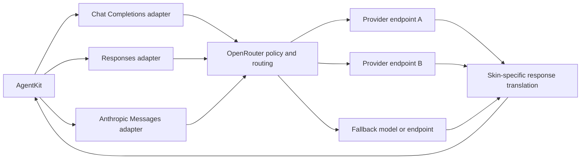
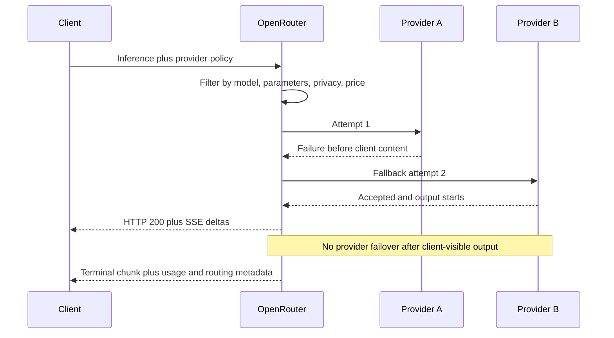
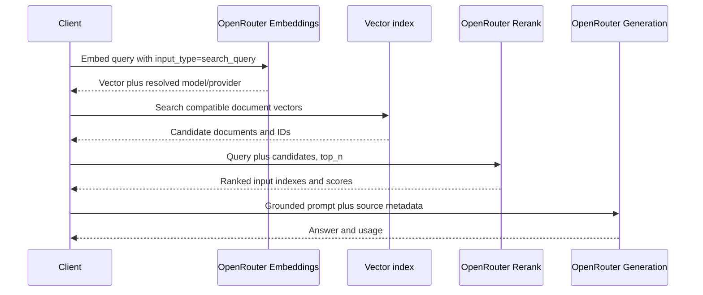

# OpenRouter API

**Contract snapshot:** 2026-09-06  
**Base URL:** <code>https://openrouter.ai/api/v1</code>  
**Preferred primitive:** Chat Completions for broadest compatibility; Responses
when its item/event model is required  
**Transport:** JSON over HTTPS, SSE for streaming, asynchronous beta Batch API

OpenRouter is a router, protocol translator, and policy layer over many upstream
providers. An OpenRouter model slug is not sufficient provenance by itself: a
request can be served by different providers, endpoint variants, regions,
quantizations, or fallback models. Routing is part of the wire contract and part
of observability.

## Authentication, attribution, and privacy

Send <code>Authorization: Bearer OPENROUTER_API_KEY</code>. Optional attribution
headers are <code>HTTP-Referer</code> for the application's canonical URL and
<code>X-OpenRouter-Title</code> for its display name.

<code>X-OpenRouter-Metadata: enabled</code> opts successful inference responses
into an <code>openrouter_metadata</code> object describing routing decisions.
For streaming inference it arrives in the final chunk/event. Preserve it for
diagnostics, but do not couple core deserialization to its current fields.

Data-policy choices are independent of protocol compatibility. The request
<code>provider</code> object can require <code>zdr:true</code> or
<code>data_collection:"deny"</code>. Account/workspace policy and provider
policy can further restrict the eligible endpoint set.

## Runtime endpoint inventory

| Surface                   | Method and path                                                                                         | Wire dialect                                             |
| ------------------------- | ------------------------------------------------------------------------------------------------------- | -------------------------------------------------------- |
| Chat                      | POST <code>/chat/completions</code>                                                                     | Extended OpenAI Chat Completions                         |
| Responses                 | POST <code>/responses</code>                                                                            | OpenResponses / OpenAI-compatible item and event model   |
| Messages                  | POST <code>/messages</code>                                                                             | Anthropic Messages skin                                  |
| Legacy completion         | POST <code>/completions</code>                                                                          | OpenAI text completion compatibility                     |
| Embeddings                | POST <code>/embeddings</code>                                                                           | OpenAI-shaped response plus routing and input extensions |
| Embedding models          | GET <code>/embeddings/models</code>                                                                     | Embedding-specific model catalog                         |
| Rerank                    | POST <code>/rerank</code>                                                                               | OpenRouter rerank contract                               |
| Models                    | GET <code>/models</code>, <code>/models/count</code>, <code>/models/{author}/{slug}</code>              | Catalog and capability metadata                          |
| Model endpoints           | GET <code>/models/{author}/{slug}/endpoints</code>                                                      | Upstream endpoint, price, context, and parameter support |
| Providers                 | GET <code>/providers</code>                                                                             | Provider catalog                                         |
| Generation metadata       | GET <code>/generation?id=...</code>                                                                     | Timing, usage, cost, provider, and routing record        |
| Stored generation content | GET <code>/generation/content?id=...</code>                                                             | Input/output content only when storage policy permits    |
| Files                     | POST/GET <code>/files</code>; GET/DELETE <code>/files/{id}</code>; GET <code>/files/{id}/content</code> | Workspace-scoped file resources                          |
| Media                     | image, video, speech, and transcription endpoints                                                       | Dedicated model-dependent contracts                      |

The asynchronous Batch API uses
<code>https://openrouter.ai/api/beta/batches</code>, not the v1 base. Workspace,
key, BYOK, preset, guardrail, observability, and analytics APIs also exist; they
are control-plane surfaces unless directly needed for inference policy.

## Three inference skins

Each skin is a separate
[API-family capability profile](../concepts/model-providers-and-capabilities.md)
that enters the same provider-neutral request pipeline:

These are distinct protocol adapters. Do not deserialize <code>/messages</code>
as Chat Completions or flatten Responses items into a single assistant message.
The same upstream error is deliberately translated to different envelopes by
each skin.

## Chat Completions request

The portable core is <code>{model, messages, tools?, tool_choice?,
response_format?, stream?, max_tokens?, temperature?, top_p?}</code>. OpenRouter
adds routing and orchestration controls:

| Field                                                                                       | Type             | Semantics                                                                                     |
| ------------------------------------------------------------------------------------------- | ---------------- | --------------------------------------------------------------------------------------------- |
| <code>model</code>                                                                          | string?          | Provider-qualified model slug; may be omitted when another routing mechanism supplies it      |
| <code>models</code>                                                                         | string[]?        | Ordered model fallback list                                                                   |
| <code>provider</code>                                                                       | object?          | Upstream provider selection and policy                                                        |
| <code>plugins</code>                                                                        | object[]?        | OpenRouter plugin configuration such as web search or response healing                        |
| <code>reasoning</code>                                                                      | object?          | Cross-provider reasoning controls; effective support is model/provider-specific               |
| <code>session_id</code>                                                                     | string?          | Routing/observability grouping and sticky-provider hint, not a server conversation transcript |
| <code>route</code>                                                                          | string?          | Router selection where supported                                                              |
| <code>stop_server_tools_when</code>                                                         | condition[]?     | Stop conditions for OpenRouter-operated tool loops                                            |
| <code>max_tool_calls</code>                                                                 | integer?         | Ceiling for hosted tool calls                                                                 |
| <code>debug</code>                                                                          | object?          | Optional transformed-upstream-body diagnostics; sensitive                                     |
| <code>transforms</code>                                                                     | string[]?        | Message/context transformations                                                               |
| <code>image_config</code>, <code>modalities</code>, <code>audio</code>                      | object/string[]? | Model-dependent output controls                                                               |
| <code>min_p</code>, <code>top_a</code>, <code>top_k</code>, <code>repetition_penalty</code> | number?          | Non-OpenAI sampling extensions                                                                |

Message content and tool-call shapes follow the documented OpenAI-compatible
union, extended for supported media. The response retains the Chat Completions
structure and can add <code>provider</code>, <code>usage.cost</code>, native
finish information, reasoning details, and routing metadata. Preserve both
normalized <code>finish_reason</code> and <code>native_finish_reason</code>.

Set <code>provider.require_parameters:true</code> when silently ignored
parameters would violate application semantics. Without it, unsupported
parameters can be ignored by an upstream endpoint. Even with it,
capability-check the selected model before dispatch.

## Provider routing contract

<code>provider</code> is shared by compatible inference, embedding, and rerank
surfaces where documented. Its current fields are:

| Field                                  | Type                            | Meaning                                                                  |
| -------------------------------------- | ------------------------------- | ------------------------------------------------------------------------ |
| <code>order</code>                     | string[]?                       | Provider endpoint slugs to try in order                                  |
| <code>allow_fallbacks</code>           | boolean?                        | Allow backup endpoints; default true                                     |
| <code>require_parameters</code>        | boolean?                        | Restrict to endpoints supporting all request parameters                  |
| <code>data_collection</code>           | <code>allow &#124; deny</code>? | Permit or exclude providers that may store data                          |
| <code>zdr</code>                       | boolean?                        | Restrict to zero-data-retention endpoints when true                      |
| <code>enforce_distillable_text</code>  | boolean?                        | Require endpoints whose terms allow text distillation                    |
| <code>only</code>, <code>ignore</code> | string[]?                       | Provider allowlist/blocklist                                             |
| <code>quantizations</code>             | string[]?                       | Acceptable quantization families                                         |
| <code>sort</code>                      | string or object?               | Sort by price, throughput, or latency; object form supports partitioning |
| <code>preferred_min_throughput</code>  | number or percentile object?    | Soft performance preference                                              |
| <code>preferred_max_latency</code>     | number or percentile object?    | Soft latency preference                                                  |
| <code>max_price</code>                 | object?                         | Hard price ceiling by prompt/completion/request/image component          |

Base provider slugs can match regional or endpoint variants; a full slug narrows
the target. Account-wide restrictions and request restrictions compose. If no
candidate satisfies them, expect a not-found/no-provider error rather than
silent policy relaxation.

For stable embedding indexes, pin an exact model and constrain provider routing
when upstream equivalence is not guaranteed. Model fallback across different
embedding models creates incompatible vector spaces even if every response is
syntactically valid.

## Responses API

<code>POST /responses</code> accepts the OpenResponses item model:
<code>input</code>, <code>instructions</code>, <code>model/models</code>, tools
and tool choice, text/structured-output configuration, reasoning controls,
previous response reference, sampling, modalities, routing, plugins, session,
metadata, and streaming.

Model and provider support is not identical to OpenAI's native Responses API.
Treat OpenRouter-specific <code>provider</code>, <code>models</code>,
<code>plugins</code>, <code>session_id</code>, <code>route</code>,
<code>stop_server_tools_when</code>, and <code>debug</code> as namespaced
extensions. <code>store</code> is not evidence that OpenRouter implements every
OpenAI stored-response retrieval method; code only against endpoints present in
the OpenRouter reference.

Streaming uses Responses event envelopes. A terminal failure can be
<code>response.failed</code>, <code>response.error</code>, or <code>error</code>
depending on the failure stage. OpenRouter also adds top-level
<code>error_type</code> because conversion to the narrower Responses error-code
set can lose detail.

## Anthropic Messages API

<code>POST /messages</code> accepts Anthropic Messages-shaped requests,
including ordered content blocks, tools, tool choice, system content, maximum
tokens, sampling, and streaming where the selected model supports them. It
returns Anthropic message/content-block events rather than Chat chunks.

OpenRouter translates internal failures to Anthropic error envelopes and
includes its canonical <code>error_type</code> inside the error object. Preserve
it separately from Anthropic's <code>error.type</code>. Optional router metadata
arrives on the terminal <code>message_stop</code> event.

## Embeddings

As a [separate semantic operation](semantic-operations.md), <code>POST
/embeddings</code> accepts:

<code>EmbeddingRequest = {model, input, dimensions?, encoding_format?,
input_type?, provider?, user?}</code>

| Field                        | Type                                                           | Notes                                                                           |
| ---------------------------- | -------------------------------------------------------------- | ------------------------------------------------------------------------------- |
| <code>input</code>           | string, string[], number[], number[][], or documented object[] | Text, token IDs, or model-dependent multimodal inputs; non-empty                |
| <code>model</code>           | string                                                         | Embedding model slug                                                            |
| <code>dimensions</code>      | integer?                                                       | Minimum 1; only supported by some models                                        |
| <code>encoding_format</code> | <code>float &#124; base64</code>?                              | Wire representation                                                             |
| <code>input_type</code>      | string?                                                        | Semantic role such as <code>search_query</code> or <code>search_document</code> |
| <code>provider</code>        | routing object?                                                | Provider selection and policy                                                   |
| <code>user</code>            | string?                                                        | Stable end-user identifier                                                      |

Response:

<code>{id?, object:"list", model, data:[{object:"embedding",
embedding:number[]|string, index}], usage}</code>

Preserve <code>index</code>, response model, upstream provider/routing metadata,
usage fields, output dimension, encoding, and <code>input_type</code>. Do not
compare vectors produced through different resolved models/providers without
checking their embedding-space identities.

<code>GET /embeddings/models</code> returns embedding models with identifiers,
canonical slug, context length, tokenizer/architecture modalities, pricing,
per-request limits, supported parameters, and endpoint information. Prefer this
filtered catalog to guessing embedding support from a general text-model list.

## Rerank

The independent [rerank capability](semantic-operations.md) maps <code>POST
/rerank</code> as follows:

<code>RerankRequest = {model, query, documents, top_n?, provider?}</code>

| Field                  | Type                                                        | Notes                                             |
| ---------------------- | ----------------------------------------------------------- | ------------------------------------------------- |
| <code>model</code>     | string                                                      | Required reranker slug                            |
| <code>query</code>     | string                                                      | Required search query                             |
| <code>documents</code> | <code>(string &#124; {text?:string,image?:string})[]</code> | Non-empty; multimodal forms require model support |
| <code>top_n</code>     | integer?                                                    | At least 1                                        |
| <code>provider</code>  | routing object?                                             | Upstream constraints                              |

Response:

<code>{id?, model, provider?, results:[{index, relevance_score, document?}],
usage?}</code>

Results are sorted by relevance. <code>index</code> maps to the original
candidate array and is the correlation key. <code>document</code> can be
omitted. Usage can include <code>search_units</code> and
<code>total_tokens</code>.

Scores are not declared cross-model probabilities. Treat them as request-local
ordering values and version any threshold with model, route, input
preprocessing, and evaluation corpus.

## Batch API

<code>POST https://openrouter.ai/api/beta/batches</code> has required top-level
<code>endpoint</code>, <code>model</code>, and non-empty
<code>requests:[{custom_id,body}]</code>. Supported endpoint skins are
<code>/v1/chat/completions</code>, <code>/v1/responses</code>,
<code>/v1/messages</code>, and <code>/v1/embeddings</code>. Every request in a
batch uses the same endpoint and model.

The API stream-parses input, so serialize <code>endpoint</code> and
<code>model</code> before <code>requests</code>. This unusual property is
contract-significant. A successful submission returns HTTP 202 with status
<code>validating</code>, not completed.

| Operation        | Contract                                                           |
| ---------------- | ------------------------------------------------------------------ |
| Create           | POST <code>/api/beta/batches</code>                                |
| List             | GET <code>/api/beta/batches</code> with cursor/status/time filters |
| Retrieve/results | GET <code>/api/beta/batches/{id}</code>                            |

States progress through <code>validating -> in_progress -> finalizing ->
completed</code>; <code>failed</code>, <code>expired</code>, and
<code>cancelled</code> are also terminal. Completed results are inline, not a
separate download. Each item has exactly one of <code>response</code> or
<code>error</code> and correlates by <code>custom_id</code>.

Batch input is currently text-only. Embedding batch bodies accept string or
token-array inputs but not multimodal input, <code>input_type</code>, or
per-request <code>provider</code> preferences. Batch artifacts have their own
documented retention period; copy required results before expiry.

## Files, model discovery, and generation records

Files are workspace-scoped. Upload is multipart and currently limited to the
documented file formats and 100 MB. The metadata shape is
<code>{id,type:"file",filename,mime_type,size_bytes,created_at,downloadable}</code>.
List pagination uses an opaque cursor and <code>has_more</code>. Only
server-created downloadable files return content; an uploaded file can validly
report <code>downloadable:false</code>.

The general model catalog must drive capability discovery. Filter by
input/output modalities and supported parameters, then inspect per-model
endpoints before enabling a feature. Model aliases and router slugs trade
repeatability for automatic evolution; store the exact reported model, provider,
and endpoint metadata with results.

<code>GET /generation?id=...</code> exposes the authoritative post-request
record: requested/resolved model and router, provider name, upstream ID,
normalized/native token counts, reasoning/cache/media/search usage, cost, BYOK
status, timing, finish reasons, region, streaming/cancellation state, request
ID, and session ID. Fields evolve; bind known fields and preserve the raw
object.

## Errors, streaming, and retries

The generic envelope is
<code>{error:{code:number,message:string,metadata?:object}}</code>. Important
HTTP classes include 400 invalid request, 401 authentication, 402 credits, 403
policy/permission, 404 no eligible provider/resource, 408/524 timeout, 413
payload too large, 429 rate limit, 500 internal, 502 upstream failure, 503
unavailable, and 529 provider overload.

OpenRouter's canonical provider <code>error_type</code> is more stable than
skin-specific converted codes. The
[AgentKit error mapping](../concepts/error-taxonomy.md) preserves it along with
<code>provider_code</code> when present.

- Before streaming begins, errors use a non-2xx HTTP status and OpenRouter may
  try fallback endpoints.
- After HTTP 200 is committed, a Chat stream can contain an SSE chunk with a
  top-level error and <code>finish_reason:"error"</code>.
- A non-streaming request can also return HTTP 200 with an error body after
  upstream acceptance. Inspect the body.
- Provider failover stops after client-visible content; do not stitch partial
  generations from different providers.
- Honor <code>Retry-After</code> on 429/503 and use bounded jitter. Retry only
  stateless/idempotent requests whose tool or hosted-side effects have not
  committed.

## Adapter rules

1. Implement Chat, Responses, Messages, embedding, and rerank as separate codecs
   behind explicit capabilities.
2. Preserve requested model/router and actual model/provider/endpoint according
   to the
   [provider identity model](../concepts/model-providers-and-capabilities.md).
   Never report OpenRouter as the only model provenance.
3. Make routing, data collection, ZDR, BYOK, and regional requirements typed
   policy, not arbitrary headers hidden in configuration.
4. Use <code>require_parameters:true</code> for semantic requirements and still
   preflight model capabilities.
5. Keep normalized and native finish reasons, token counts, errors, and usage
   units.
6. Capture the generation ID early. It is the join key for post-request timing,
   cost, and routing diagnostics.
7. Treat router/debug metadata as sensitive: transformed upstream bodies may
   contain prompts, document text, and tool arguments.

## Coding-harness interoperability

The
[provider-specific compatibility requirements](../profiles/coding-harness/provider-interoperability.md#provider-specific-compatibility-requirements)
define the route, history-repair, streaming, and compatibility details required
by a long-running coding loop. They do not override the public contract verified
below.

## First-party sources

- [OpenRouter API overview](https://openrouter.ai/docs/api_reference/overview)
- [Chat Completions reference](https://openrouter.ai/docs/api/api-reference/chat/create-a-chat-completion)
- [Responses API overview](https://openrouter.ai/docs/api_reference/responses/overview)
- [Anthropic Messages reference](https://openrouter.ai/docs/api/api-reference/anthropic-messages/create-a-message)
- [Provider routing](https://openrouter.ai/docs/guides/routing/provider-selection)
- [Router metadata](https://openrouter.ai/docs/guides/features/router-metadata)
- [Embeddings reference](https://openrouter.ai/docs/api/api-reference/embeddings/submit-an-embedding-request)
- [Embedding model catalog](https://openrouter.ai/docs/api/api-reference/embeddings/list-all-embeddings-models)
- [Rerank reference](https://openrouter.ai/docs/api/api-reference/rerank/submit-a-rerank-request)
- [RAG with embeddings and rerank](https://openrouter.ai/docs/cookbook/evaluate-and-optimize/rag)
- [Batch API](https://openrouter.ai/docs/batch-quickstart)
- [Errors and debugging](https://openrouter.ai/docs/api_reference/errors-and-debugging)
- [Generation metadata](https://openrouter.ai/docs/api/api-reference/generations/get-generation)
