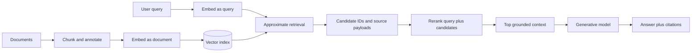
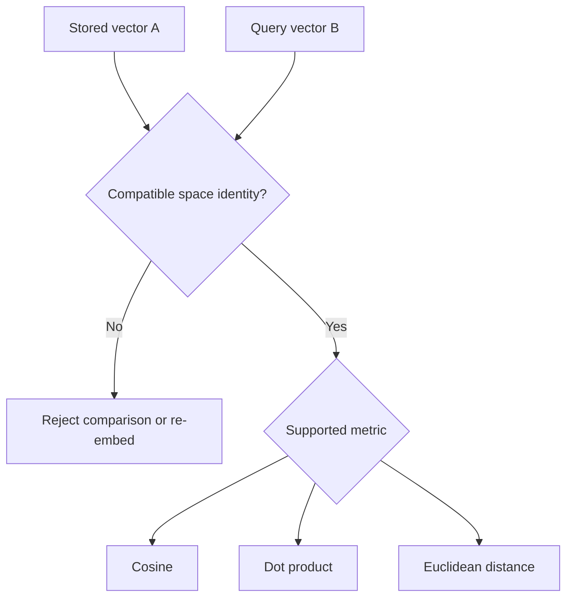
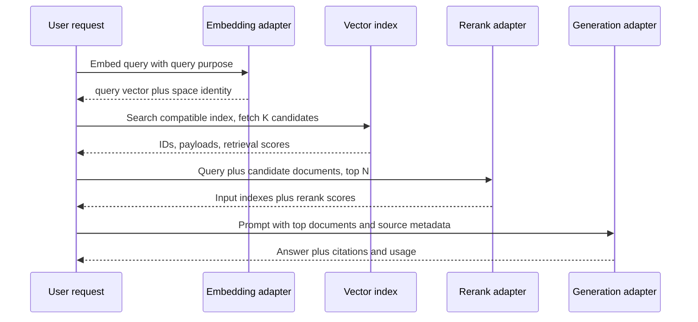

# Embedding, rerank, and retrieval contracts

**Contract snapshot:** 2026-09-06  
**Scope:** provider-neutral semantic operations for Agent Framework

Embedding, reranking, and retrieval are three different operations. They may
appear in one RAG pipeline, but they do not share a request model, score
meaning, storage lifecycle, or retry boundary.

| Operation | Input                              | Output                                   | State                                                                  |
| --------- | ---------------------------------- | ---------------------------------------- | ---------------------------------------------------------------------- |
| Embedding | One or more items                  | One vector per item                      | Stateless transformation; vectors are normally persisted by the caller |
| Rerank    | One query plus candidate documents | A relevance-ordered subset with scores   | Stateless scoring of the supplied candidate set                        |
| Retrieval | Query plus corpus/index identity   | Security-filtered or index-filtered hits | Depends on a managed corpus, vector store, or search service           |

Do not expose retrieval as “rerank with omitted documents,” or rerank as
“embedding with scores.” The operational and security semantics are not remotely
the same.

## Structural model

The framework should model at least four independent capabilities:
<code>IEmbeddingGenerator</code>, <code>IReranker</code>,
<code>IRetriever</code>, and conversational generation. A provider adapter may
implement any subset.

## Canonical embedding contract

### Embedding request

<code>EmbeddingRequest</code> should carry:

| Field                         | Type                                                                                                     | Semantics                                                                                               |
| ----------------------------- | -------------------------------------------------------------------------------------------------------- | ------------------------------------------------------------------------------------------------------- |
| <code>model</code>            | <code>ModelReference</code>                                                                              | Required logical model; may include a provider-qualified exact revision                                 |
| <code>inputs</code>           | <code>EmbeddingInput[]</code>                                                                            | Non-empty ordered inputs                                                                                |
| <code>purpose</code>          | <code>EmbeddingPurpose?</code>                                                                           | Query/document, similarity, classification, clustering, QA, code retrieval, or provider-specific intent |
| <code>dimensions</code>       | integer?                                                                                                 | Requested output dimension; capability-gated                                                            |
| <code>encoding</code>         | <code>float32 &#124; float64 &#124; int8 &#124; uint8 &#124; binary &#124; ubinary &#124; base64</code>? | Requested wire/vector representation                                                                    |
| <code>normalization</code>    | <code>provider_default &#124; unit_length &#124; none</code>?                                            | Desired normalization only when the provider supports it                                                |
| <code>truncation</code>       | <code>reject &#124; start &#124; end &#124; provider_default</code>?                                     | Explicit overlength policy                                                                              |
| <code>provider_options</code> | namespaced JSON object?                                                                                  | Routing, title, user ID, priority, and other provider controls                                          |

<code>EmbeddingInput</code> is an open tagged union:

- <code>text</code>: UTF-8 text plus optional caller correlation ID;
- <code>token_ids</code>: provider-tokenizer IDs, only where accepted;
- <code>image</code>, <code>audio</code>, <code>video</code>, or compound
  content: capability-gated and never translated to text silently;
- <code>provider_native</code>: opaque extension for a documented provider input
  shape.

The portable minimum is non-empty text. Token IDs are not portable across
tokenizers. Multimodal embedding support is model-specific even when the
endpoint accepts a multimodal union.

### Embedding response

<code>EmbeddingResponse</code> should contain:

| Field                          | Type                                          | Semantics                                                        |
| ------------------------------ | --------------------------------------------- | ---------------------------------------------------------------- |
| <code>items</code>             | <code>EmbeddingResult[]</code>                | One successful vector for each successful input                  |
| <code>model</code>             | <code>ResolvedModelReference</code>           | Model reported by the provider, not merely the requested alias   |
| <code>usage</code>             | provider-native counters plus normalized view | Tokens, images, billable units, and cost are separate quantities |
| <code>request_id</code>        | string?                                       | Provider request/generation ID                                   |
| <code>provider_metadata</code> | namespaced JSON object?                       | Raw routing, truncation, and model metadata                      |

Each <code>EmbeddingResult</code> carries <code>input_index</code>, optional
caller ID, a vector union, and optional per-item token count/truncation
information. Use the provider's returned index when present; never assume
response order when an index exists.

### Vector representation

The vector is a tagged union rather than an unlabelled numeric array:

<code>DenseFloatVector(float[] values) | DenseIntegerVector(byte[] values,
signed) | PackedBinaryVector(byte[] values, signed) | EncodedVector(string
base64, elementType, dimensions)</code>

Decode base64 according to the provider's documented element type and byte
order. A base64 string is an encoding, not a new embedding space. Quantization,
dimensionality reduction, and normalization can change distance behavior and
must remain visible.

## Embedding space identity

A stored vector without its space identity is corrupted data with good manners.
Persist this immutable identity beside every vector collection:

<code>EmbeddingSpaceIdentity = {adapter, endpoint_origin, region?,
requested_model, resolved_model, model_revision?, dimensions, element_type,
purpose_transform, normalization, truncation_policy, provider_route?,
provider_fingerprint?}</code>

Two vectors are comparable only when their effective space identities are
compatible. At minimum, require equality of resolved model/revision, dimensions,
purpose transform, normalization, and element interpretation. Region or upstream
provider also becomes identity-bearing when a router does not guarantee
byte-for-byte equivalent model weights.

Never mix query-optimized and document-optimized embeddings merely because their
lengths match. Cohere <code>search_query</code>/<code>search_document</code>,
Google <code>RETRIEVAL_QUERY</code>/<code>RETRIEVAL_DOCUMENT</code>, and
OpenRouter's <code>input_type</code> can apply asymmetric transformations
intentionally.

## Canonical rerank contract

### Rerank request

<code>RerankRequest</code> should carry:

| Field                                | Type                              | Semantics                                                               |
| ------------------------------------ | --------------------------------- | ----------------------------------------------------------------------- |
| <code>model</code>                   | <code>ModelReference</code>       | Required reranker identity                                              |
| <code>query</code>                   | string or provider-native content | Required ranking intent                                                 |
| <code>documents</code>               | <code>RerankDocument[]</code>     | Non-empty candidate set                                                 |
| <code>top_n</code>                   | integer?                          | Maximum results, constrained to <code>1..documents.count</code> locally |
| <code>max_tokens_per_document</code> | integer?                          | Explicit provider-side truncation ceiling where supported               |
| <code>return_documents</code>        | boolean?                          | Ask the provider to echo content only when supported                    |
| <code>provider_options</code>        | namespaced JSON object?           | Routing, priority, rank fields, and provider controls                   |

<code>RerankDocument</code> contains a stable caller <code>id</code>, text or a
capability-gated multimodal document, and opaque caller metadata that is not
sent unless the provider contract allows it. Preserve the original input index
independently of the ID.

### Rerank response

<code>RerankResponse</code> contains the resolved model/provider, request ID,
usage, raw metadata, and <code>results[]</code>. Each result has:

- <code>input_index</code>, required when returned by the provider;
- the caller's stable document ID recovered from the input;
- <code>relevance_score</code> as the provider returned it;
- optionally echoed/truncated document content;
- provider-native explanation or metadata when offered.

Results are ordered by relevance unless a provider explicitly says otherwise.
Validate indexes for range and uniqueness. Map by index first, then attach the
caller's document ID; echoed text is not a safe correlation key.

### Score semantics

Rerank scores are ordinarily useful for ordering within one response. They are
not assumed to be probabilities, cosine similarities, or calibrated across
models, providers, queries, versions, or candidate-set sizes. A threshold is an
application/model-specific evaluation artifact and must be versioned with the
rerank model and preprocessing policy.

## Retrieval contract boundary

A retrieval request owns corpus identity, authorization context, filters, query
transformations, paging, and managed-index behavior. Its result should expose
source identity, source URL, extracts/chunks, provider relevance values,
citations, security labels, and paging tokens.

Microsoft 365 Copilot Retrieval is the cleanest warning: it accepts a
natural-language query and returns permission-trimmed extracts from SharePoint,
OneDrive, or Copilot connectors. Its <code>relevanceScore</code> is a normalized
cosine similarity for an extract, but callers neither receive embeddings nor
supply the candidate set. It implements <code>IRetriever</code>, not
<code>IEmbeddingGenerator</code> or <code>IReranker</code>.

OpenAI vector-store search and xAI collection search are likewise managed
retrieval contracts. Do not expose them as raw embedding APIs merely because
embeddings exist behind the service.

## End-to-end timing and failure boundaries

The calls are separate retry boundaries. An embedding retry is safe if it is
stateless. A rerank retry is safe when documents and model are identical. A
generation retry can be unsafe after tool side effects or state creation. Do not
retry the whole RAG pipeline because the last step failed; doing so wastes
retrieval work and may produce a different candidate set.

## Batching and partial failure

- Keep provider batch-job orchestration separate from an individual embedding
  request containing many inputs.
- Preserve two levels of correlation: batch <code>custom_id</code> and
  per-vector <code>index</code>.
- A batch may complete with per-item errors. Completion of the job is not proof
  that every item succeeded.
- Enforce provider request-size, item-count, token-count, and per-input limits
  before dispatch where they are discoverable.
- Do not silently truncate. If the provider only offers silent truncation,
  surface that capability and record whether truncation occurred.

## Provider mapping

| Provider                              | Embedding contract                                                                     | Native rerank contract                                              | Important distinction                                                    |
| ------------------------------------- | -------------------------------------------------------------------------------------- | ------------------------------------------------------------------- | ------------------------------------------------------------------------ |
| OpenAI                                | <code>POST /v1/embeddings</code>; Batch supports <code>/v1/embeddings</code>           | None                                                                | Vector-store/file-search ranking is hosted retrieval, not generic rerank |
| OpenRouter                            | <code>POST /api/v1/embeddings</code>; routed and batch-capable                         | <code>POST /api/v1/rerank</code>                                    | Persist resolved model and upstream provider; routing can alter identity |
| Cohere                                | <code>POST /v2/embed</code>                                                            | <code>POST /v2/rerank</code>                                        | Purpose and vector encoding are first-class                              |
| Gemini Developer API                  | <code>models.embedContent</code>, synchronous and async batch variants                 | None                                                                | Task type and optional output dimension define the space                 |
| Vertex AI                             | Model-family <code>:predict</code> for embeddings                                      | Vertex AI Search Ranking API is a separate Discovery Engine service | Project/location/model resource is part of identity                      |
| Amazon Bedrock                        | Model-specific <code>InvokeModel</code> payload                                        | Bedrock Agent Runtime <code>Rerank</code>                           | Runtime and Agent Runtime are different AWS services/endpoints           |
| Azure OpenAI                          | OpenAI-compatible <code>/embeddings</code>, deployment/model selected by dialect       | None in Azure OpenAI                                                | Azure AI Search semantic ranking is a separate search service            |
| Mistral                               | <code>POST /v1/embeddings</code>                                                       | None                                                                | Output dtype and dimension are model-dependent                           |
| xAI                                   | OpenAI-compatible <code>POST /v1/embeddings</code> where enabled; gRPC model discovery | None                                                                | Collection search is managed retrieval                                   |
| Ollama                                | <code>POST /api/embed</code>                                                           | None                                                                | Local model digest and daemon version are identity-bearing               |
| Anthropic, Z.ai, Kimi, DeepSeek, Groq | No documented native embedding/rerank endpoint in the scoped public runtime            | None                                                                | Pair with a separate semantic provider; do not fake support through chat |

Provider availability is model- and account-dependent. The table describes
protocol surfaces, not a promise that every account can use every model.

## Adapter and conformance rules

1. Expose capabilities per model: modalities, maximum inputs, token limits,
   output dimensions/encodings, task purposes, truncation, batch, maximum rerank
   candidates, and echoed documents.
2. Reject unsupported semantics before sending. Never drop purpose, dimensions,
   routing constraints, or truncation controls silently.
3. Preserve requested and resolved model/provider identities plus raw usage and
   request IDs.
4. Validate one vector per successful input, stable correlation, finite numeric
   values, expected dimensions, and legal indexes.
5. Treat empty vectors, dimension drift, duplicate indexes, missing rerank
   indexes, and non-finite scores as protocol failures.
6. Redact document text and embeddings from routine logs. Vectors can leak
   information and are not harmless telemetry.
7. Test batch ordering, partial failure, input-type asymmetry, base64 decoding,
   provider fallback, truncation, cancellation, and unknown response fields.

## First-party sources

- [OpenAI embeddings reference](https://developers.openai.com/api/reference/resources/embeddings/methods/create)
- [OpenAI Batch reference](https://developers.openai.com/api/reference/resources/batches)
- [OpenRouter embeddings reference](https://openrouter.ai/docs/api/api-reference/embeddings/submit-an-embedding-request)
- [OpenRouter rerank reference](https://openrouter.ai/docs/api/api-reference/rerank/submit-a-rerank-request)
- [Cohere Embed reference](https://docs.cohere.com/reference/embed)
- [Cohere Rerank reference](https://docs.cohere.com/reference/rerank)
- [Gemini embeddings reference](https://ai.google.dev/api/embeddings)
- [Vertex AI text embeddings](https://cloud.google.com/vertex-ai/generative-ai/docs/embeddings/get-text-embeddings)
- [Vertex AI Search Ranking API](https://cloud.google.com/generative-ai-app-builder/docs/ranking)
- [Amazon Bedrock Rerank API](https://docs.aws.amazon.com/bedrock/latest/APIReference/API_agent-runtime_Rerank.html)
- [Microsoft 365 Copilot Retrieval API](https://learn.microsoft.com/en-us/microsoft-365/copilot/extensibility/api/ai-services/retrieval/copilotroot-retrieval)
