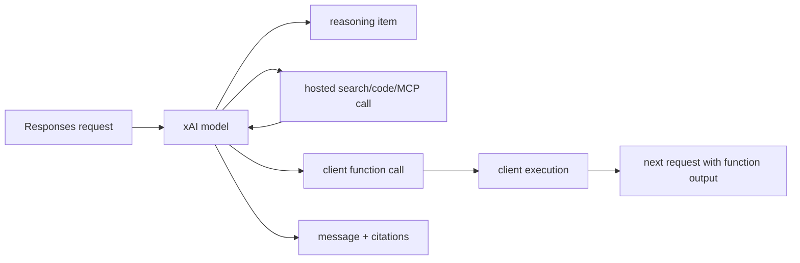
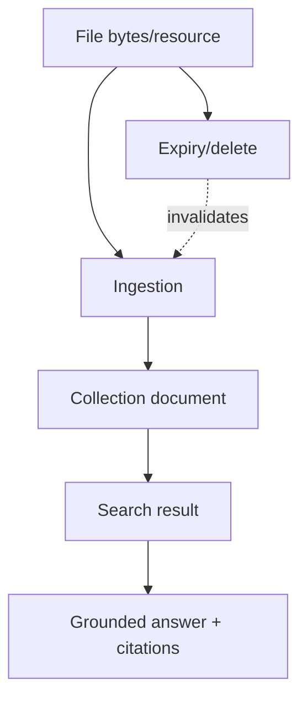
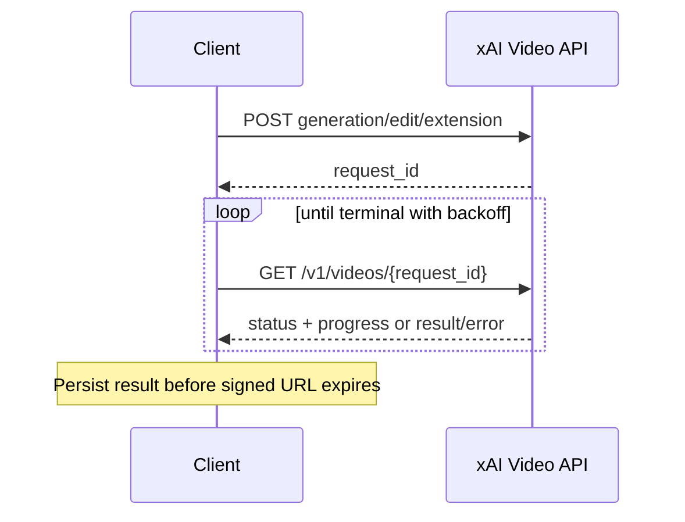

# xAI API

**Contract snapshot:** 2026-09-06  
**REST base URL:** <code>https://api.x.ai/v1</code>  
**gRPC authority:** <code>api.x.ai</code>  
**Preferred primitive:** Responses for agent workflows; Chat Completions for the
broadest OpenAI compatibility  
**Transport:** JSON/HTTPS, SSE, gRPC, WebSocket, and WebRTC depending on
capability

xAI exposes REST and first-party gRPC surfaces for text, hosted tools,
files/search, images, video, speech, voice, models, tokenization, and batches.
Its OpenAI-shaped endpoints include xAI-specific fields and intentionally
unsupported compatibility fields.

## Authentication and routing

Send <code>Authorization: Bearer XAI_API_KEY</code>. REST requests generally use
JSON; uploads and media can use multipart/binary bodies. gRPC sends the same
bearer metadata to <code>api.x.ai</code> and uses the published protobuf
definitions.

Regional cluster selection can alter the hostname/query and data residency.
Treat cluster as routing configuration, not a model field. Never place a
long-lived key in a browser; voice/realtime clients should use the documented
client-secret/call bootstrap flow.

## REST endpoint inventory

| Family             | Principal paths under <code>/v1</code>                                                                                                    |
| ------------------ | ----------------------------------------------------------------------------------------------------------------------------------------- |
| Chat               | POST <code>/chat/completions</code>; GET <code>/chat/deferred-completion/{request_id}</code>                                              |
| Responses          | POST <code>/responses</code>, POST <code>/responses/compact</code>, GET/DELETE <code>/responses/{response_id}</code>                      |
| Embeddings         | POST <code>/embeddings</code> where enabled; embedding model discovery in first-party gRPC                                                |
| Models             | list/get model resources                                                                                                                  |
| Tokenization       | tokenizer/count operations documented for the selected interface                                                                          |
| Files              | upload/list/get/delete/content and public-URL operations                                                                                  |
| Collections/search | document collections, ingestion, search, and related sources                                                                              |
| Images             | POST <code>/images/generations</code>, <code>/images/edits</code>                                                                         |
| Videos             | POST <code>/videos/generations</code>, <code>/videos/edits</code>, <code>/videos/extensions</code>; GET <code>/videos/{request_id}</code> |
| Text to speech     | POST <code>/tts</code> and voice selection/custom-voice resources                                                                         |
| Speech to text     | POST <code>/stt</code>; streaming at <code>wss://api.x.ai/v1/stt</code>                                                                   |
| Realtime voice     | client-secret/call/session resources plus WebSocket/WebRTC media/events                                                                   |
| Batch              | create/list/get; request add/list; results; cancel                                                                                        |

Check the live model page for endpoint eligibility. Image/video/speech models
and batch support are not inferred from a text model name.

## Chat Completions

The request is OpenAI-shaped: <code>model</code>, <code>messages</code>, stream,
token/sampling controls, tools/tool choice, structured response format,
logprobs, parallel tool calls, and service tier. xAI extensions include
hosted-tool/search configuration and response metadata.

Message content is an ordered text/image/file part union. Uploaded files can be
referenced by <code>file_id</code>; public URLs may be accepted by supported
content types. Attaching files can cause server-side document search, so a
file-bearing turn may become an agentic workflow rather than pure prompt
expansion.

Tools form an open union:

- client function tools;
- web search and X search;
- code execution;
- file/collection search;
- remote MCP tools and other documented hosted tools.

Hosted tools execute at xAI; function calls return to the client. Preserve
citations, tool traces, source metadata, and cost/usage extensions.

The response is
<code>{id,object,created,model,choices[],usage,service_tier?...}</code>.
Assistant messages can contain visible text, reasoning, refusal, citations, and
tool calls. Usage can include input/output/reasoning/image/search tokens and
<code>cost_in_usd_ticks</code>. Do not convert cost ticks to floating point
before applying the documented scale.

SSE follows Chat Completion chunks and <code>[DONE]</code>. A deferred
completion instead returns/uses a request ID that is retrieved through its
dedicated endpoint; do not treat it as a stored Response.

## Responses API

Responses accepts string or typed item input, instructions, tools, text/JSON
schema output configuration, reasoning controls, streaming, previous
response/state, and model-specific generation fields. xAI stores eligible
responses for a documented retention window, enabling retrieval and continuation
by response ID.

Output is an ordered open union of messages, reasoning, client function calls,
hosted-tool calls, and results/traces. The adapter must retain unknown item
types and avoid assuming that visible answer text is first.

xAI's reference labels some OpenAI compatibility fields as accepted but unused
or unsupported. Examples include sampling/processing fields on particular modes.
Represent support as four states: supported, accepted-but-ignored, rejected, and
unknown. Only the first should influence application behavior.

### Context compaction

POST <code>/responses/compact</code> shrinks a context into a reusable compacted
representation. Treat compacted content as opaque protocol state tied to the
model/API. It is not a human summary and must not be edited or moved across
providers.

### Stream terminality

Semantic events cover response creation/progress/completion and
item/content/tool deltas. Only a terminal completed/incomplete/failed event
establishes outcome. Preserve event sequence and response/item IDs for
replay-safe reducers.

## Files, collections, and search

<code>File</code> resources include ID, filename, byte count/media type,
purpose/status, creation time, and optional expiry policy. xAI supports
<code>expires_after</code> or explicit <code>expires_at</code> on eligible
uploads. Deletion invalidates later content reads and references.

Collections organize documents for ingestion and retrieval. Keep these concepts
separate:

Ingestion status is asynchronous. A successful upload does not mean a document
is searchable. Search results and citations must retain
collection/document/chunk identity.

## Embeddings and rerank boundary

Embedding participates in AgentKit's
[semantic-operation model](semantic-operations.md); collection search remains a
managed retrieval capability rather than a generic reranker.

xAI exposes an OpenAI-compatible <code>POST /v1/embeddings</code> route where an
embedding model is enabled for the team. Its first-party gRPC Models service
separately supports <code>ListEmbeddingModels</code> and
<code>GetEmbeddingModel</code>. Availability is account/model-specific, so
discover embedding models rather than assuming a language model can embed.

Treat the REST body/result as the OpenAI embedding dialect supported by the
selected model and preserve the returned model, dimensions, encoding, cluster,
and model fingerprint/version when available. The full model fingerprint is
stronger provenance than a moving alias.

Collections Search embeds the query against xAI-managed collection data and
returns matches, but it does not expose the document vectors. It is
<code>IRetriever</code>, not raw embedding generation. xAI does not currently
document a generic caller-supplied-candidate rerank endpoint.

## Image API

Generation and edit requests include <code>model</code>, prompt, input image for
edits, count, aspect/size, format, and model-specific controls. Image inputs can
be URL, data URL/base64, or file ID where documented. Results return URL or
base64 plus model/usage.

Signed media URLs expire. Applications that need retention must fetch them
promptly into an explicitly authorized store; do not make URL lifetime part of
the canonical media type.

## Video API

Video generation, edit, and extension are asynchronous. Creation returns
<code>request_id</code>; GET <code>/videos/{request_id}</code> returns
status/progress and eventually video URL, duration, moderation data, model, and
usage.

## Speech and realtime voice

### Speech to text

REST POST <code>/v1/stt</code> transcribes a complete audio input. Its
structured result can include merged text, BCP-47 language, duration, word
timestamps, and per-channel transcripts. Streaming STT uses WebSocket at
<code>wss://api.x.ai/v1/stt</code>: send configuration/control JSON and binary
audio frames; receive partial/final transcript events.

### Text to speech and voices

TTS accepts model/voice/text plus encoding, sampling, speed, and other voice
controls. The response is audio/binary or a documented envelope. Voice listing
and custom-voice CRUD are distinct resources; IDs and consent/ownership
requirements must be preserved.

### Speech-to-speech sessions

Realtime voice uses a session/call bootstrap, then bidirectional audio and
semantic events. Separate transport state, conversational items, model
responses, and tool calls. Backpressure audio writes and handle
session-expiry/go-away events.

## Batch API

xAI batches are incrementally populated resources, unlike file-only batch APIs:

| Method/path                                           | Purpose                                                  |
| ----------------------------------------------------- | -------------------------------------------------------- |
| POST/GET <code>/v1/batches</code>                     | Create/list batches                                      |
| GET <code>/v1/batches/{batch_id}</code>               | Inspect batch/state counts                               |
| POST/GET <code>/v1/batches/{batch_id}/requests</code> | Add/list requests                                        |
| GET <code>/v1/batches/{batch_id}/results</code>       | Page available results, including before full completion |
| POST <code>/v1/batches/{batch_id}:cancel</code>       | Cancel remaining processing                              |

Requests can also come from an uploaded JSONL file with <code>custom_id</code>,
POST method, endpoint URL, and body. Supported batch families include Chat,
Responses, image generation/edit, and video generation/edit/extension for
eligible models. A batch can mix endpoints.

Correlate by <code>batch_request_id</code>/<code>custom_id</code>. Results are
paginated and become available incrementally. A batch-level state does not
replace per-request success/error. Media result URLs can expire quickly.

## gRPC surface

The published protobuf API covers Chat, Image, Video, Batch Management, Models,
Auth, Tokenize, and raw model sampling. RPC request/response types are
authoritative for gRPC and may expose fields not available in REST.

Do not JSON-transcode a REST request and assume protobuf equivalence. Oneofs,
enums, presence, streaming RPC cardinality, deadlines, and status details must
be handled natively. Preserve <code>google.rpc.Status</code>-style details and
request IDs.

## Errors, retrying, and adapter rules

REST and gRPC failures map through the
[AgentKit error taxonomy](../concepts/error-taxonomy.md) without losing cluster,
request, model, or service-tier diagnostics.

- Preserve REST status/body/headers or gRPC status/details, plus xAI request
  IDs, cluster, model, and service tier.
- Retry 429 and transient 5xx/<code>UNAVAILABLE</code> with jitter and server
  guidance.
- Do not retry uploads, batch mutation, custom-voice, or media creation without
  an idempotency strategy.
- Treat safety/content errors and invalid tool schemas as terminal until input
  changes.
- Hosted tools and web/X results are untrusted external content.
- Query model capabilities rather than sending every OpenAI field and hoping
  ignored means supported.

## First-party sources

- [xAI REST Chat and Responses reference](https://docs.x.ai/developers/rest-api-reference/inference/chat)
- [xAI Batch API](https://docs.x.ai/developers/advanced-api-usage/batch-api)
- [xAI Files API](https://docs.x.ai/developers/rest-api-reference/files/manage)
- [xAI Video API](https://docs.x.ai/developers/rest-api-reference/inference/videos)
- [xAI Speech to Text](https://docs.x.ai/developers/rest-api-reference/inference/speech-to-text)
- [xAI gRPC reference](https://docs.x.ai/developers/grpc-api-reference)
- [xAI inference REST overview](https://docs.x.ai/developers/rest-api-reference/inference)
- [xAI release notes](https://docs.x.ai/developers/release-notes)
