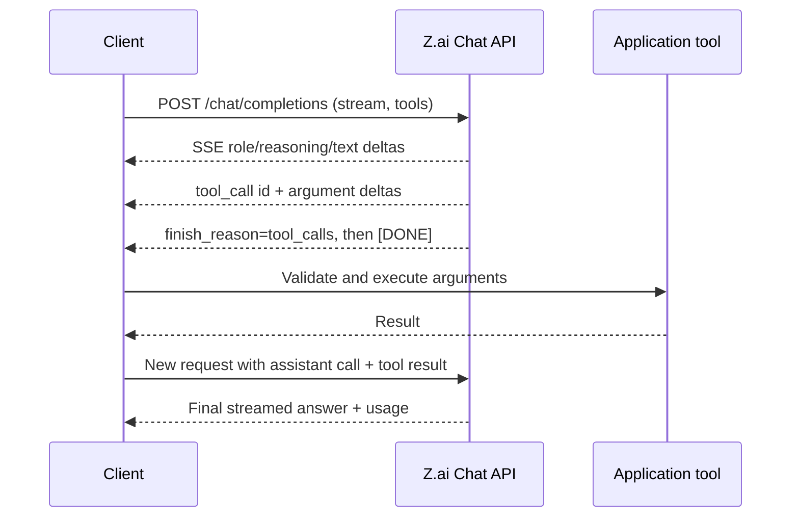
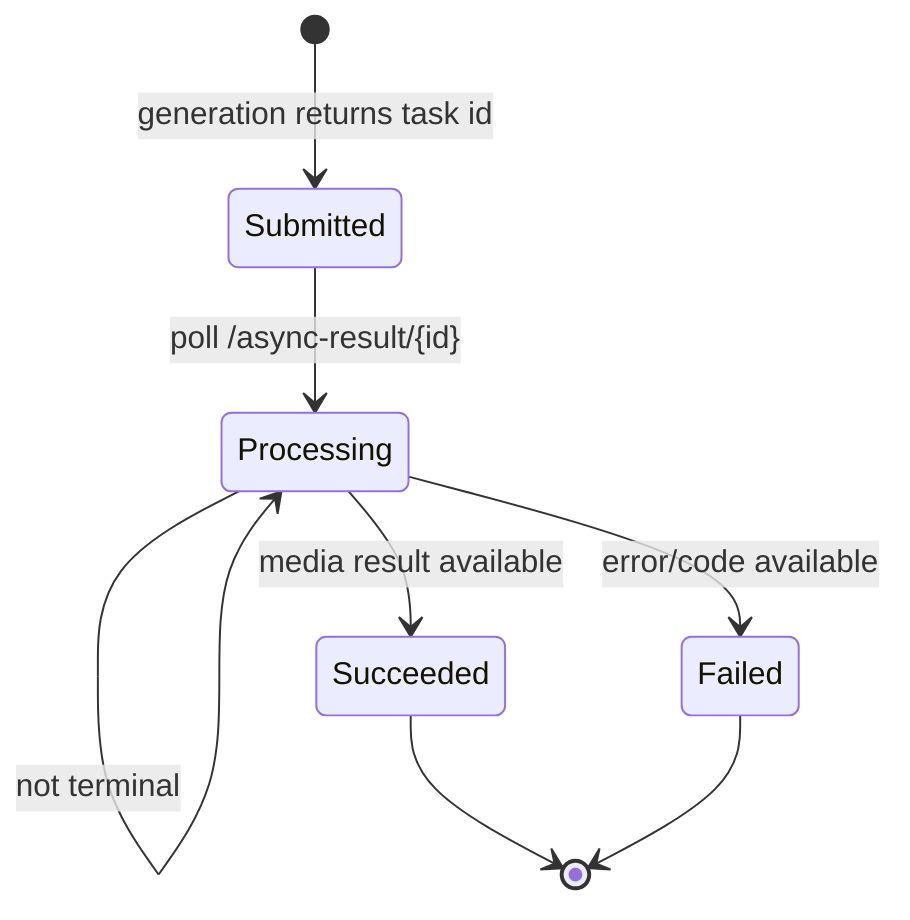
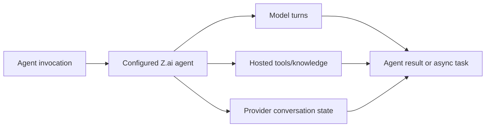

# Z.ai API

**Contract snapshot:** 2026-09-06  
**General base URL:** <code>https://api.z.ai/api/paas/v4</code>  
**Coding base URL:** <code>https://api.z.ai/api/coding/paas/v4</code>  
**Preferred primitive:** Chat Completions  
**Transport:** JSON/HTTPS and SSE; polling for asynchronous media

Z.ai provides an OpenAI-shaped chat surface plus first-party image, video,
speech transcription, document extraction, search, tokenizer, file, and agent
APIs. It is a dialect, not a drop-in OpenAI implementation.

## Authentication and endpoints

Send <code>Authorization: Bearer ZAI_API_KEY</code>. Some Z.ai integrations
derive a short-lived JWT from the issued key; follow the credential type shown
by the console and never perform signing in an untrusted client.

The public OpenAPI document expresses paths beneath the host, while examples
commonly present the composed <code>/api/paas/v4</code> base. Configure the full
base URL rather than joining independently guessed prefixes. The coding-plan
base is a separate routing/billing surface.

## Endpoint inventory

| Method and path                             | Purpose                                                                    |
| ------------------------------------------- | -------------------------------------------------------------------------- |
| POST <code>/chat/completions</code>         | Text/multimodal generation, reasoning, tools, structured output, streaming |
| POST <code>/images/generations</code>       | Synchronous image generation                                               |
| POST <code>/async/images/generations</code> | Asynchronous image generation                                              |
| POST <code>/videos/generations</code>       | Asynchronous video generation                                              |
| GET <code>/async-result/{id}</code>         | Poll async image/video task                                                |
| POST <code>/audio/transcriptions</code>     | Speech-to-text                                                             |
| POST <code>/files</code>                    | Upload a file for supported media/document operations                      |
| POST <code>/tokenizer</code>                | Tokenize/count request content                                             |
| POST <code>/layout_parsing</code>           | Parse document layout and structured regions                               |
| POST <code>/web_search</code>               | Standalone web search                                                      |
| POST <code>/reader</code>                   | Fetch/read supported web or document content                               |
| POST <code>/v1/agents</code>                | Invoke a configured agent                                                  |
| POST <code>/v1/agents/async-result</code>   | Query asynchronous agent result                                            |
| POST <code>/v1/agents/conversation</code>   | Agent conversation/history operation                                       |

The final three paths are shown as absolute paths in Z.ai's schema and may use a
host/base different from the PaaS v4 inference prefix. Keep their documented
full URL configurable.

No public embeddings endpoint appears in the verified public OpenAPI contract.
Do not silently route embedding calls to Chat Completions.

## Chat Completions request

The core shape is:

<code>ChatCompletionRequest = {model, messages, stream?, thinking?, tools?,
tool_choice?, response_format?, max_tokens?, stop?, temperature?, top_p?,
do_sample?, request_id?, user_id?}</code>

| Type                        | Wire shape and notes                                                                                |
| --------------------------- | --------------------------------------------------------------------------------------------------- |
| <code>Message</code>        | Role plus string or typed multimodal content; assistant messages may carry reasoning and tool calls |
| <code>ContentPart</code>    | Tagged text, image URL, video URL, or file content where the selected model allows it               |
| <code>Thinking</code>       | Model-specific reasoning control; preserve returned reasoning separately from visible text          |
| <code>FunctionTool</code>   | <code>{type:"function", function:{name,description?,parameters}}</code>                             |
| <code>ToolChoice</code>     | auto/none or a forced named function, subject to model support                                      |
| <code>ResponseFormat</code> | text, JSON object, or JSON Schema form depending on model                                           |

Sampling and token fields are not uniform across GLM model generations.
Capability-gate them and surface provider validation errors; do not retry by
stripping fields invisibly.

## Chat response and streaming

Non-streaming responses follow the familiar
<code>{id,created,model,choices,usage}</code> envelope. A choice contains
<code>index</code>, an assistant <code>message</code>, and
<code>finish_reason</code>. The message can include:

- visible <code>content</code>;
- <code>reasoning_content</code> or the model's current reasoning field;
- <code>tool_calls[]</code> with stable call IDs and JSON argument text;
- media or provider extensions.

Usage commonly separates prompt, completion, and total tokens, with
cache/reasoning details on supported models. Preserve extra counters.

With <code>stream:true</code>, consume SSE <code>data:</code> records as
<code>ChatCompletionChunk</code> objects and stop on <code>[DONE]</code>. Merge
choices by <code>index</code>, tool calls by their index and ID, and arguments
by concatenation. A finish reason can arrive before final usage.

Z.ai's hosted search options and standalone <code>/web_search</code> are
different contracts. A model-hosted search may appear as a tool/configuration
field inside chat; standalone search returns search records directly.

## Media and document types

### Images and videos

A generation request selects <code>model</code>, prompt, and model-specific
size/quality/style/output controls. Synchronous image generation returns created
time plus generated image entries such as URL or base64 data. Async image/video
creation returns a task ID.

<code>AsyncResult</code> must be treated as a state machine, not a nullable
result:

Persist the task ID before polling. Status strings are open enums; retain
unknown values and the raw result. Media URLs can be temporary, so copy them
only under the caller's explicit retention policy.

### Audio, tokenizer, reader, and layout

- Transcription is multipart and returns text plus model-dependent
  timing/segment detail.
- Tokenizer accepts model and text/message content and returns token/count data
  useful for preflight, but its count is authoritative only for that
  model/version.
- Layout parsing accepts a supported document reference/upload and returns
  structured page/region content. Preserve coordinates, page numbers, category
  labels, and raw provider fields.
- Reader resolves supported URLs or inputs into extracted content and metadata.
  Treat fetched content as untrusted data.

## Agent surface

The agent endpoints execute platform-configured agents rather than merely
exposing a model. Requests identify an agent and input/conversation context;
results can be synchronous or referenced asynchronously. Conversation operations
manage provider state.

Model these independently from Chat Completions:

Do not synthesize agent history from chat messages if the API returns
conversation identifiers. Provider deletion/retention behavior belongs in the
application data policy.

## Errors and retries

Expect JSON errors with a code/message envelope, plus request identifiers in
bodies or headers. The [AgentKit error mapping](../concepts/error-taxonomy.md)
preserves the exact HTTP status and raw body.

- 400/422: invalid model, parameter combination, content part, or schema;
  terminal until the request changes.
- 401/403: credential, plan, or entitlement problem; terminal for that
  credential.
- 429: quota/rate limit; honor reset or retry guidance and jitter.
- 5xx/network: retry only idempotent reads or safely repeatable inference. Avoid
  duplicating media/agent jobs.
- A successful async submission is not a successful generation; terminal task
  state is authoritative.

## Compatibility rules

1. Reuse OpenAI SDK transport only after setting the exact Z.ai base URL.
2. Keep Z.ai request/response extensions in a namespaced bag.
3. Use the
   [model capability profile](../concepts/model-providers-and-capabilities.md)
   to gate multimodal parts, reasoning, JSON Schema, and tools by discovered
   model.
4. Preserve unknown finish reasons and stream fields.
5. Keep [semantic operations](semantic-operations.md) separate and never
   advertise embeddings or OpenAI Responses without a documented Z.ai endpoint.

## First-party sources

- [Z.ai API documentation](https://docs.z.ai/api-reference/introduction)
- [Z.ai Chat Completions](https://docs.z.ai/api-reference/llm/chat-completion)
- [Z.ai OpenAPI schema](https://docs.z.ai/openapi.json)
- [Z.ai image generation](https://docs.z.ai/api-reference/image/generate-image)
- [Z.ai video generation](https://docs.z.ai/api-reference/video/generate-video)
- [Z.ai web search](https://docs.z.ai/api-reference/tools/web-search)
